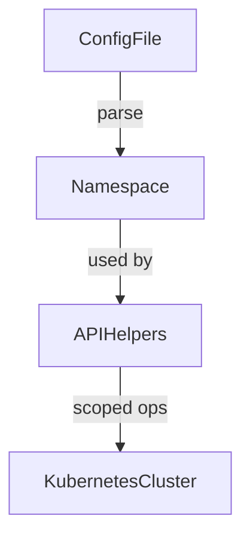

Namespace` – A Lightweight Namespace Representation  

## Purpose  
The `Namespace` struct is a minimal, immutable data holder used throughout the **configuration** package to refer to Kubernetes namespaces. It contains only the namespace name and is passed between configuration‑loading routines, validation helpers, and API wrappers that need to know which namespace they should operate in.

> **Why a separate type?**  
> Even though it holds just one string field, defining its own type gives the following benefits:  
> * **Type safety** – functions can explicitly accept `Namespace` instead of an arbitrary string, preventing accidental misuse.  
> * **Future extensibility** – if additional namespace‑related metadata (labels, annotations, etc.) becomes necessary, it can be added to this struct without changing all call sites.  

## Fields  
| Field | Type   | Description |
|-------|--------|-------------|
| `Name` | `string` | The Kubernetes namespace identifier (e.g., `"cert-manager"`). |

> **Read‑only** – the struct has no exported setters; its value is set once during configuration parsing and then treated as immutable.

## Dependencies & Usage  
* **Configuration loading** – When a YAML/JSON config file specifies a target namespace, the loader unmarshals it into a `Namespace` instance.  
* **API helpers** – Functions that create or query Kubernetes objects often accept a `Namespace` to scope the operation (`client.Get(ctx, client.ObjectKey{Namespace: ns.Name, ...})`).  
* **Validation** – Some validation utilities check whether the namespace exists in the cluster; they receive a `Namespace` instance for this purpose.

No external packages are imported directly by `Namespace`; it relies solely on the Go standard library.

## Side Effects & Mutability  
The struct is **immutable** after creation. No method mutates its state, and there are no side‑effecting functions associated with it in this package. It merely carries data.

## How it fits the package  
Within `github.com/redhat-best-practices-for-k8s/certsuite/pkg/configuration`, the `Namespace` type is a building block for higher‑level configuration objects such as `ClusterConfiguration` or `ServiceAccountConfig`. These composite structs embed or reference `Namespace` to keep namespace handling consistent across the codebase.

In summary, `Namespace` is a lightweight, type‑safe representation of a Kubernetes namespace that promotes clarity and future extensibility while remaining completely side‑effect free.
