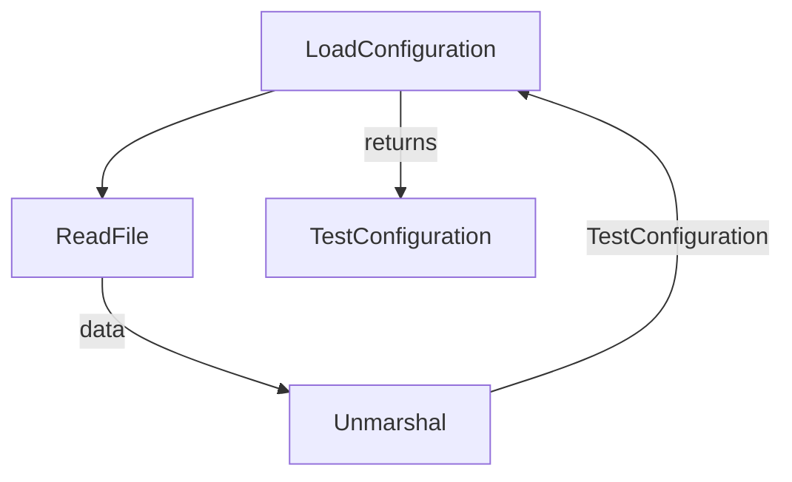

TestConfiguration`

> **Package**: `github.com/redhat-best-practices-for-k8s/certsuite/pkg/configuration`  
> **File**: `configuration.go` (line 82)

### Purpose
`TestConfiguration` is the central configuration holder for all test‑related settings in CertSuite.  It aggregates values that drive how tests discover resources, authenticate to collectors, and filter objects. The struct is populated once by the package helper `LoadConfiguration`, which reads a JSON/YAML file (via `ReadFile` → `Unmarshal`) and returns a fully‑filled instance.

### Key Fields & Their Roles

| Field | Type | Role |
|-------|------|------|
| **AcceptedKernelTaints** | `[]AcceptedKernelTaintsInfo` | List of kernel taints that the test runner will tolerate or ignore. |
| **CollectorAppEndpoint** | `string` | URL for the external collector service used to report test results. |
| **CollectorAppPassword** | `string` | Secret token/credential for authenticating with `CollectorAppEndpoint`. |
| **ConnectAPIConfig** | `ConnectAPIConfig` | Credentials and settings for interacting with Red Hat Connect API (used in certain tests). |
| **CrdFilters** | `[]CrdFilter` | Rules to include/exclude specific Custom Resource Definitions during test discovery. |
| **ExecutedBy** | `string` | Identifier of the entity (user/CI job) that triggered the run; logged for traceability. |
| **ManagedDeployments** | `[]ManagedDeploymentsStatefulsets` | StatefulSets considered “managed” by the test harness (e.g., those it will scale or delete). |
| **ManagedStatefulsets** | `[]ManagedDeploymentsStatefulsets` | Same as above, but for generic stateful sets outside of deployments. |
| **OperatorsUnderTestLabels** | `[]string` | Label selectors that identify the operators being tested. |
| **PartnerName** | `string` | Name of the partner or product under test; used in reporting metadata. |
| **PodsUnderTestLabels** | `[]string` | Label selectors for pods whose health/status is monitored during tests. |
| **ProbeDaemonSetNamespace** | `string` | Namespace where probe DaemonSets (e.g., metrics collectors) are deployed. |
| **ServicesIgnoreList** | `[]string` | Service names that should be excluded from service‑level checks. |
| **SkipHelmChartList** | `[]SkipHelmChartList` | Helm charts that the test suite should skip during deployment or verification steps. |
| **SkipScalingTestDeployments** | `[]SkipScalingTestDeploymentsInfo` | Deployments that are exempt from scaling tests (e.g., critical workloads). |
| **SkipScalingTestStatefulSets** | `[]SkipScalingTestStatefulSetsInfo` | StatefulSets exempt from scaling tests. |
| **TargetNameSpaces** | `[]Namespace` | List of namespaces in which tests will run; each entry may carry additional metadata. |
| **ValidProtocolNames** | `[]string` | Protocol names (e.g., http, https) considered valid for certain network checks. |

> *Note:* The nested types (`AcceptedKernelTaintsInfo`, `ConnectAPIConfig`, etc.) are defined elsewhere in the package and provide finer‑grained configuration for each field.

### Dependencies & Interaction Flow

1. **`LoadConfiguration(filePath string)`**  
   - Reads the file at `filePath`.  
   - Calls `ReadFile` → `Unmarshal` into a `TestConfiguration`.  
   - Emits logs via `Debug`, `Info`, and `Warn` for progress/error reporting.

2. The returned `TestConfiguration` is then used by other packages (e.g., test runners, collectors) to:
   - Determine which Kubernetes objects to monitor (`PodsUnderTestLabels`, `OperatorsUnderTestLabels`).  
   - Authenticate against external services (`CollectorAppEndpoint`, `CollectorAppPassword`).  
   - Apply filtering rules (`CrdFilters`, `ServicesIgnoreList`).

### Side‑Effects & Constraints

- **Immutable after Load**: Once loaded, the struct is treated as read‑only; mutating it at runtime can break test consistency.
- **File Format Flexibility**: The unmarshalling step supports JSON or YAML (depending on file extension), but any unsupported field results in a decoding error that propagates back to `LoadConfiguration`.
- **Logging**: All I/O and parsing stages emit logs, which can be redirected by the calling application.

### How It Fits the Package

`TestConfiguration` is the *single source of truth* for test behavior across CertSuite.  The configuration package exposes only two public APIs:

| API | Role |
|-----|------|
| `LoadConfiguration(path string)` | Reads a file and returns a fully‑populated `TestConfiguration`. |
| `TestConfiguration` struct | Holds all runtime parameters needed by the rest of the suite. |

By centralizing these settings, developers can adjust test scope, authentication, or filtering without touching business logic elsewhere in the codebase.
