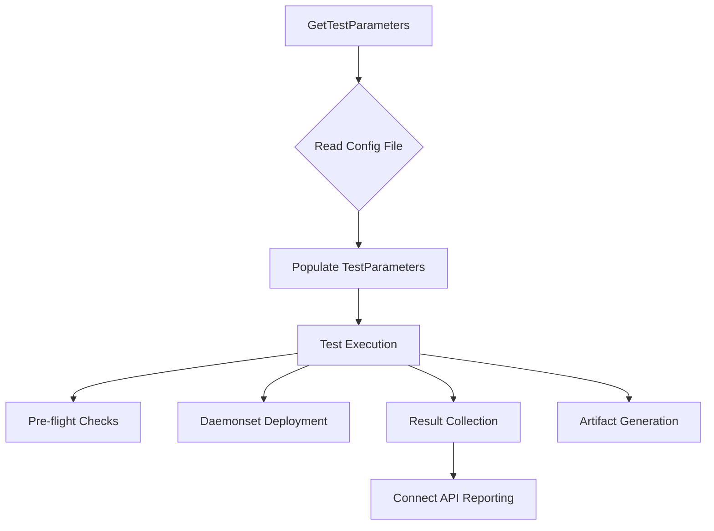

TestParameters` – Configuration Snapshot for CertSuite

| Section | Description |
|---------|-------------|
| **Purpose** | Holds a snapshot of all runtime configuration values that influence how CertSuite executes tests, collects data, and produces reports. It is the central read‑only object returned by `GetTestParameters`. |
| **Location** | `/pkg/configuration/configuration.go` (line 113) |
| **Exported** | Yes – consumers import `github.com/redhat-best-practices-for-k8s/certsuite/pkg/configuration` and use the struct directly. |

---

### Key Fields & Their Roles

| Field | Type | Typical Use |
|-------|------|-------------|
| `AllowPreflightInsecure` | `bool` | Enables insecure pre‑flight checks (e.g., disabling TLS verification). |
| `CertSuiteImageRepo` | `string` | Docker registry repo for the CertSuite image. |
| `CertSuiteProbeImage` | `string` | Full image name used for probe containers. |
| `ConfigFile` | `string` | Path to the YAML/JSON config file that seeded these values. |
| `ConnectAPIBaseURL` / `ConnectAPIKey` / `ConnectProjectID` | `string` | Credentials & endpoint for reporting results to Red‑Hat Connect API. |
| `ConnectAPIProxyPort`, `ConnectAPIProxyURL` | `string` | Optional HTTP proxy configuration when contacting the Connect API. |
| `DaemonsetCPULim`, `DaemonsetCPUReq`, `DaemonsetMemLim`, `DaemonsetMemReq` | `string` | Resource requests/limits for the test daemonset. |
| `EnableDataCollection` | `bool` | Whether to gather telemetry data during tests. |
| `EnableXMLCreation` | `bool` | Toggle creation of XML reports (used by CI pipelines). |
| `IncludeWebFilesInOutputFolder` | `bool` | Decide if web artifacts are copied into the output directory. |
| `Intrusive` | `bool` | If true, tests may modify cluster state (e.g., install CRDs). |
| `Kubeconfig` | `string` | Path to kubeconfig used for cluster access. |
| `LabelsFilter` | `string` | Kubernetes label selector to narrow down test targets. |
| `LogLevel` | `string` | Logging verbosity (`debug`, `info`, etc.). |
| `OfflineDB` | `string` | Local path to the database of known results (used in offline mode). |
| `OmitArtifactsZipFile` | `bool` | Skip zipping of artifacts after test run. |
| `OutputDir` | `string` | Base directory where all reports & logs are written. |
| `PfltDockerconfig` | `string` | Path to Docker config file for pulling images (used by pre‑flight). |
| `SanitizeClaim` | `bool` | Remove sensitive data from claims before reporting. |
| `ServerMode` | `bool` | Run CertSuite as a long‑running server rather than a one‑off CLI. |
| `Timeout` | `time.Duration` | Global timeout for test execution (affects API calls, image pulls, etc.). |

---

### Interaction Flow

1. **Configuration Load** – `GetTestParameters()` reads the configuration file (`ConfigFile`) and environment variables to populate a `TestParameters` instance.
2. **Test Execution** – The CLI or server passes this struct to test runners, which reference fields like `Kubeconfig`, resource limits, and `Intrusive`.
3. **Reporting** – When results are sent to Connect API, the struct supplies authentication (`ConnectAPIKey`) and target project (`ConnectProjectID`).
4. **Artifact Handling** – Flags such as `EnableXMLCreation`, `IncludeWebFilesInOutputFolder`, and `OmitArtifactsZipFile` guide how artifacts are written into `OutputDir`.

---

### Side Effects & Dependencies

| Field | Side Effect | Dependency |
|-------|-------------|------------|
| `AllowPreflightInsecure` | Alters TLS verification in pre‑flight checks. | Pre‑flight utilities that read this flag. |
| `ConnectAPI*` fields | Triggers HTTP requests to external service. | Connect API client code (not shown here). |
| `Daemonset*` limits/requests | Affects Kubernetes deployment specs for test daemonsets. | Daemonset creation logic. |
| `EnableDataCollection` | Starts telemetry collection goroutines. | Data‑collection package. |
| `LogLevel` | Configures the global logger (e.g., logrus). | Logging subsystem. |
| `Timeout` | Wraps context with deadline for all operations. | Context usage in API calls and image pulls. |

---

### Suggested Mermaid Diagram

---

### How It Fits the Package

`TestParameters` is the *single source of truth* for runtime configuration in the `configuration` package. All other modules (CLI, server, test runners) depend on this struct to remain agnostic about how values were sourced—whether from a file, env vars, or defaults. By exposing it as an exported type and providing a dedicated accessor (`GetTestParameters()`), the package promotes a clean separation between configuration parsing and business logic.
