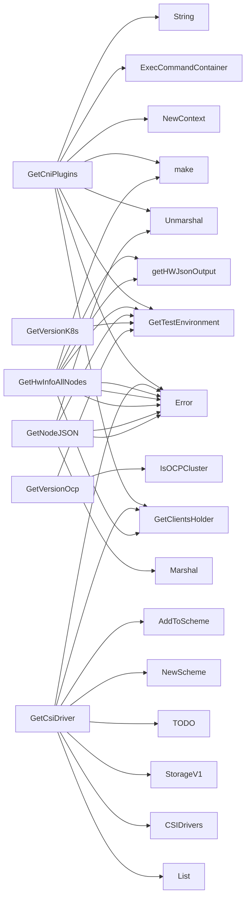

## Package diagnostics (github.com/redhat-best-practices-for-k8s/certsuite/pkg/diagnostics)

### Structs

- **NodeHwInfo** (exported) — 4 fields, 0 methods

### Functions

- **GetCniPlugins** — func()(map[string][]interface{})
- **GetCsiDriver** — func()(map[string]interface{})
- **GetHwInfoAllNodes** — func()(map[string]NodeHwInfo)
- **GetNodeJSON** — func()(map[string]interface{})
- **GetVersionK8s** — func()(string)
- **GetVersionOcClient** — func()(string)
- **GetVersionOcp** — func()(string)

### Call graph (exported symbols, partial)

### Symbol docs

- [struct NodeHwInfo](symbols/struct_NodeHwInfo.md)
- [function GetCniPlugins](symbols/function_GetCniPlugins.md)
- [function GetCsiDriver](symbols/function_GetCsiDriver.md)
- [function GetHwInfoAllNodes](symbols/function_GetHwInfoAllNodes.md)
- [function GetNodeJSON](symbols/function_GetNodeJSON.md)
- [function GetVersionK8s](symbols/function_GetVersionK8s.md)
- [function GetVersionOcClient](symbols/function_GetVersionOcClient.md)
- [function GetVersionOcp](symbols/function_GetVersionOcp.md)
