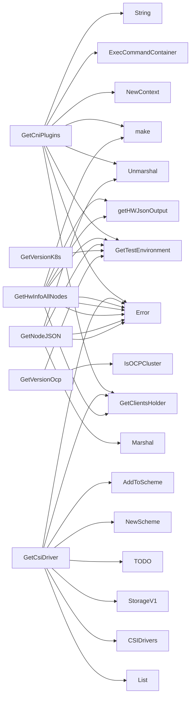

## Package diagnostics (github.com/redhat-best-practices-for-k8s/certsuite/pkg/diagnostics)

# diagnostics package – High‑level overview

The `diagnostics` package provides a set of helper functions that query the Kubernetes cluster and return structured information about nodes, CNI plugins, CSI drivers, and cluster versioning.  
All helpers are *read‑only*: they only read data from the API server or from probe pods; no state is modified.

---

## Key concepts

| Concept | Purpose |
|---------|---------|
| **NodeHwInfo** | Holds low‑level hardware information collected from each node (IP config, block devices, CPU and PCI data). |
| **Probe pod** | A temporary pod created by the tests that runs diagnostic commands inside the node’s container runtime. All `getHW…` helpers use this pod to execute commands such as `ip`, `lsblk`, etc. |
| **Command executor (`clientsholder.Command`)** | Wraps a Kubernetes client and knows how to run a command in a pod container (via `ExecCommandContainer`). |

---

## Data structures

### `NodeHwInfo`

```go
type NodeHwInfo struct {
    IPconfig interface{}   // raw JSON from `ip -j address`
    Lsblk    interface{}   // raw JSON from `lsblk -J`
    Lscpu    interface{}   // raw JSON from `lscpu -json`
    Lspci    []string      // plain text lines from `lspci -nn | grep -E "00:1b.0|00:1c.0"`
}
```

*All fields are stored as the unmarshalled JSON result or string slice; callers decide how to interpret them.*

---

## Global constants

```go
const (
    ipCommand          = "ip -j address"
    lsblkCommand       = "lsblk -J"
    lscpuCommand       = "lscpu -json"
    lspciCommand       = "lspci -nn | grep -E \"00:1b.0|00:1c.0\""
    cniPluginsCommand  = "oc get pods --all-namespaces -o jsonpath='{range .items[*]}{.metadata.name} {.spec.containers[?(@.name=="cni")].image}\n{end}'"
)
```

These are the shell commands executed inside probe pods or via `oc` to fetch cluster‑wide information.

---

## Core helpers

| Function | Return type | What it does |
|----------|-------------|--------------|
| **GetCniPlugins** | `map[string][]interface{}` | Runs `cniPluginsCommand` on the control plane node, parses JSON and returns a map of node name → list of CNI plugin images. |
| **GetCsiDriver** | `map[string]interface{}` | Lists CSI drivers via the Storage API (`storage.k8s.io/v1.CSIDriver`) and serialises the result to JSON. |
| **GetHwInfoAllNodes** | `map[string]NodeHwInfo` | For every node, spawns a probe pod and collects hardware data (IP config, block devices, CPU & PCI) using the helper functions below. |
| **GetNodeJSON** | `map[string]interface{}` | Serialises the entire `corev1.NodeList` returned by the API to a generic map. |
| **GetVersionK8s / GetVersionOcClient / GetVersionOcp** | `string` | Return Kubernetes server version, `oc` client version and OCP release (if applicable). |

---

## Helper functions used by `GetHwInfoAllNodes`

```go
func getHWJsonOutput(pod *corev1.Pod, cmd clientsholder.Command, command string) (interface{}, error)
```
*Executes the given `command` in the probe pod’s container and unmarshals the JSON output.*

```go
func getHWTextOutput(pod *corev1.Pod, cmd clientsholder.Command, command string) ([]string, error)
```
*Runs a command that returns plain text (e.g., `lspci`) and splits it into lines.*

Both helpers create a context with `NewContext`, call `ExecCommandContainer` from the shared client holder, then handle errors.

---

## Typical data flow

```mermaid
flowchart TD
    subgraph Cluster[Cluster]
        oc[oc CLI] -->|runs cniPluginsCommand| node1
        node1[Node] -->|probe pod exec ip/lsblk/lscpu/lspci| probePod
        probePod -->|collects JSON/text| diagnostics.GetHwInfoAllNodes
    end

    GetCniPlugins --> oc
    GetCsiDriver --> storage.k8s.io/v1.CSIDriver API
    GetNodeJSON --> corev1.NodeList API
```

* Each helper obtains a `clientsholder` instance (`GetClientsHolder`) and the test environment (`GetTestEnvironment`).  
* Probe pods are short‑lived; the helpers do not keep any persistent state.

---

## How functions connect

| Function | Called by | Calls |
|----------|-----------|-------|
| **GetCniPlugins** | external callers (tests) | `ExecCommandContainer`, JSON unmarshalling |
| **GetHwInfoAllNodes** | external callers | `getHWJsonOutput`, `getHWTextOutput` per node |
| **getHWJsonOutput / getHWTextOutput** | `GetHwInfoAllNodes` | `ExecCommandContainer`, error handling |
| **GetCsiDriver** | external callers | K8s API `List(CSIDriver)` + serialization |

---

## Usage pattern

```go
hw, err := diagnostics.GetHwInfoAllNodes()
if err != nil { /* handle */ }
fmt.Printf("Node %q has CPU: %+v\n", nodeName, hw[nodeName].Lscpu)
```

The package is intentionally lightweight; it relies on the surrounding test harness (`clientsholder`, `log`) for context creation and command execution.

---

### Structs

- **NodeHwInfo** (exported) — 4 fields, 0 methods

### Functions

- **GetCniPlugins** — func()(map[string][]interface{})
- **GetCsiDriver** — func()(map[string]interface{})
- **GetHwInfoAllNodes** — func()(map[string]NodeHwInfo)
- **GetNodeJSON** — func()(map[string]interface{})
- **GetVersionK8s** — func()(string)
- **GetVersionOcClient** — func()(string)
- **GetVersionOcp** — func()(string)

### Call graph (exported symbols, partial)



### Symbol docs

- [struct NodeHwInfo](symbols/struct_NodeHwInfo.md)
- [function GetCniPlugins](symbols/function_GetCniPlugins.md)
- [function GetCsiDriver](symbols/function_GetCsiDriver.md)
- [function GetHwInfoAllNodes](symbols/function_GetHwInfoAllNodes.md)
- [function GetNodeJSON](symbols/function_GetNodeJSON.md)
- [function GetVersionK8s](symbols/function_GetVersionK8s.md)
- [function GetVersionOcClient](symbols/function_GetVersionOcClient.md)
- [function GetVersionOcp](symbols/function_GetVersionOcp.md)
