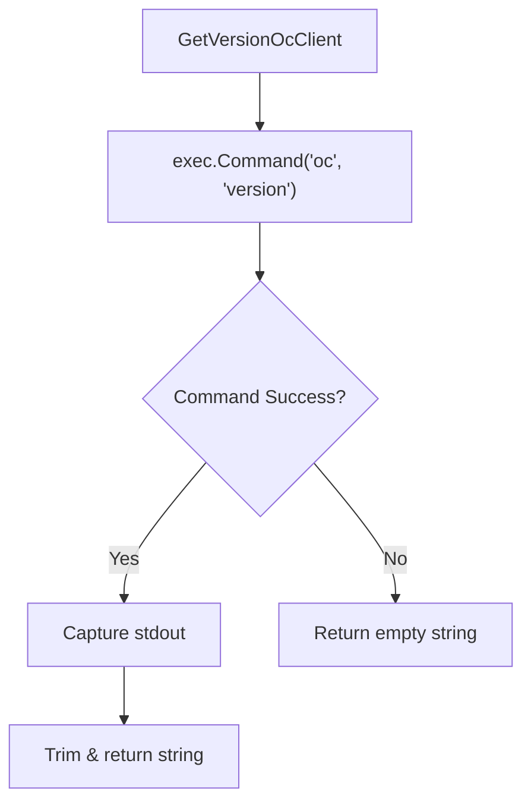

GetVersionOcClient`

**Location**

`pkg/diagnostics/diagnostics.go:199`

**Signature**

```go
func GetVersionOcClient() string
```

---

### Purpose

`GetVersionOcClient` retrieves the version of the OpenShift Client (`oc`) that is installed on the host system.  
It is used by diagnostic routines to:

* Verify that a compatible `oc` binary is available.
* Report the client version in logs or diagnostics output.

The function is **pure**: it does not modify any global state and has no side‑effects other than invoking an external command.

---

### Inputs / Outputs

| Direction | Description |
|-----------|-------------|
| **Input** | None. The function reads the environment only through `exec.Command`. |
| **Output** | A string containing the version information returned by `oc version`. If the command fails or is not found, an empty string (`""`) is returned. |

---

### Key Dependencies

| Dependency | Role |
|------------|------|
| `os/exec` | Executes the external `oc` binary and captures its stdout/stderr. |
| `bytes` | Buffers command output for conversion to a Go string. |
| `strings` | Trims whitespace from the captured output. |

The function relies on the presence of the `oc` executable in the system `PATH`. It does **not** use any of the other diagnostic constants (`lscpuCommand`, `lsblkCommand`, etc.).

---

### Implementation Sketch

```go
func GetVersionOcClient() string {
    cmd := exec.Command("oc", "version")
    var out bytes.Buffer
    cmd.Stdout = &out
    if err := cmd.Run(); err != nil {
        // Command failed (e.g., oc not installed). Return empty string.
        return ""
    }
    return strings.TrimSpace(out.String())
}
```

* The command is invoked with `oc version`.
* Standard output is captured in a buffer.
* On error, an empty string signals that the client could not be queried.

---

### Side Effects

None beyond executing an external binary. The function does **not** modify files, environment variables, or internal state.

---

### Package Context

`diagnostics` collects runtime information about the host and cluster. `GetVersionOcClient` is a small helper used by higher‑level diagnostics functions (e.g., `PrintDiagnostics`, `RunAllChecks`) to embed client version data into diagnostic reports. It keeps the package self‑contained: all interactions with external tools are encapsulated in dedicated helpers.

---

### Suggested Mermaid Diagram



This diagram illustrates the control flow of the function: execution, success/failure handling, and output.
