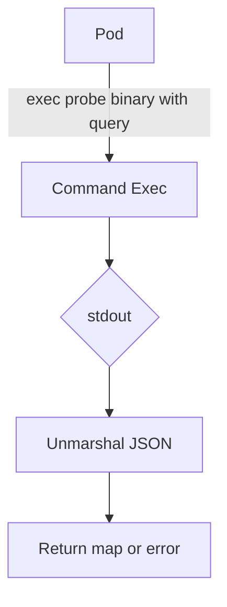

getHWJsonOutput` – internal helper for hardware diagnostics

## Purpose
Collect a raw JSON representation of a pod’s environment by executing a command inside the probe container and unmarshaling the result.

> The function is used only internally in this package (not exported).  
> It powers the higher‑level diagnostic helpers that query *lscpu*, *lsblk*, *lspci*, etc.  

## Signature
```go
func getHWJsonOutput(
    pod *corev1.Pod,          // probe pod to run the command against
    cmd clientsholder.Command,// kubectl exec command wrapper (executes a container)
    query string,             // JSONPath‑style query that selects the part of the output we need
) (interface{}, error)
```

| Parameter | Description |
|-----------|-------------|
| `pod` | The probe pod instance whose container will be queried. |
| `cmd` | A wrapper providing `ExecCommandContainer`, which runs a command inside the pod’s container and returns its stdout/stderr. |
| `query` | A string used with `kubectl`’s JSONPath to extract a subset of the raw JSON output (e.g., `"status.containerStatuses[0].state.running"`). |

## Workflow
1. **Context creation** –  
   ```go
   ctx := context.TODO()
   ```
   The function uses a background context; no cancellation is supported.

2. **Command execution** –  
   Calls `cmd.ExecCommandContainer(ctx, pod.Namespace, pod.Name, "probe", []string{...})`.  
   *The command string consists of the probe binary followed by the JSONPath query.*  
   Errors from exec are wrapped with a diagnostic‑specific message.

3. **Unmarshaling** –  
   The raw stdout is decoded into `map[string]interface{}` via `json.Unmarshal`.  
   If unmarshalling fails, an error is returned.

4. **Return value** –  
   On success, the unmarshaled JSON object (typically a map) is returned; otherwise an error explains what went wrong.

## Key Dependencies
| Dependency | Role |
|------------|------|
| `clientsholder.Command` | Provides the exec interface (`ExecCommandContainer`). |
| `context.TODO()` | Supplies context for the exec call. |
| `encoding/json.Unmarshal` | Parses the command output into Go data structures. |

## Side Effects & Constraints
- **Side effect**: Executes a binary inside the probe pod; it relies on that binary being present and executable.
- **No mutation**: The function does not modify any global state or the passed pod object.
- **Error handling**: All errors are wrapped with context to aid debugging.

## Integration in the Package
`getHWJsonOutput` is a low‑level routine used by higher‑level diagnostic functions such as `GetCPUInfo`, `GetDiskInfo`, etc. Those helpers construct the appropriate JSONPath query, call this function, and then process the returned map into typed structs for users of the diagnostics API.

---

### Suggested Mermaid Diagram


This diagram visualizes the flow from the pod to the final Go data structure.
