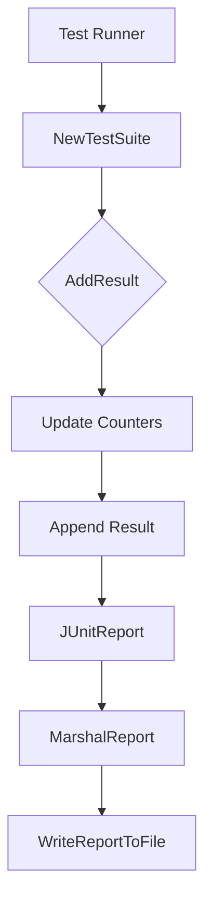

## Package junit (github.com/redhat-best-practices-for-k8s/certsuite/pkg/junit)

## Overview of `github.com/redhat-best-practices-for-k8s/certsuite/pkg/junit`

The **junit** package is responsible for serializing test results into the [JUnit XML format](https://github.com/se-edu/java-test-runner/blob/master/doc/JUnit.md).  
It is a read‑only, small utility used by CertSuite’s testing harness to produce a machine‑readable report that can be consumed by CI systems (Jenkins, GitHub Actions, …).

---

### Key Data Structures

| Type | Purpose |
|------|---------|
| `TestResult` | Holds the outcome of an individual test.  It contains: <br>• `Name` – human‑friendly identifier.<br>• `Status` – one of *pass*, *fail*, *skip*.<br>• `Duration` – time taken in seconds.<br>• Optional `ErrorMessage` and `StackTrace`. |
| `TestSuite` | Represents a collection of tests that belong together (e.g., all tests for a particular compliance check).  It stores: <br>• `Name` – suite identifier.<br>• `Tests`, `Failures`, `Errors`, `Skipped` counters.<br>• `Timestamp` – when the run started.<br>• Slice of *TestResult* objects. |
| `JUnitReport` | The top‑level container for one or more `TestSuite`s.  This struct is marshalled into XML with the proper `<testsuites>` root element. |

> **Note:** These structs are *plain* Go structs without methods; all logic lives in helper functions.

---

### Global Variables

| Variable | Type | Role |
|----------|------|------|
| `defaultTimestampFormat` | `string` | Format string used to serialize timestamps (`time.RFC3339`). |

No other globals exist; the package is intentionally stateless.

---

### Core Functions

| Function | Signature | Responsibility |
|----------|-----------|----------------|
| `NewTestSuite(name string) *TestSuite` | Creates an empty suite, initializing counters and timestamp. |
| `AddResult(suite *TestSuite, res TestResult)` | Updates suite counters based on the result’s status, appends to the slice. |
| `MarshalReport(report JUnitReport) ([]byte, error)` | Serialises a `JUnitReport` into XML compliant with the JUnit schema. Uses `encoding/xml`. |
| `WriteReportToFile(report JUnitReport, path string) error` | Convenience wrapper: marshals and writes to disk; creates directories if needed. |

> **Flow**  
> 1. The test harness calls `NewTestSuite()` for each logical group.<br>
> 2. As tests finish, `AddResult()` is invoked with the outcome.<br>
> 3. After all suites are populated, a single `JUnitReport` aggregates them.<br>
> 4. Finally, `WriteReportToFile()` produces the final XML file.

---

### How It Fits Into CertSuite

* The **CertSuite** test runner gathers results from various compliance checks (e.g., CIS, OCP, RHEL).  
* For each check it builds a `TestSuite`, feeding individual test outcomes via `AddResult()`.  
* Once the entire run completes, the harness compiles all suites into a `JUnitReport` and writes it to `certsuite-results.xml`.  
* CI pipelines consume this file to display test trends, failure counts, etc.

---

### Suggested Mermaid Diagram



This diagram captures the linear progression from test discovery to XML output.

---

### Summary

- **Data structures** (`TestResult`, `TestSuite`, `JUnitReport`) model individual tests, grouped suites, and the overall report.  
- **Globals** are minimal; only a timestamp format is stored.  
- **Functions** orchestrate creation, aggregation, serialization, and persistence of JUnit XML.  
- The package plays a critical role in making CertSuite’s results consumable by external tooling without adding runtime state or side‑effects.

### Call graph (exported symbols, partial)

```mermaid
graph LR
```

### Symbol docs

