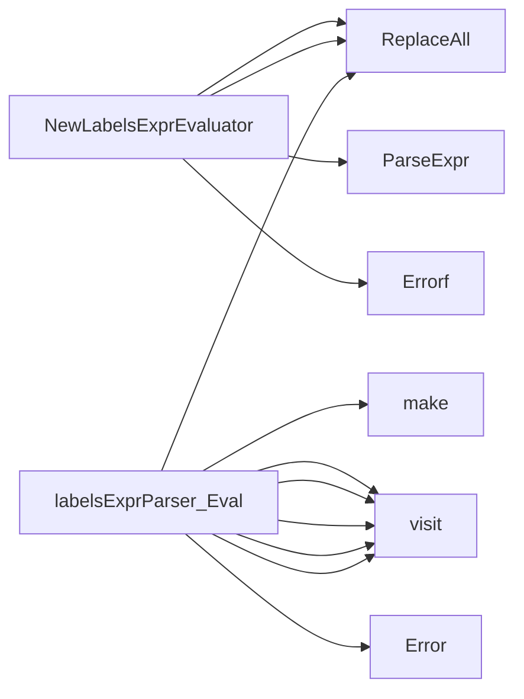

## Package labels (github.com/redhat-best-practices-for-k8s/certsuite/pkg/labels)

### Structs

- **labelsExprParser**  — 1 fields, 1 methods

### Interfaces

- **LabelsExprEvaluator** (exported) — 1 methods

### Functions

- **NewLabelsExprEvaluator** — func(string)(LabelsExprEvaluator, error)
- **labelsExprParser.Eval** — func([]string)(bool)

### Call graph (exported symbols, partial)

### Symbol docs

- [interface LabelsExprEvaluator](symbols/interface_LabelsExprEvaluator.md)
- [function NewLabelsExprEvaluator](symbols/function_NewLabelsExprEvaluator.md)
- [function labelsExprParser.Eval](symbols/function_labelsExprParser_Eval.md)
