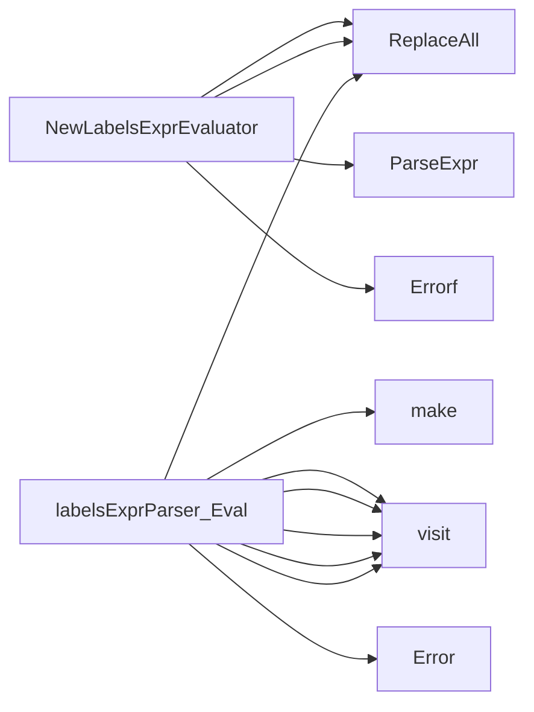

## Package labels (github.com/redhat-best-practices-for-k8s/certsuite/pkg/labels)

# Package Overview – `github.com/redhat-best-practices-for-k8s/certsuite/pkg/labels`

The **`labels`** package implements a tiny expression language that lets users filter Kubernetes objects by their labels.  
At runtime the user supplies an expression such as

```
"app=web && (env=prod || env=test)"
```

and the package evaluates it against a slice of label strings (`[]string{"app=web", "env=prod"}`) returning `true` if the object satisfies the filter.

The implementation is intentionally lightweight: it parses the expression into an *AST* once and then walks that tree for every evaluation.  No external dependencies are required beyond the standard library and a small internal logger.

---

## Core Concepts

| Element | Role |
|---------|------|
| **`LabelsExprEvaluator`** | Interface exposed to callers. Only one method: `Eval([]string) bool`. |
| **`labelsExprParser`** | Concrete struct that implements `LabelsExprEvaluator`. Holds the parsed expression tree (`astRootNode`). |
| **Expression Syntax** | Basic boolean logic with `&&`, `||`, and parentheses. Labels are compared using equality (`key=value`). No inequality or functions. |

---

## Data Structures

```go
type labelsExprParser struct {
    astRootNode ast.Expr   // Root of the parsed AST
}
```

* The parser stores the *abstract syntax tree* generated by Go’s `parser.ParseExpr`.  
  This is a generic `ast.Expr` that may be any combination of binary expressions, identifiers, literals, or parenthesised sub‑expressions.

---

## Key Functions

### `NewLabelsExprEvaluator(expr string) (LabelsExprEvaluator, error)`

1. **Sanitisation** – replaces all `&` and `|` with the Go operators `&&` / `||`.  
   This allows users to write expressions in a more natural form.
2. **Parsing** – uses `parser.ParseExpr` to turn the string into an `ast.Expr`.  
   Errors propagate back to the caller (`fmt.Errorf` is used for clear messages).
3. **Return** – constructs a `labelsExprParser` with the resulting AST.

> *Why parse with Go’s parser?*  
> It guarantees correct precedence, handles parentheses automatically, and eliminates the need to write a custom lexer / parser.

---

### `func (l labelsExprParser) Eval(labels []string) bool`

1. **Pre‑processing** – builds a map (`labelMap`) of key→value for fast lookup.  
   `make(map[string]string)` is used to store label pairs.
2. **AST Walk** – the helper function `visit` recursively traverses the AST:
   * **Binary expressions** – evaluate left & right sides and combine with `&&` / `||`.  
   * **Parentheses** – simply recurse into the sub‑expression.  
   * **Basic label comparison** – for an expression like `"app=web"`, check if `labelMap["app"] == "web"`.
3. **Error handling** – any unexpected node type causes a log entry via `log.Error` and returns `false`.  
4. **Result** – the boolean result of the whole expression is returned.

---

## How It All Connects

```mermaid
flowchart TD
    UserInput((Expression string))
    Parser{{ParseExpr}}
    AST[AST (ast.Expr)]
    Evaluator[labelsExprParser]
    LabelsSlice(([]string))
    LabelMap{key→value map}
    EvalFunc["Eval(labels []string) bool"]
    Result((bool))

    UserInput -->|sanitise| Parser
    Parser --> AST
    AST --> Evaluator
    Evaluator --> EvalFunc
    EvalFunc --> LabelsSlice
    EvalFunc -->|build map| LabelMap
    EvalFunc -->|walk AST| Result
```

* **Step 1 – Construction**: `NewLabelsExprEvaluator` parses the expression once, creating an evaluator.  
* **Step 2 – Evaluation**: For every object, `Eval` is called with its label slice; it builds a map and walks the stored AST to decide whether the object matches.

Because the AST is reused, repeated evaluations are inexpensive—only the map construction and tree walk incur per‑object cost.

---

## Usage Example

```go
expr := "app=web && (env=prod || env=test)"
evaluator, err := labels.NewLabelsExprEvaluator(expr)
if err != nil { log.Fatal(err) }

objLabels := []string{"app=web", "env=prod"}
matches := evaluator.Eval(objLabels) // true
```

---

## Summary

* **Single entry point** – `NewLabelsExprEvaluator` turns a string into an evaluator.  
* **Lightweight runtime** – uses Go’s built‑in parser and simple map lookups.  
* **Extensibility** – the design keeps parsing logic isolated; adding new operators would only affect the `visit` function.  

The package is deliberately small yet expressive enough for most label‑based filtering needs in a Kubernetes context.

### Structs

- **labelsExprParser**  — 1 fields, 1 methods

### Interfaces

- **LabelsExprEvaluator** (exported) — 1 methods

### Functions

- **NewLabelsExprEvaluator** — func(string)(LabelsExprEvaluator, error)
- **labelsExprParser.Eval** — func([]string)(bool)

### Call graph (exported symbols, partial)



### Symbol docs

- [interface LabelsExprEvaluator](symbols/interface_LabelsExprEvaluator.md)
- [function NewLabelsExprEvaluator](symbols/function_NewLabelsExprEvaluator.md)
- [function labelsExprParser.Eval](symbols/function_labelsExprParser_Eval.md)
