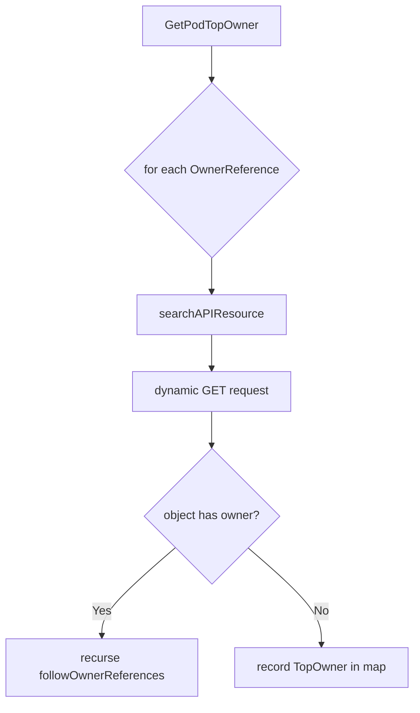
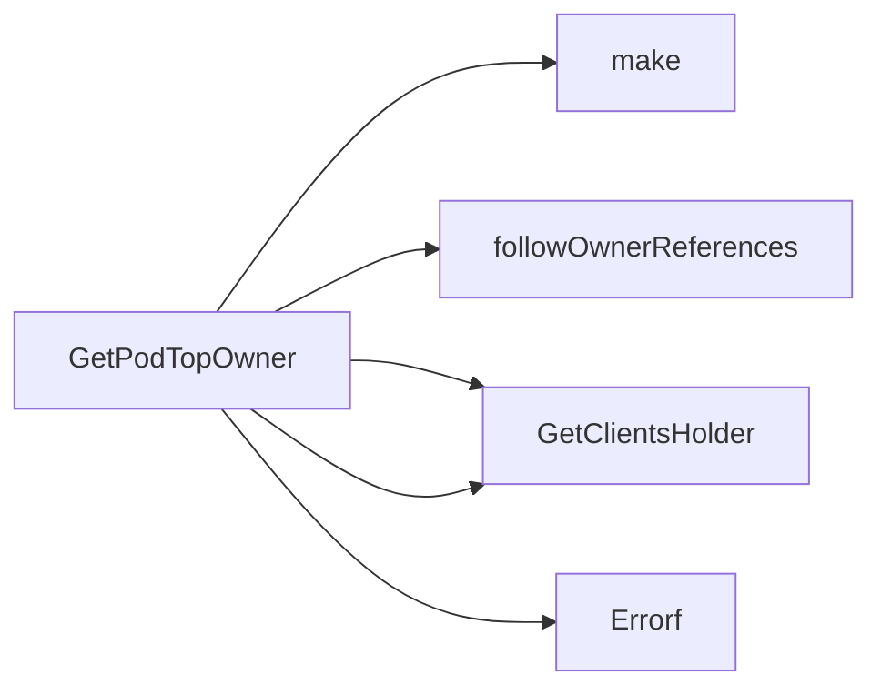

## Package podhelper (github.com/redhat-best-practices-for-k8s/certsuite/pkg/podhelper)

# podhelper package – Overview

The **`podhelper`** package is a small utility that walks the ownership tree of a Kubernetes Pod and reports the *top‑level* owners (e.g., ReplicaSet, Deployment, StatefulSet, DaemonSet, etc.).  
It exposes one public function `GetPodTopOwner`, which returns a map keyed by pod name containing the highest‑level owner for each pod.

> **Why this is useful** – In many compliance checks or runtime diagnostics we need to know *which controller* ultimately owns a Pod.  
> The ownership chain can be several levels deep (Pod → ReplicaSet → Deployment → OwnerReference).  
> `podhelper` resolves that chain using the Kubernetes dynamic client, making it reusable across any client configuration.

---

## Data structures

| Name | Exported | Purpose |
|------|----------|---------|
| **TopOwner** | ✅ | Holds a concise representation of an object that owns (directly or indirectly) a pod.  Fields are identical to the standard Kubernetes `OwnerReference` plus `Namespace`. |

```go
type TopOwner struct {
    APIVersion string // e.g., "apps/v1"
    Kind       string // e.g., "Deployment"
    Name       string // name of the owning object
    Namespace  string // namespace in which the owner resides
}
```

> **Note** – `TopOwner` is deliberately minimal; it only contains information needed for reporting and not the full CRD spec.

---

## Core functions

### 1. `GetPodTopOwner`

```go
func GetPodTopOwner(podName string, podOwners []metav1.OwnerReference) (map[string]TopOwner, error)
```

* **Input**  
  * `podName` – the name of the Pod we’re investigating.  
  * `podOwners` – the slice of `OwnerReference`s attached to that Pod.

* **Process**  
  1. Creates a map with an entry for the pod (`topOwners[podName] = TopOwner{}`).
  2. Calls `followOwnerReferences` to walk each owner chain recursively.
  3. Handles errors from the dynamic client and returns them up the call stack.

* **Output**  
  * A map where key is pod name, value is its highest‑level owner (`TopOwner`).  
  * `nil` error on success; otherwise an informative `fmt.Errorf`.

---

### 2. `followOwnerReferences`

```go
func followOwnerReferences(
    apiResources []*metav1.APIResourceList,
    dynClient dynamic.Interface,
    topOwners map[string]TopOwner,
    namespace string,
    owners []metav1.OwnerReference,
) error
```

* **Role** – Recursively traverses the ownership chain until it reaches an object that has no owner (i.e., a *top‑level* controller).  
* **Key steps**  
  1. For each `OwnerReference` in `owners`:  
     * Find the matching `APIResource` via `searchAPIResource`.  
     * Build a dynamic client request: `dynClient.Resource(gvr).Namespace(namespace).Get(...)`.
  2. If the object is **not found** (`errors.IsNotFound`) it logs a warning and skips further recursion.
  3. Inspect the retrieved object's own `OwnerReferences`:
     * If none → we have reached a top owner; populate `topOwners[podName]`.
     * Else → recurse with those owners.

* **Dependencies**  
  * `searchAPIResource` – locate the `APIResource` for a given kind and API version.  
  * Kubernetes dynamic client (`dynamic.Interface`) – performs generic GET calls.

---

### 3. `searchAPIResource`

```go
func searchAPIResource(kind, apiVersion string, resources []*metav1.APIResourceList) (*metav1.APIResource, error)
```

* **Purpose** – Helper that scans a list of `APIResourceList`s (obtained from the discovery API) to find an `APIResource` matching the requested kind and API version.  
* Returns an error if no match is found.

---

## How it all fits together



1. `GetPodTopOwner` starts the process for a single Pod.
2. For each immediate owner it looks up the corresponding resource type (`searchAPIResource`) and fetches the object via the dynamic client.
3. If that object itself has an owner, recursion continues; otherwise the current object is recorded as the *top* owner.

---

## Global state

The package does **not** define any global variables or constants.  
All state flows through function parameters, making it straightforward to test and to use in concurrent contexts.

---

## Usage snippet

```go
import (
    "github.com/redhat-best-practices-for-k8s/certsuite/pkg/podhelper"
)

func main() {
    // Assume `podOwners` has been extracted from a Pod object
    topOwners, err := podhelper.GetPodTopOwner("my-pod", podOwners)
    if err != nil { /* handle error */ }

    fmt.Printf("Top owner of my-pod: %+v\n", topOwners["my-pod"])
}
```

---

## Summary

* **Single public API** – `GetPodTopOwner`.
* **Recursive traversal** using the dynamic client, no hard‑coded resource types.
* **Minimal data model** (`TopOwner`) sufficient for reporting ownership.
* **No global state**, making it thread‑safe and testable.

This design keeps the implementation concise while covering all typical ownership scenarios encountered in Kubernetes workloads.

### Structs

- **TopOwner** (exported) — 4 fields, 0 methods

### Functions

- **GetPodTopOwner** — func(string, []metav1.OwnerReference)(map[string]TopOwner, error)

### Call graph (exported symbols, partial)



### Symbol docs

- [struct TopOwner](symbols/struct_TopOwner.md)
- [function GetPodTopOwner](symbols/function_GetPodTopOwner.md)
