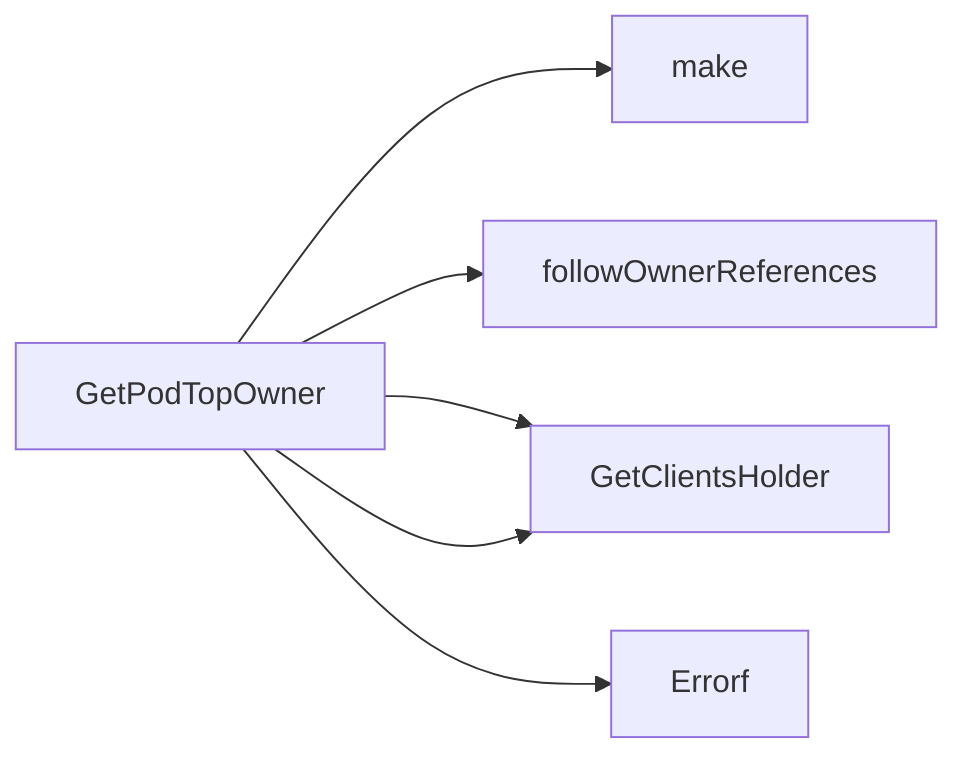

## Package podhelper (github.com/redhat-best-practices-for-k8s/certsuite/pkg/podhelper)

### Structs

- **TopOwner** (exported) — 4 fields, 0 methods

### Functions

- **GetPodTopOwner** — func(string, []metav1.OwnerReference)(map[string]TopOwner, error)

### Call graph (exported symbols, partial)

### Symbol docs

- [struct TopOwner](symbols/struct_TopOwner.md)
- [function GetPodTopOwner](symbols/function_GetPodTopOwner.md)
