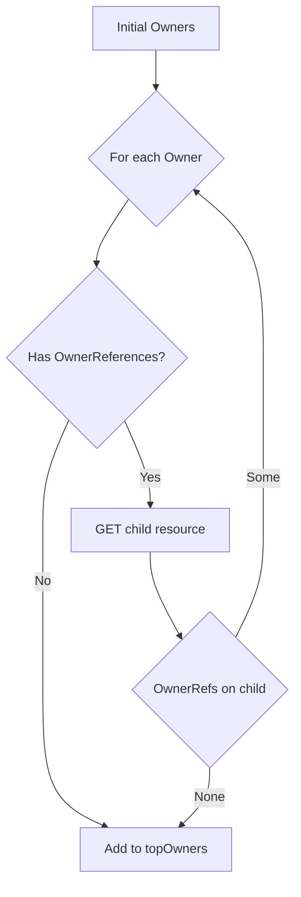

followOwnerReferences`

| Feature | Detail |
|---------|--------|
| **Package** | `podhelper` (`github.com/redhat-best-practices-for-k8s/certsuite/pkg/podhelper`) |
| **Visibility** | Unexported – internal helper used only within this package. |
| **Signature** | ```go
func followOwnerReferences(
    apiResourceLists []*metav1.APIResourceList,
    dynClient dynamic.Interface,
    topOwners map[string]TopOwner,
    namespace string,
    owners []metav1.OwnerReference,
) error
``` |

### Purpose

`followOwnerReferences` walks an **ownership chain** of Kubernetes objects to discover the *top‑level* owner(s).  
Given a list of `APIResourceList`s (the discovery data), a dynamic client, and an initial set of `OwnerReference`s, it recursively resolves each reference until it reaches objects that have no further owners. Those top‑level objects are stored in the supplied `topOwners` map.

### Inputs

| Parameter | Type | Role |
|-----------|------|------|
| `apiResourceLists` | `[]*metav1.APIResourceList` | Discovery information used to locate a resource’s group/version and plural name. |
| `dynClient` | `dynamic.Interface` | Dynamic Kubernetes client used for runtime GETs of resources during traversal. |
| `topOwners` | `map[string]TopOwner` | Accumulator map keyed by an owner identifier (e.g., UID). The function populates it with discovered top owners. |
| `namespace` | `string` | Namespace of the current object being examined. Used when fetching child resources. |
| `owners` | `[]metav1.OwnerReference` | List of owners for the current object; the function processes each one recursively. |

### Outputs

* **error** – Returns an error if any step fails (e.g., missing API resource, failed GET).  
  A successful run returns `nil`; all discovered top owners are stored in `topOwners`.

### Key Dependencies & Flow

1. **`searchAPIResource`**  
   Locates the `GroupVersionKind` and plural name for a given kind using `apiResourceLists`. If not found, an error is returned.

2. **`ParseGroupVersion`** (from `k8s.io/apimachinery/pkg/runtime/schema`)  
   Parses the group/version string obtained from discovery to create a `schema.GroupVersion`.

3. **Dynamic Client (`dynClient.Get`)**  
   Retrieves the child resource identified by its namespace, plural name, and UID. The call is made via:
   ```go
   dynClient.Resource(gv.WithResource(plural)).
       Namespace(namespace).Get(ctx, uid, metav1.GetOptions{})
   ```

4. **Owner Traversal**  
   - If the retrieved object has no `OwnerReferences`, it’s considered a top owner and added to `topOwners`.
   - Otherwise, its owners are extracted with `GetOwnerReferences` and `followOwnerReferences` is called recursively.

5. **Error Handling**  
   - Uses `errors.IsNotFound` to ignore missing resources (treated as no further owners).
   - All other errors propagate up the call chain via `fmt.Errorf`.

### Side Effects

* Mutates the supplied `topOwners` map by inserting entries for each discovered top owner.
* Performs network calls against the Kubernetes API server through `dynClient`, potentially impacting latency and rate limits.

### Package Context

Within `podhelper`, this function supports higher‑level utilities that need to understand pod ownership—for example, determining which controller (Deployment, ReplicaSet, etc.) ultimately manages a pod. By resolving the ownership chain, downstream code can make decisions based on top‑level controllers rather than intermediate resources.

---

#### Suggested Mermaid Diagram



This visual captures the recursive descent until a root owner is reached.
