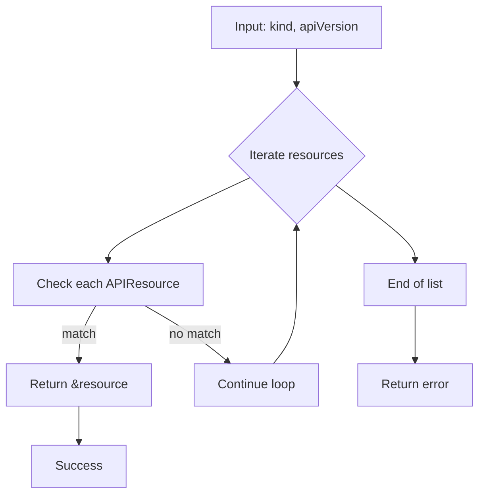

searchAPIResource`

| Item | Details |
|------|---------|
| **Package** | `github.com/redhat-best-practices-for-k8s/certsuite/pkg/podhelper` |
| **Location** | `/Users/deliedit/dev/certsuite/pkg/podhelper/podhelper.go:87` |
| **Signature** | `func searchAPIResource(kind, apiVersion string, resources []*metav1.APIResourceList) (*metav1.APIResource, error)` |

## Purpose
`searchAPIResource` is a helper that looks up an API resource definition by its **kind** and **apiVersion** within a slice of `*metav1.APIResourceList`.  
It returns the first matching `*metav1.APIResource`, or an error if none is found.

## Parameters

| Name | Type | Description |
|------|------|-------------|
| `kind` | `string` | The Kubernetes resource kind (e.g., `"Pod"`, `"Deployment"`). |
| `apiVersion` | `string` | Full API version string (e.g., `"v1"`, `"apps/v1"`). |
| `resources` | `[]*metav1.APIResourceList` | List of resource lists fetched from the Kubernetes discovery API. |

## Return Values

| Type | Description |
|------|-------------|
| `*metav1.APIResource` | Pointer to the matching resource definition, or `nil`. |
| `error` | Non‑nil if no matching resource is found; otherwise `nil`. |

## Algorithm
```text
for each APIResourceList in resources:
    for each APIResource in list.Resources:
        if resource.Kind == kind && resource.GroupVersion == apiVersion:
            return &resource, nil
return nil, fmt.Errorf("API resource %s/%s not found", kind, apiVersion)
```
The function uses `fmt.Errorf` (aliased as `Errorf`) to construct the error message.

## Dependencies

* **k8s.io/apimachinery/pkg/apis/meta/v1** – provides `APIResourceList` and `APIResource`.
* **fmt** – for formatting error messages (`Errorf`).

No external global state is read or modified; all inputs are function parameters, making this a pure helper with no side effects.

## Integration in the Package

The `podhelper` package deals with operations on Kubernetes pods.  
When creating or inspecting a pod, the code often needs to translate between resource kinds and the corresponding API objects. `searchAPIResource` is used by other functions in the package (e.g., when generating manifests or querying the cluster) to resolve the exact API resource information required for subsequent REST calls.

---

### Suggested Mermaid Diagram



This diagram visualizes the linear search performed by `searchAPIResource`.
