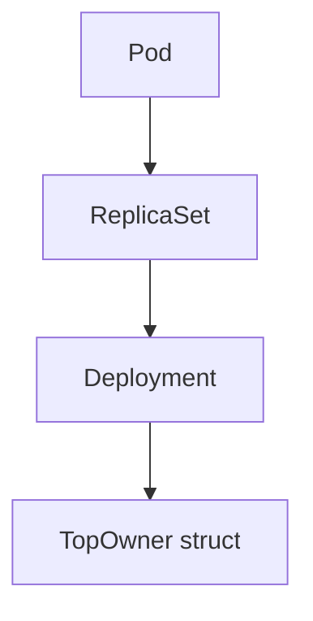

TopOwner`

```go
// TopOwner represents the highest‑level Kubernetes object that owns a pod.
// It is returned by the helper functions in this package when tracing the
// ownership chain (pod → ReplicaSet → Deployment, etc.).
type TopOwner struct {
    APIVersion string // API group/version of the owner, e.g. "apps/v1"
    Kind       string // Resource kind, e.g. "Deployment"
    Name       string // Metadata name of the owner object
    Namespace  string // Namespace where the owner lives (empty for cluster‑scoped resources)
}
```

### Purpose

* **Identity** – Stores a unique identifier for the top‑level controller that ultimately created or manages a pod.
* **Tracing** – Enables callers to map any pod back to the Deployment, StatefulSet, DaemonSet, Job, etc. that owns it.
* **Filtering/Reporting** – The returned `map[string]TopOwner` from `GetPodTopOwner` allows consumers (e.g., tests or metrics) to group pods by their top owner.

### Typical Usage Flow

1. **Call** `GetPodTopOwner(podNamespace, podOwners)`  
   *Input*: a namespace string and the slice of `metav1.OwnerReference`s attached to a pod.  
2. **Recursion** – Internally it calls `followOwnerReferences`, which walks up the ownership tree using the Kubernetes API until it reaches an object with no further owners (the “top”).
3. **Result** – A map keyed by pod name whose value is a `TopOwner` instance describing that pod’s ultimate owner.



### Fields

| Field | Type   | Description |
|-------|--------|-------------|
| `APIVersion` | `string` | The API group and version of the top owner (e.g., `"apps/v1"`). |
| `Kind`        | `string` | The Kubernetes kind (`"Deployment"`, `"StatefulSet"`, etc.). |
| `Name`        | `string` | Object name from the resource’s metadata. |
| `Namespace`   | `string` | Namespace of the owner; empty for cluster‑scoped resources like DaemonSets in some cases. |

### Dependencies

* **`metav1.OwnerReference`** – The input to `GetPodTopOwner`; each reference contains a `Kind`, `APIVersion`, and `Name` that are used to build the `TopOwner`.
* **Kubernetes dynamic client** – Used by `followOwnerReferences` to fetch owner objects when traversing the chain.

### Side‑Effects

The struct itself is immutable; creating or assigning it has no side effects.  
Only the functions that produce it (`GetPodTopOwner`, `followOwnerReferences`) interact with the Kubernetes API, potentially incurring network latency and requiring proper client configuration (handled by `GetClientsHolder`).

---

**In Summary:**  
`TopOwner` is a lightweight DTO that captures the essential identity of a pod’s ultimate controlling object. It is produced by the helper functions to enable downstream code to reason about ownership relationships without re‑implementing the recursive lookup logic.
