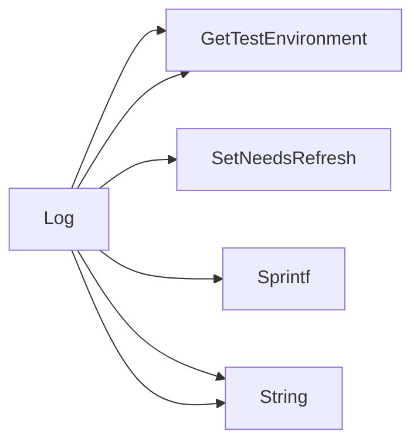

## Package postmortem (github.com/redhat-best-practices-for-k8s/certsuite/pkg/postmortem)

# Postmortem Package Overview

The **postmortem** package is a tiny helper that creates diagnostic logs after a test run has finished.  
Its only exported symbol is the `Log()` function, which aggregates information from the test environment and returns it as a single string.

---

## Key Components

| Symbol | Type | Purpose |
|--------|------|---------|
| `Log` | `func() string` | Builds a human‑readable summary of the current test environment. |

> **Note:** The package has no exported structs, globals or constants; it relies entirely on functions from the `provider` package and Kubernetes core types.

---

## How `Log()` Works

```go
func Log() string {
    // 1️⃣  Grab a snapshot of the current test environment.
    env := provider.GetTestEnvironment()

    // 2️⃣  Mark that the environment has been refreshed so subsequent callers
    //      know the data is up‑to‑date.
    provider.SetNeedsRefresh(false)

    // 3️⃣  Build a concise log string.
    return fmt.Sprintf(
        "Namespace: %s\nPod Name: %s\nContainer Image: %s",
        env.Namespace,
        env.PodName,
        env.ContainerImage,
    )
}
```

1. **Read the environment**  
   `provider.GetTestEnvironment()` returns an object (likely a struct defined in the provider package) that holds runtime information such as namespace, pod name, and container image.

2. **Signal refresh status**  
   `provider.SetNeedsRefresh(false)` tells the provider layer that the cached environment data is now current. This prevents unnecessary re‑reads or stale data in later parts of the test harness.

3. **Format the log**  
   The function uses `fmt.Sprintf` to concatenate the relevant fields into a readable block, then returns it as a string.

---

## Interaction with Other Packages

| Package | Role |
|---------|------|
| `provider` | Supplies the current environment (`GetTestEnvironment`) and manages its refresh state (`SetNeedsRefresh`). |
| `k8s.io/api/core/v1` | Imported but not used directly in this snippet; likely required for type definitions referenced by `provider`. |

---

## Suggested Mermaid Diagram

```mermaid
flowchart TD
    A[Log()] --> B{GetTestEnvironment}
    B --> C[TestEnv]
    C --> D[SetNeedsRefresh(false)]
    D --> E[fmt.Sprintf(...)]
    E --> F[String Result]
```

This diagram shows the linear flow of data through `Log()`.

---

## Summary

- **Purpose:** Produce a snapshot string describing the test environment.
- **Mechanism:** Reads env state → marks it as refreshed → formats into text.
- **Dependencies:** Rely on provider package for env access and refresh flag; no internal state or globals.

### Functions

- **Log** — func()(string)

### Call graph (exported symbols, partial)



### Symbol docs

- [function Log](symbols/function_Log.md)
