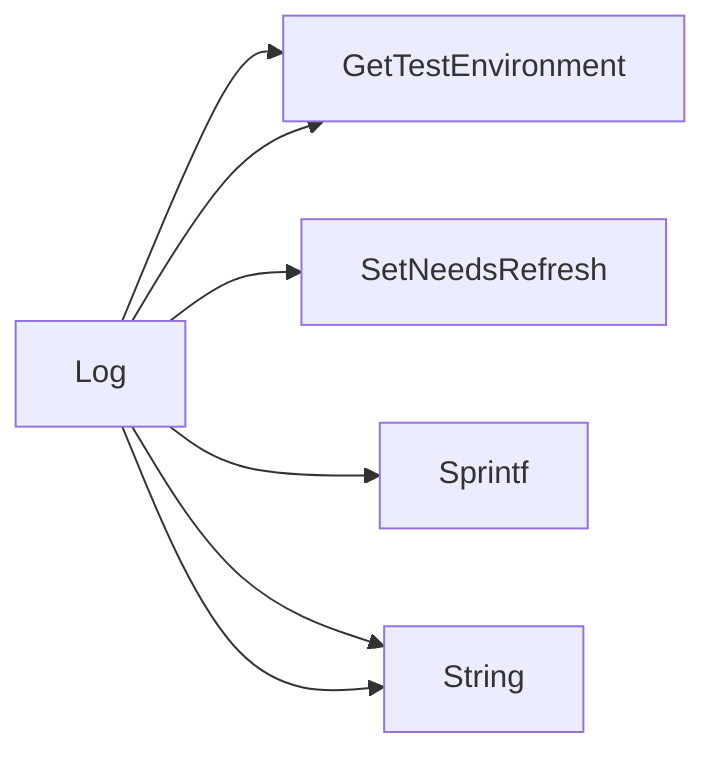

## Package postmortem (github.com/redhat-best-practices-for-k8s/certsuite/pkg/postmortem)

### Functions

- **Log** — func()(string)

### Call graph (exported symbols, partial)

### Symbol docs

- [function Log](symbols/function_Log.md)
