## Package provider (github.com/redhat-best-practices-for-k8s/certsuite/pkg/provider)

## Overview – `github.com/redhat‑best‑practices‑for‑k8s/certsuite/pkg/provider`

The *provider* package is the core data‑model and discovery layer of **CertSuite**.  
It gathers all information about a running OpenShift/Kubernetes cluster (nodes,
pods, operators, CRDs, network policies, etc.) into strongly typed Go structs
and exposes helper methods that implement the logic required by the test
suite.

> **Key points**
> * All structs embed the original Kubernetes objects – this keeps the full API
>   surface while adding convenience helpers.
> * A single `TestEnvironment` instance is built once (via `GetTestEnvironment`) and
>   holds the entire cluster state that is used by all tests.
> * The package contains a handful of global constants/variables that drive
>   discovery behaviour.

Below we walk through the main data structures, globals and most important
functions, showing how they are connected.

---

### 1. Global configuration

| Name | Type | Purpose |
|------|------|---------|
| `MasterLabels` / `WorkerLabels` | `[]string` | Lists of node role labels used to classify control‑plane vs worker nodes. |
| `env`, `loaded` | `bool` | Used by the lazy singleton that creates the `TestEnvironment`. |
| Constants such as `DaemonSetName`, `CniNetworksStatusKey`, `IstioProxyContainerName` | `string` / `int` | Hard‑coded values used in discovery (e.g. name of the privileged DaemonSet). |

---

### 2. Core data structures

All structs embed a *raw* Kubernetes object and add fields/methods that are
specific to CertSuite.

| Struct | Embedded type | Added fields / purpose |
|--------|---------------|-----------------------|
| **`TestEnvironment`** | `-` | Holds the entire cluster snapshot: lists of nodes, pods, operators, CRDs, etc.  It also contains configuration (`config`, `params`) and a few runtime flags (`SkipPreflight`). |
| **`Node`** | `*corev1.Node` | Adds a cached `MachineConfig` (from OpenShift) and helper methods to identify the OS (`IsRHEL`, `IsCSCOS`, …). |
| **`Pod`** | `*corev1.Pod` | Stores containers, network info, and helpers for compliance checks (`IsPodGuaranteed`, `HasHugepages`, …). |
| **`Container`** | `*corev1.Container` | Adds image identification, preflight results storage, and helper methods to check security contexts. |
| **`Deployment`, `StatefulSet`** | `*appsv1.Deployment` / `*appsv1.StatefulSet` | Simple wrappers with `Is…Ready` helpers. |
| **`Operator`** | `-` | Represents an OLM Operator: channel, CSV, install plans, operand pods, etc. |
| **`CrScale`, `ScaleObject`** | `scalingv1.Scale` | Wraps a Kubernetes Scale object and provides readiness checks. |
| **`Event`** | `*corev1.Event` | Simple string representation. |
| **`MachineConfig`** | `*mcv1.MachineConfig` | Adds parsed `Systemd.Units`. |

> **Example: `Pod.IsPodGuaranteed`**

```go
func (p *Pod) IsPodGuaranteed() bool {
    return AreResourcesIdentical(p)
}
```

The helper uses the cluster‑wide functions defined in `isolation.go`.

---

### 3. Discovery helpers – building a `TestEnvironment`

| Function | Return type | Key steps |
|----------|-------------|-----------|
| `GetTestEnvironment()` | `TestEnvironment` | Calls `buildTestEnvironment()` (lazy init). |
| `buildTestEnvironment()` | `func() TestEnvironment` | 1. Load config & parameters.<br>2. Deploy the privileged DaemonSet that collects node data.<br>3. Auto‑discover all resources: nodes, pods, operators, CRDs, etc.<br>4. Build maps (`AllServiceAccountsMap`, `CSVToPodListMap`). |
| `deployDaemonSet(name string)` | error | Creates the DaemonSet and waits for readiness. |
| `createNodes([]corev1.Node) map[string]Node` | `map[string]Node` | Builds a map keyed by node name, enriching each with its MachineConfig if it’s an OpenShift cluster. |
| `createOperators(...) []Operator` | `[]*Operator` | For every CSV & subscription builds the operator object and attaches operand pods. |

> **Diagram – Discovery flow**

```mermaid
graph TD;
    Config --> Parameters;
    Parameters --> DaemonSet[Deploy privileged DaemonSet];
    DaemonSet --> NodeList[Get nodes];
    NodeList --> MachineConfig[Retrieve MachineConfigs];
    NodeList --> PodList[Get pods];
    PodList --> OperatorList[Discover Operators (CSV, Subscriptions)];
    OperatorList --> OperandPods[Attach operand pods];
    AllTogether-->TestEnvironment;
```

---

### 4. Filtering helpers

The package provides a set of `Get…` methods on `TestEnvironment` that return
filtered slices based on various compliance rules.

| Method | Filters applied |
|--------|-----------------|
| `GetGuaranteedPods()` | Pods where requests == limits (`IsPodGuaranteed`). |
| `GetGuaranteedPodsWithExclusiveCPUs()` | Guaranteed pods + `AreCPUResourcesWholeUnits`. |
| `GetHugepagesPods()` | Pods with hugepage resources. |
| `GetPodsUsingSRIOV()` | Pods that use a SR‑IOV network attachment definition. |
| `GetAffinityRequiredPods()` | Pods with the label set by `AffinityRequiredKey`. |
| … | Many more (see functions list). |

These helpers are used in tests to iterate over relevant subsets of pods.

---

### 5. Preflight integration

CertSuite runs preflight checks against containers and operators:

* **`Container.SetPreflightResults()`** – launches the *openshift‑preflight*
  binary inside the container, collects results, and stores them in
  `PreflightResultsDB`.

* **`Operator.SetPreflightResults()`** – does the same for an operator’s pods.

The helper uses a temporary buffer writer to capture preflight output and
parses it into `PreflightTest` structs (`Name`, `Description`, `Remediation`,
etc.).

---

### 6. Helper functions

A few utility functions are used throughout:

* **Resource comparison** – `AreResourcesIdentical` and `AreCPUResourcesWholeUnits`
  compare container requests/limits to decide if a pod is guaranteed or uses
  whole CPU units.

* **Network helpers** – `GetPodIPsPerNet`, `GetCNCFNetworksNamesFromPodAnnotation`,
  `isNetworkAttachmentDefinitionConfigTypeSRIOV` etc. extract Multus network info.

* **Operator helpers** – `getAtLeastOneCsv`, `getAtLeastOneInstallPlan`,
  `getCatalogSourceImageIndexFromInstallPlan` assist in determining operator
  readiness.

---

## Take‑away

The *provider* package is a data‑centric layer that:

1. **Collects** all Kubernetes/Operator resources into enriched Go structs.
2. **Exposes** convenience methods to classify nodes, pods and operators.
3. **Filters** the cluster state for specific compliance checks (e.g. guaranteed
   pods, SR‑IOV usage).
4. **Runs** preflight tests on containers/operators and stores results.

All logic is read‑only – no mutation of the live cluster occurs – making it a
safe discovery layer that can be reused by different test suites.

### Structs

- **CniNetworkInterface** (exported) — 6 fields, 0 methods
- **Container** (exported) — 9 fields, 11 methods
- **ContainerImageIdentifier** (exported) — 4 fields, 0 methods
- **CrScale** (exported) — 1 fields, 2 methods
- **CsvInstallPlan** (exported) — 3 fields, 0 methods
- **Deployment** (exported) — 1 fields, 2 methods
- **Event** (exported) — 1 fields, 1 methods
- **MachineConfig** (exported) — 2 fields, 0 methods
- **Node** (exported) — 2 fields, 12 methods
- **Operator** (exported) — 16 fields, 2 methods
- **Pod** (exported) — 9 fields, 20 methods
- **PreflightResultsDB** (exported) — 3 fields, 0 methods
- **PreflightTest** (exported) — 4 fields, 0 methods
- **ScaleObject** (exported) — 2 fields, 0 methods
- **StatefulSet** (exported) — 1 fields, 2 methods
- **TestEnvironment** (exported) — 63 fields, 23 methods
- **deviceInfo**  — 3 fields, 0 methods
- **pci**  — 1 fields, 0 methods

### Functions

- **AreCPUResourcesWholeUnits** — func(*Pod)(bool)
- **AreResourcesIdentical** — func(*Pod)(bool)
- **Container.GetUID** — func()(string, error)
- **Container.HasExecProbes** — func()(bool)
- **Container.HasIgnoredContainerName** — func()(bool)
- **Container.IsContainerRunAsNonRoot** — func(*bool)(bool, string)
- **Container.IsContainerRunAsNonRootUserID** — func(*int64)(bool, string)
- **Container.IsIstioProxy** — func()(bool)
- **Container.IsReadOnlyRootFilesystem** — func(*log.Logger)(bool)
- **Container.IsTagEmpty** — func()(bool)
- **Container.SetPreflightResults** — func(map[string]PreflightResultsDB, *TestEnvironment)(error)
- **Container.String** — func()(string)
- **Container.StringLong** — func()(string)
- **ConvertArrayPods** — func([]*corev1.Pod)([]*Pod)
- **CrScale.IsScaleObjectReady** — func()(bool)
- **CrScale.ToString** — func()(string)
- **CsvToString** — func(*olmv1Alpha.ClusterServiceVersion)(string)
- **Deployment.IsDeploymentReady** — func()(bool)
- **Deployment.ToString** — func()(string)
- **Event.String** — func()(string)
- **GetAllOperatorGroups** — func()([]*olmv1.OperatorGroup, error)
- **GetCatalogSourceBundleCount** — func(*TestEnvironment, *olmv1Alpha.CatalogSource)(int)
- **GetPciPerPod** — func(string)([]string, error)
- **GetPodIPsPerNet** — func(string)(map[string]CniNetworkInterface, error)
- **GetPreflightResultsDB** — func(*plibRuntime.Results)(PreflightResultsDB)
- **GetRuntimeUID** — func(*corev1.ContainerStatus)(string)
- **GetTestEnvironment** — func()(TestEnvironment)
- **GetUpdatedCrObject** — func(scale.ScalesGetter, string, string, schema.GroupResource)(*CrScale, error)
- **GetUpdatedDeployment** — func(appv1client.AppsV1Interface, string, string)(*Deployment, error)
- **GetUpdatedStatefulset** — func(appv1client.AppsV1Interface, string, string)(*StatefulSet, error)
- **IsOCPCluster** — func()(bool)
- **LoadBalancingDisabled** — func(*Pod)(bool)
- **NewContainer** — func()(*Container)
- **NewEvent** — func(*corev1.Event)(Event)
- **NewPod** — func(*corev1.Pod)(Pod)
- **Node.GetCSCOSVersion** — func()(string, error)
- **Node.GetRHCOSVersion** — func()(string, error)
- **Node.GetRHELVersion** — func()(string, error)
- **Node.HasWorkloadDeployed** — func([]*Pod)(bool)
- **Node.IsCSCOS** — func()(bool)
- **Node.IsControlPlaneNode** — func()(bool)
- **Node.IsHyperThreadNode** — func(*TestEnvironment)(bool, error)
- **Node.IsRHCOS** — func()(bool)
- **Node.IsRHEL** — func()(bool)
- **Node.IsRTKernel** — func()(bool)
- **Node.IsWorkerNode** — func()(bool)
- **Node.MarshalJSON** — func()([]byte, error)
- **Operator.SetPreflightResults** — func(*TestEnvironment)(error)
- **Operator.String** — func()(string)
- **Pod.AffinityRequired** — func()(bool)
- **Pod.CheckResourceHugePagesSize** — func(string)(bool)
- **Pod.ContainsIstioProxy** — func()(bool)
- **Pod.CreatedByDeploymentConfig** — func()(bool, error)
- **Pod.GetRunAsNonRootFalseContainers** — func(map[string]bool)([]*Container, []string)
- **Pod.GetTopOwner** — func()(map[string]podhelper.TopOwner, error)
- **Pod.HasHugepages** — func()(bool)
- **Pod.HasNodeSelector** — func()(bool)
- **Pod.IsAffinityCompliant** — func()(bool, error)
- **Pod.IsAutomountServiceAccountSetOnSA** — func()(*bool, error)
- **Pod.IsCPUIsolationCompliant** — func()(bool)
- **Pod.IsPodGuaranteed** — func()(bool)
- **Pod.IsPodGuaranteedWithExclusiveCPUs** — func()(bool)
- **Pod.IsRunAsUserID** — func(int64)(bool)
- **Pod.IsRuntimeClassNameSpecified** — func()(bool)
- **Pod.IsShareProcessNamespace** — func()(bool)
- **Pod.IsUsingClusterRoleBinding** — func([]rbacv1.ClusterRoleBinding, *log.Logger)(bool, string, error)
- **Pod.IsUsingSRIOV** — func()(bool, error)
- **Pod.IsUsingSRIOVWithMTU** — func()(bool, error)
- **Pod.String** — func()(string)
- **StatefulSet.IsStatefulSetReady** — func()(bool)
- **StatefulSet.ToString** — func()(string)
- **TestEnvironment.GetAffinityRequiredPods** — func()([]*Pod)
- **TestEnvironment.GetBaremetalNodes** — func()([]Node)
- **TestEnvironment.GetCPUPinningPodsWithDpdk** — func()([]*Pod)
- **TestEnvironment.GetDockerConfigFile** — func()(string)
- **TestEnvironment.GetGuaranteedPodContainersWithExclusiveCPUs** — func()([]*Container)
- **TestEnvironment.GetGuaranteedPodContainersWithExclusiveCPUsWithoutHostPID** — func()([]*Container)
- **TestEnvironment.GetGuaranteedPodContainersWithIsolatedCPUsWithoutHostPID** — func()([]*Container)
- **TestEnvironment.GetGuaranteedPods** — func()([]*Pod)
- **TestEnvironment.GetGuaranteedPodsWithExclusiveCPUs** — func()([]*Pod)
- **TestEnvironment.GetGuaranteedPodsWithIsolatedCPUs** — func()([]*Pod)
- **TestEnvironment.GetHugepagesPods** — func()([]*Pod)
- **TestEnvironment.GetMasterCount** — func()(int)
- **TestEnvironment.GetNonGuaranteedPodContainersWithoutHostPID** — func()([]*Container)
- **TestEnvironment.GetNonGuaranteedPods** — func()([]*Pod)
- **TestEnvironment.GetOfflineDBPath** — func()(string)
- **TestEnvironment.GetPodsUsingSRIOV** — func()([]*Pod, error)
- **TestEnvironment.GetPodsWithoutAffinityRequiredLabel** — func()([]*Pod)
- **TestEnvironment.GetShareProcessNamespacePods** — func()([]*Pod)
- **TestEnvironment.GetWorkerCount** — func()(int)
- **TestEnvironment.IsIntrusive** — func()(bool)
- **TestEnvironment.IsPreflightInsecureAllowed** — func()(bool)
- **TestEnvironment.IsSNO** — func()(bool)
- **TestEnvironment.SetNeedsRefresh** — func()()

### Globals

- **MasterLabels**: 
- **WorkerLabels**: 

### Call graph (exported symbols, partial)

```mermaid
graph LR
  AreCPUResourcesWholeUnits --> MilliValue
  AreCPUResourcesWholeUnits --> Cpu
  AreCPUResourcesWholeUnits --> MilliValue
  AreCPUResourcesWholeUnits --> Cpu
  AreCPUResourcesWholeUnits --> Debug
  AreCPUResourcesWholeUnits --> String
  AreCPUResourcesWholeUnits --> isInteger
  AreCPUResourcesWholeUnits --> Debug
  AreResourcesIdentical --> len
  AreResourcesIdentical --> Debug
  AreResourcesIdentical --> String
  AreResourcesIdentical --> Cpu
  AreResourcesIdentical --> Cpu
  AreResourcesIdentical --> Memory
  AreResourcesIdentical --> Memory
  AreResourcesIdentical --> Equal
  Container_GetUID --> Split
  Container_GetUID --> len
  Container_GetUID --> len
  Container_GetUID --> Debug
  Container_GetUID --> New
  Container_GetUID --> Debug
  Container_HasIgnoredContainerName --> IsIstioProxy
  Container_HasIgnoredContainerName --> Contains
  Container_IsContainerRunAsNonRoot --> Sprintf
  Container_IsContainerRunAsNonRoot --> PointerToString
  Container_IsContainerRunAsNonRoot --> Sprintf
  Container_IsContainerRunAsNonRootUserID --> Sprintf
  Container_IsContainerRunAsNonRootUserID --> PointerToString
  Container_IsContainerRunAsNonRootUserID --> Sprintf
  Container_IsReadOnlyRootFilesystem --> Info
  Container_SetPreflightResults --> Info
  Container_SetPreflightResults --> Info
  Container_SetPreflightResults --> append
  Container_SetPreflightResults --> WithDockerConfigJSONFromFile
  Container_SetPreflightResults --> GetDockerConfigFile
  Container_SetPreflightResults --> IsPreflightInsecureAllowed
  Container_SetPreflightResults --> Info
  Container_SetPreflightResults --> append
  Container_String --> Sprintf
  Container_StringLong --> Sprintf
  ConvertArrayPods --> NewPod
  ConvertArrayPods --> append
  CrScale_IsScaleObjectReady --> Info
  CrScale_ToString --> Sprintf
  CsvToString --> Sprintf
  Deployment_ToString --> Sprintf
  Event_String --> Sprintf
  GetAllOperatorGroups --> GetClientsHolder
  GetAllOperatorGroups --> List
  GetAllOperatorGroups --> OperatorGroups
  GetAllOperatorGroups --> OperatorsV1
  GetAllOperatorGroups --> TODO
  GetAllOperatorGroups --> IsNotFound
  GetAllOperatorGroups --> IsNotFound
  GetAllOperatorGroups --> Warn
  GetCatalogSourceBundleCount --> Info
  GetCatalogSourceBundleCount --> NewVersion
  GetCatalogSourceBundleCount --> Error
  GetCatalogSourceBundleCount --> Major
  GetCatalogSourceBundleCount --> Major
  GetCatalogSourceBundleCount --> Minor
  GetCatalogSourceBundleCount --> getCatalogSourceBundleCountFromProbeContainer
  GetCatalogSourceBundleCount --> getCatalogSourceBundleCountFromPackageManifests
  GetPciPerPod --> Unmarshal
  GetPciPerPod --> Errorf
  GetPciPerPod --> append
  GetPodIPsPerNet --> make
  GetPodIPsPerNet --> Unmarshal
  GetPodIPsPerNet --> Errorf
  GetPreflightResultsDB --> Name
  GetPreflightResultsDB --> Metadata
  GetPreflightResultsDB --> Help
  GetPreflightResultsDB --> append
  GetPreflightResultsDB --> Name
  GetPreflightResultsDB --> Metadata
  GetPreflightResultsDB --> Help
  GetPreflightResultsDB --> append
  GetRuntimeUID --> Split
  GetRuntimeUID --> len
  GetRuntimeUID --> len
  GetTestEnvironment --> buildTestEnvironment
  GetUpdatedCrObject --> FindCrObjectByNameByNamespace
  GetUpdatedDeployment --> FindDeploymentByNameByNamespace
  GetUpdatedStatefulset --> FindStatefulsetByNameByNamespace
  LoadBalancingDisabled --> Debug
  LoadBalancingDisabled --> Debug
  LoadBalancingDisabled --> Debug
  LoadBalancingDisabled --> Debug
  NewPod --> make
  NewPod --> GetPodIPsPerNet
  NewPod --> GetAnnotations
  NewPod --> Error
  NewPod --> GetPciPerPod
  NewPod --> GetAnnotations
  NewPod --> Error
  NewPod --> GetLabels
  Node_GetCSCOSVersion --> IsCSCOS
  Node_GetCSCOSVersion --> Errorf
  Node_GetCSCOSVersion --> Split
  Node_GetCSCOSVersion --> Split
  Node_GetCSCOSVersion --> TrimSpace
  Node_GetRHCOSVersion --> IsRHCOS
  Node_GetRHCOSVersion --> Errorf
  Node_GetRHCOSVersion --> Split
  Node_GetRHCOSVersion --> Split
  Node_GetRHCOSVersion --> TrimSpace
  Node_GetRHCOSVersion --> GetShortVersionFromLong
  Node_GetRHELVersion --> IsRHEL
  Node_GetRHELVersion --> Errorf
  Node_GetRHELVersion --> Split
  Node_GetRHELVersion --> Split
  Node_GetRHELVersion --> TrimSpace
  Node_IsCSCOS --> Contains
  Node_IsCSCOS --> TrimSpace
  Node_IsControlPlaneNode --> StringInSlice
  Node_IsHyperThreadNode --> GetClientsHolder
  Node_IsHyperThreadNode --> NewContext
  Node_IsHyperThreadNode --> ExecCommandContainer
  Node_IsHyperThreadNode --> Errorf
  Node_IsHyperThreadNode --> MustCompile
  Node_IsHyperThreadNode --> FindStringSubmatch
  Node_IsHyperThreadNode --> len
  Node_IsHyperThreadNode --> Atoi
  Node_IsRHCOS --> Contains
  Node_IsRHCOS --> TrimSpace
  Node_IsRHEL --> Contains
  Node_IsRHEL --> TrimSpace
  Node_IsRTKernel --> Contains
  Node_IsRTKernel --> TrimSpace
  Node_IsWorkerNode --> StringInSlice
  Node_MarshalJSON --> Marshal
  Operator_SetPreflightResults --> len
  Operator_SetPreflightResults --> Warn
  Operator_SetPreflightResults --> GetClientsHolder
  Operator_SetPreflightResults --> NewMapWriter
  Operator_SetPreflightResults --> ContextWithWriter
  Operator_SetPreflightResults --> TODO
  Operator_SetPreflightResults --> append
  Operator_SetPreflightResults --> WithDockerConfigJSONFromFile
  Operator_String --> Sprintf
  Pod_AffinityRequired --> ParseBool
  Pod_AffinityRequired --> Warn
  Pod_CheckResourceHugePagesSize --> len
  Pod_CheckResourceHugePagesSize --> len
  Pod_CheckResourceHugePagesSize --> Contains
  Pod_CheckResourceHugePagesSize --> String
  Pod_CheckResourceHugePagesSize --> String
  Pod_CheckResourceHugePagesSize --> Contains
  Pod_CheckResourceHugePagesSize --> String
  Pod_CheckResourceHugePagesSize --> String
  Pod_CreatedByDeploymentConfig --> GetClientsHolder
  Pod_CreatedByDeploymentConfig --> GetOwnerReferences
  Pod_CreatedByDeploymentConfig --> Get
  Pod_CreatedByDeploymentConfig --> ReplicationControllers
  Pod_CreatedByDeploymentConfig --> CoreV1
  Pod_CreatedByDeploymentConfig --> TODO
  Pod_CreatedByDeploymentConfig --> GetOwnerReferences
  Pod_GetRunAsNonRootFalseContainers --> IsContainerRunAsNonRoot
  Pod_GetRunAsNonRootFalseContainers --> IsContainerRunAsNonRootUserID
  Pod_GetRunAsNonRootFalseContainers --> append
  Pod_GetRunAsNonRootFalseContainers --> append
  Pod_GetTopOwner --> GetPodTopOwner
  Pod_HasHugepages --> Contains
  Pod_HasHugepages --> String
  Pod_HasHugepages --> Contains
  Pod_HasHugepages --> String
  Pod_HasNodeSelector --> len
  Pod_IsAffinityCompliant --> Errorf
  Pod_IsAffinityCompliant --> String
  Pod_IsAffinityCompliant --> Errorf
  Pod_IsAffinityCompliant --> String
  Pod_IsAffinityCompliant --> Errorf
  Pod_IsAffinityCompliant --> String
  Pod_IsAutomountServiceAccountSetOnSA --> Errorf
  Pod_IsAutomountServiceAccountSetOnSA --> Errorf
  Pod_IsCPUIsolationCompliant --> LoadBalancingDisabled
  Pod_IsCPUIsolationCompliant --> Debug
  Pod_IsCPUIsolationCompliant --> IsRuntimeClassNameSpecified
  Pod_IsCPUIsolationCompliant --> Debug
  Pod_IsPodGuaranteed --> AreResourcesIdentical
  Pod_IsPodGuaranteedWithExclusiveCPUs --> AreCPUResourcesWholeUnits
  Pod_IsPodGuaranteedWithExclusiveCPUs --> AreResourcesIdentical
  Pod_IsUsingClusterRoleBinding --> Info
  Pod_IsUsingClusterRoleBinding --> Error
  Pod_IsUsingSRIOV --> getCNCFNetworksNamesFromPodAnnotation
  Pod_IsUsingSRIOV --> GetClientsHolder
  Pod_IsUsingSRIOV --> Debug
  Pod_IsUsingSRIOV --> Get
  Pod_IsUsingSRIOV --> NetworkAttachmentDefinitions
  Pod_IsUsingSRIOV --> K8sCniCncfIoV1
  Pod_IsUsingSRIOV --> TODO
  Pod_IsUsingSRIOV --> Errorf
  Pod_IsUsingSRIOVWithMTU --> getCNCFNetworksNamesFromPodAnnotation
  Pod_IsUsingSRIOVWithMTU --> GetClientsHolder
  Pod_IsUsingSRIOVWithMTU --> Debug
  Pod_IsUsingSRIOVWithMTU --> Get
  Pod_IsUsingSRIOVWithMTU --> NetworkAttachmentDefinitions
  Pod_IsUsingSRIOVWithMTU --> K8sCniCncfIoV1
  Pod_IsUsingSRIOVWithMTU --> TODO
  Pod_IsUsingSRIOVWithMTU --> Errorf
  Pod_String --> Sprintf
  StatefulSet_ToString --> Sprintf
  TestEnvironment_GetAffinityRequiredPods --> AffinityRequired
  TestEnvironment_GetAffinityRequiredPods --> append
  TestEnvironment_GetBaremetalNodes --> HasPrefix
  TestEnvironment_GetBaremetalNodes --> append
  TestEnvironment_GetCPUPinningPodsWithDpdk --> filterDPDKRunningPods
  TestEnvironment_GetCPUPinningPodsWithDpdk --> GetGuaranteedPodsWithExclusiveCPUs
  TestEnvironment_GetGuaranteedPodContainersWithExclusiveCPUs --> getContainers
  TestEnvironment_GetGuaranteedPodContainersWithExclusiveCPUs --> GetGuaranteedPodsWithExclusiveCPUs
  TestEnvironment_GetGuaranteedPodContainersWithExclusiveCPUsWithoutHostPID --> getContainers
  TestEnvironment_GetGuaranteedPodContainersWithExclusiveCPUsWithoutHostPID --> filterPodsWithoutHostPID
  TestEnvironment_GetGuaranteedPodContainersWithExclusiveCPUsWithoutHostPID --> GetGuaranteedPodsWithExclusiveCPUs
  TestEnvironment_GetGuaranteedPodContainersWithIsolatedCPUsWithoutHostPID --> getContainers
  TestEnvironment_GetGuaranteedPodContainersWithIsolatedCPUsWithoutHostPID --> filterPodsWithoutHostPID
  TestEnvironment_GetGuaranteedPodContainersWithIsolatedCPUsWithoutHostPID --> GetGuaranteedPodsWithIsolatedCPUs
  TestEnvironment_GetGuaranteedPods --> IsPodGuaranteed
  TestEnvironment_GetGuaranteedPods --> append
  TestEnvironment_GetGuaranteedPodsWithExclusiveCPUs --> IsPodGuaranteedWithExclusiveCPUs
  TestEnvironment_GetGuaranteedPodsWithExclusiveCPUs --> append
  TestEnvironment_GetGuaranteedPodsWithIsolatedCPUs --> IsPodGuaranteedWithExclusiveCPUs
  TestEnvironment_GetGuaranteedPodsWithIsolatedCPUs --> IsCPUIsolationCompliant
  TestEnvironment_GetGuaranteedPodsWithIsolatedCPUs --> append
  TestEnvironment_GetHugepagesPods --> HasHugepages
  TestEnvironment_GetHugepagesPods --> append
  TestEnvironment_GetMasterCount --> IsControlPlaneNode
  TestEnvironment_GetNonGuaranteedPodContainersWithoutHostPID --> getContainers
  TestEnvironment_GetNonGuaranteedPodContainersWithoutHostPID --> filterPodsWithoutHostPID
  TestEnvironment_GetNonGuaranteedPodContainersWithoutHostPID --> GetNonGuaranteedPods
  TestEnvironment_GetNonGuaranteedPods --> IsPodGuaranteed
  TestEnvironment_GetNonGuaranteedPods --> append
  TestEnvironment_GetPodsUsingSRIOV --> IsUsingSRIOV
  TestEnvironment_GetPodsUsingSRIOV --> Errorf
  TestEnvironment_GetPodsUsingSRIOV --> append
  TestEnvironment_GetPodsWithoutAffinityRequiredLabel --> AffinityRequired
  TestEnvironment_GetPodsWithoutAffinityRequiredLabel --> append
  TestEnvironment_GetShareProcessNamespacePods --> IsShareProcessNamespace
  TestEnvironment_GetShareProcessNamespacePods --> append
  TestEnvironment_GetWorkerCount --> IsWorkerNode
  TestEnvironment_IsSNO --> len
```



### Symbol docs

- [struct CniNetworkInterface](symbols/struct_CniNetworkInterface.md)
- [struct Container](symbols/struct_Container.md)
- [struct ContainerImageIdentifier](symbols/struct_ContainerImageIdentifier.md)
- [struct CrScale](symbols/struct_CrScale.md)
- [struct CsvInstallPlan](symbols/struct_CsvInstallPlan.md)
- [struct Deployment](symbols/struct_Deployment.md)
- [struct Event](symbols/struct_Event.md)
- [struct MachineConfig](symbols/struct_MachineConfig.md)
- [struct Node](symbols/struct_Node.md)
- [struct Operator](symbols/struct_Operator.md)
- [struct Pod](symbols/struct_Pod.md)
- [struct PreflightResultsDB](symbols/struct_PreflightResultsDB.md)
- [struct PreflightTest](symbols/struct_PreflightTest.md)
- [struct ScaleObject](symbols/struct_ScaleObject.md)
- [struct StatefulSet](symbols/struct_StatefulSet.md)
- [struct TestEnvironment](symbols/struct_TestEnvironment.md)
- [function AreCPUResourcesWholeUnits](symbols/function_AreCPUResourcesWholeUnits.md)
- [function AreResourcesIdentical](symbols/function_AreResourcesIdentical.md)
- [function Container.GetUID](symbols/function_Container_GetUID.md)
- [function Container.HasExecProbes](symbols/function_Container_HasExecProbes.md)
- [function Container.HasIgnoredContainerName](symbols/function_Container_HasIgnoredContainerName.md)
- [function Container.IsContainerRunAsNonRoot](symbols/function_Container_IsContainerRunAsNonRoot.md)
- [function Container.IsContainerRunAsNonRootUserID](symbols/function_Container_IsContainerRunAsNonRootUserID.md)
- [function Container.IsIstioProxy](symbols/function_Container_IsIstioProxy.md)
- [function Container.IsReadOnlyRootFilesystem](symbols/function_Container_IsReadOnlyRootFilesystem.md)
- [function Container.IsTagEmpty](symbols/function_Container_IsTagEmpty.md)
- [function Container.SetPreflightResults](symbols/function_Container_SetPreflightResults.md)
- [function Container.String](symbols/function_Container_String.md)
- [function Container.StringLong](symbols/function_Container_StringLong.md)
- [function ConvertArrayPods](symbols/function_ConvertArrayPods.md)
- [function CrScale.IsScaleObjectReady](symbols/function_CrScale_IsScaleObjectReady.md)
- [function CrScale.ToString](symbols/function_CrScale_ToString.md)
- [function CsvToString](symbols/function_CsvToString.md)
- [function Deployment.IsDeploymentReady](symbols/function_Deployment_IsDeploymentReady.md)
- [function Deployment.ToString](symbols/function_Deployment_ToString.md)
- [function Event.String](symbols/function_Event_String.md)
- [function GetAllOperatorGroups](symbols/function_GetAllOperatorGroups.md)
- [function GetCatalogSourceBundleCount](symbols/function_GetCatalogSourceBundleCount.md)
- [function GetPciPerPod](symbols/function_GetPciPerPod.md)
- [function GetPodIPsPerNet](symbols/function_GetPodIPsPerNet.md)
- [function GetPreflightResultsDB](symbols/function_GetPreflightResultsDB.md)
- [function GetRuntimeUID](symbols/function_GetRuntimeUID.md)
- [function GetTestEnvironment](symbols/function_GetTestEnvironment.md)
- [function GetUpdatedCrObject](symbols/function_GetUpdatedCrObject.md)
- [function GetUpdatedDeployment](symbols/function_GetUpdatedDeployment.md)
- [function GetUpdatedStatefulset](symbols/function_GetUpdatedStatefulset.md)
- [function IsOCPCluster](symbols/function_IsOCPCluster.md)
- [function LoadBalancingDisabled](symbols/function_LoadBalancingDisabled.md)
- [function NewContainer](symbols/function_NewContainer.md)
- [function NewEvent](symbols/function_NewEvent.md)
- [function NewPod](symbols/function_NewPod.md)
- [function Node.GetCSCOSVersion](symbols/function_Node_GetCSCOSVersion.md)
- [function Node.GetRHCOSVersion](symbols/function_Node_GetRHCOSVersion.md)
- [function Node.GetRHELVersion](symbols/function_Node_GetRHELVersion.md)
- [function Node.HasWorkloadDeployed](symbols/function_Node_HasWorkloadDeployed.md)
- [function Node.IsCSCOS](symbols/function_Node_IsCSCOS.md)
- [function Node.IsControlPlaneNode](symbols/function_Node_IsControlPlaneNode.md)
- [function Node.IsHyperThreadNode](symbols/function_Node_IsHyperThreadNode.md)
- [function Node.IsRHCOS](symbols/function_Node_IsRHCOS.md)
- [function Node.IsRHEL](symbols/function_Node_IsRHEL.md)
- [function Node.IsRTKernel](symbols/function_Node_IsRTKernel.md)
- [function Node.IsWorkerNode](symbols/function_Node_IsWorkerNode.md)
- [function Node.MarshalJSON](symbols/function_Node_MarshalJSON.md)
- [function Operator.SetPreflightResults](symbols/function_Operator_SetPreflightResults.md)
- [function Operator.String](symbols/function_Operator_String.md)
- [function Pod.AffinityRequired](symbols/function_Pod_AffinityRequired.md)
- [function Pod.CheckResourceHugePagesSize](symbols/function_Pod_CheckResourceHugePagesSize.md)
- [function Pod.ContainsIstioProxy](symbols/function_Pod_ContainsIstioProxy.md)
- [function Pod.CreatedByDeploymentConfig](symbols/function_Pod_CreatedByDeploymentConfig.md)
- [function Pod.GetRunAsNonRootFalseContainers](symbols/function_Pod_GetRunAsNonRootFalseContainers.md)
- [function Pod.GetTopOwner](symbols/function_Pod_GetTopOwner.md)
- [function Pod.HasHugepages](symbols/function_Pod_HasHugepages.md)
- [function Pod.HasNodeSelector](symbols/function_Pod_HasNodeSelector.md)
- [function Pod.IsAffinityCompliant](symbols/function_Pod_IsAffinityCompliant.md)
- [function Pod.IsAutomountServiceAccountSetOnSA](symbols/function_Pod_IsAutomountServiceAccountSetOnSA.md)
- [function Pod.IsCPUIsolationCompliant](symbols/function_Pod_IsCPUIsolationCompliant.md)
- [function Pod.IsPodGuaranteed](symbols/function_Pod_IsPodGuaranteed.md)
- [function Pod.IsPodGuaranteedWithExclusiveCPUs](symbols/function_Pod_IsPodGuaranteedWithExclusiveCPUs.md)
- [function Pod.IsRunAsUserID](symbols/function_Pod_IsRunAsUserID.md)
- [function Pod.IsRuntimeClassNameSpecified](symbols/function_Pod_IsRuntimeClassNameSpecified.md)
- [function Pod.IsShareProcessNamespace](symbols/function_Pod_IsShareProcessNamespace.md)
- [function Pod.IsUsingClusterRoleBinding](symbols/function_Pod_IsUsingClusterRoleBinding.md)
- [function Pod.IsUsingSRIOV](symbols/function_Pod_IsUsingSRIOV.md)
- [function Pod.IsUsingSRIOVWithMTU](symbols/function_Pod_IsUsingSRIOVWithMTU.md)
- [function Pod.String](symbols/function_Pod_String.md)
- [function StatefulSet.IsStatefulSetReady](symbols/function_StatefulSet_IsStatefulSetReady.md)
- [function StatefulSet.ToString](symbols/function_StatefulSet_ToString.md)
- [function TestEnvironment.GetAffinityRequiredPods](symbols/function_TestEnvironment_GetAffinityRequiredPods.md)
- [function TestEnvironment.GetBaremetalNodes](symbols/function_TestEnvironment_GetBaremetalNodes.md)
- [function TestEnvironment.GetCPUPinningPodsWithDpdk](symbols/function_TestEnvironment_GetCPUPinningPodsWithDpdk.md)
- [function TestEnvironment.GetDockerConfigFile](symbols/function_TestEnvironment_GetDockerConfigFile.md)
- [function TestEnvironment.GetGuaranteedPodContainersWithExclusiveCPUs](symbols/function_TestEnvironment_GetGuaranteedPodContainersWithExclusiveCPUs.md)
- [function TestEnvironment.GetGuaranteedPodContainersWithExclusiveCPUsWithoutHostPID](symbols/function_TestEnvironment_GetGuaranteedPodContainersWithExclusiveCPUsWithoutHostPID.md)
- [function TestEnvironment.GetGuaranteedPodContainersWithIsolatedCPUsWithoutHostPID](symbols/function_TestEnvironment_GetGuaranteedPodContainersWithIsolatedCPUsWithoutHostPID.md)
- [function TestEnvironment.GetGuaranteedPods](symbols/function_TestEnvironment_GetGuaranteedPods.md)
- [function TestEnvironment.GetGuaranteedPodsWithExclusiveCPUs](symbols/function_TestEnvironment_GetGuaranteedPodsWithExclusiveCPUs.md)
- [function TestEnvironment.GetGuaranteedPodsWithIsolatedCPUs](symbols/function_TestEnvironment_GetGuaranteedPodsWithIsolatedCPUs.md)
- [function TestEnvironment.GetHugepagesPods](symbols/function_TestEnvironment_GetHugepagesPods.md)
- [function TestEnvironment.GetMasterCount](symbols/function_TestEnvironment_GetMasterCount.md)
- [function TestEnvironment.GetNonGuaranteedPodContainersWithoutHostPID](symbols/function_TestEnvironment_GetNonGuaranteedPodContainersWithoutHostPID.md)
- [function TestEnvironment.GetNonGuaranteedPods](symbols/function_TestEnvironment_GetNonGuaranteedPods.md)
- [function TestEnvironment.GetOfflineDBPath](symbols/function_TestEnvironment_GetOfflineDBPath.md)
- [function TestEnvironment.GetPodsUsingSRIOV](symbols/function_TestEnvironment_GetPodsUsingSRIOV.md)
- [function TestEnvironment.GetPodsWithoutAffinityRequiredLabel](symbols/function_TestEnvironment_GetPodsWithoutAffinityRequiredLabel.md)
- [function TestEnvironment.GetShareProcessNamespacePods](symbols/function_TestEnvironment_GetShareProcessNamespacePods.md)
- [function TestEnvironment.GetWorkerCount](symbols/function_TestEnvironment_GetWorkerCount.md)
- [function TestEnvironment.IsIntrusive](symbols/function_TestEnvironment_IsIntrusive.md)
- [function TestEnvironment.IsPreflightInsecureAllowed](symbols/function_TestEnvironment_IsPreflightInsecureAllowed.md)
- [function TestEnvironment.IsSNO](symbols/function_TestEnvironment_IsSNO.md)
- [function TestEnvironment.SetNeedsRefresh](symbols/function_TestEnvironment_SetNeedsRefresh.md)
