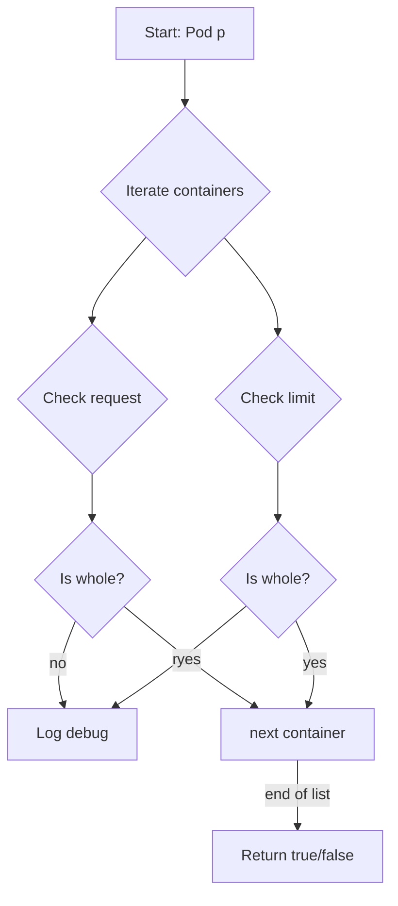

AreCPUResourcesWholeUnits`

```go
func AreCPUResourcesWholeUnits(p *Pod) bool
```

| Element | Description |
|---------|-------------|
| **Package** | `github.com/redhat-best-practices-for-k8s/certsuite/pkg/provider` |
| **Exported?** | Yes |
| **Purpose** | Determines whether all CPU requests and limits defined in a Pod are expressed as *whole* CPU units (e.g. `1`, `2`) rather than fractional values (`0.5`, `100m`). This check is used by the isolation tests to ensure that workloads do not request sub‑CPU resources, which can interfere with strict resource isolation guarantees. |

### Inputs

| Parameter | Type | Notes |
|-----------|------|-------|
| `p` | `*Pod` | A pointer to a `Pod` object (defined elsewhere in the provider package). The function examines each container’s CPU request and limit values within this Pod. |

### Output

| Return | Type | Meaning |
|--------|------|---------|
| `bool` | `true` if **every** CPU request/limit in the pod is a whole number; otherwise `false`. |

### How it works (high‑level)

1. **Iterate over containers**  
   For each container in the Pod, the function checks both the CPU request and limit values.

2. **Convert to milli‑CPUs**  
   The helper functions `Cpu()` and `MilliValue()` are used to obtain a numeric representation of the resource quantity (in millicores).  

3. **Test for whole units**  
   A value is considered a whole unit if its millisecond value is divisible by 1000 (`isInteger(val / 1000)`).  
   The function uses `isInteger()` to perform this check.

4. **Logging**  
   If a non‑whole CPU resource is found, the function logs a debug message via `Debug()` and includes the container name and offending value using `String()`. This helps trace why a pod fails the isolation test.

5. **Return result**  
   After checking all containers, it returns `true` only if every checked quantity passed the whole‑unit test; otherwise it returns `false`.

### Dependencies

| Dependency | Role |
|------------|------|
| `MilliValue()` | Parses a Kubernetes resource quantity string into an integer number of millicores. |
| `Cpu()` | Retrieves the CPU quantity from a container’s resources (request/limit). |
| `isInteger()` | Helper that returns whether a float value is an integer. |
| `Debug()` | Emits debug‑level logs; no side effects on the Pod itself. |
| `String()` | Formats resource values for logging. |

### Side Effects

* No modification of the Pod or its containers.
* Generates debug output when non‑whole CPU resources are detected.

### Where it fits in the package

`AreCPUResourcesWholeUnits` lives in **isolation.go** and is invoked by the provider’s isolation tests that validate pod resource configurations. It ensures that workloads scheduled on a node respect strict CPU allocation rules, which is critical for certain security hardening scenarios (e.g., preventing CPU over‑commitment that could lead to side‑channel attacks).

---

#### Mermaid flow diagram (optional)



This diagram illustrates the linear scan through each container’s CPU request and limit, the integer check, logging, and final boolean result.
