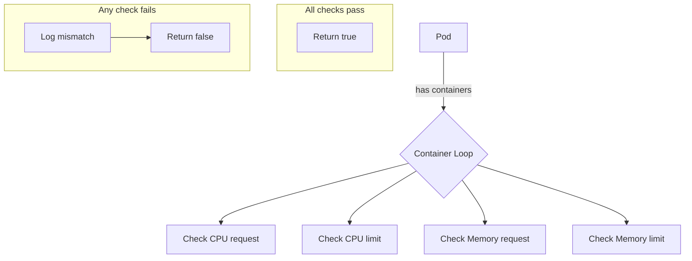

AreResourcesIdentical`

| Symbol | Details |
|--------|---------|
| **Package** | `github.com/redhat-best-practices-for-k8s/certsuite/pkg/provider` |
| **Exported** | ✅ |
| **Signature** | `func AreResourcesIdentical(pod *Pod) bool` |

#### Purpose
`AreResourcesIdentical` is a helper used by the provider to decide whether two pods (or, more precisely, the same pod across different API calls) can be treated as “resource‑identical.”  
In isolation tests it ensures that the CPU and memory requests/limits reported by the Kubernetes API are consistent with what was actually requested when the pod was created.  If a mismatch is detected, the test fails early so that subsequent checks (e.g., affinity, node selection) run on a stable resource set.

#### Inputs
* `pod *Pod` – a pointer to the `Pod` struct from the provider’s data model.  
  The function inspects:
  * `pod.Spec.Containers[i].Resources.Requests["cpu"]`
  * `pod.Spec.Containers[i].Resources.Limits["cpu"]`
  * `pod.Spec.Containers[i].Resources.Requests["memory"]`
  * `pod.Spec.Containers[i].Resources.Limits["memory"]`

#### Outputs
* `bool` – `true` if **all** containers in the pod have matching request/limit values for CPU and memory; otherwise `false`.

#### Key Dependencies
| Dependency | Role |
|------------|------|
| `k8s.io/api/core/v1.ResourceList` | Holds CPU/memory quantities. |
| `.Cpu()`, `.Memory()` methods | Convert quantity objects to *resource.Quantity*. |
| `.AsApproximateFloat64()` | Turns a `Quantity` into a float for comparison, allowing minor rounding differences. |
| `Equal(...)` (from `k8s.io/apimachinery/pkg/api/resource`) | Strict equality check for quantities. |
| `Debug()` & `String()` (internal logger) | Emit diagnostic messages when mismatches occur. |

#### How it Works
1. **Early exit on empty pod** – If the pod has no containers, resources are considered identical.
2. For each container:
   * Log the container name and its resource values.
   * Compare CPU requests: `cpuReq := c.Resources.Requests.Cpu()` vs. expected value (usually same as limit for most tests).
   * Compare CPU limits similarly.
   * Do the same for memory (`c.Resources.Requests.Memory()`, `MemoryLimit`).
3. Quantities are compared via `Equal`; if they differ, a debug log is emitted and the function returns `false`.
4. If all containers pass, return `true`.

#### Side Effects
* The function only performs read‑only operations on the pod; it does **not** modify any state.
* It logs diagnostic information when mismatches are found – useful for debugging test failures.

#### Where It Is Used
`AreResourcesIdentical` is called by isolation tests that need to assert consistency between the requested resources and what Kubernetes reports.  If it returns `false`, the test framework aborts further checks for that pod, as subsequent logic (e.g., node affinity or taint evaluation) would be unreliable.

#### Mermaid Diagram (optional)

---

**Summary**  
`AreResourcesIdentical` is a defensive helper that validates the consistency of CPU and memory specifications across all containers in a pod, aiding the provider’s isolation tests by ensuring reliable resource data before proceeding.
