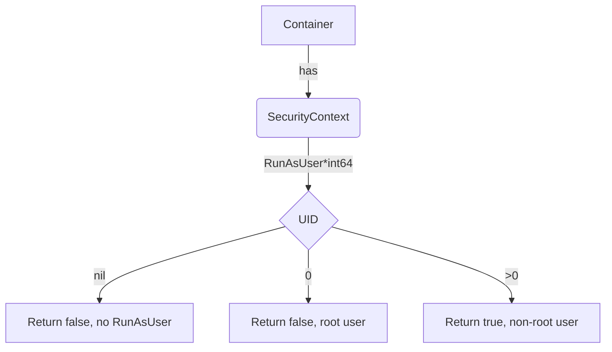

## `IsContainerRunAsNonRootUserID`

### Purpose
Determines whether a container is configured to run as a non‑root user based on its `SecurityContext.RunAsUser` field.

- **Return value**  
  - `bool`: *true* if the UID is set and is not zero (i.e., non‑root).  
  - `string`: human‑readable explanation that can be logged or reported in a test result.

The function is used by the provider’s container validation logic to enforce the best‑practice rule “containers should run as a non‑root user”.

### Signature
```go
func (c *Container) IsContainerRunAsNonRootUserID() (bool, string)
```
- `c` – pointer to a `Container` struct (defined in `containers.go`).  
  The struct contains a field `SecurityContext *v1.SecurityContext`.

### Algorithm
1. **Nil check** – If the container’s `SecurityContext` or its `RunAsUser` field is nil, the function returns `(false, "no RunAsUser defined")`.
2. **Zero UID** – If `*c.SecurityContext.RunAsUser == 0`, the container runs as root; return `(false, "<uid> (root)")`.
3. **Non‑zero UID** – The container is non‑root; return `(true, "<uid> (non‑root)")`.

The string is produced using `fmt.Sprintf` and a helper `PointerToString` that turns an `*int64` into its decimal representation.

### Dependencies
- Standard library: `fmt.Sprintf`
- Local helper: `PointerToString` (converts `*int64` to string)
- Kubernetes API types: `v1.SecurityContext`

No global variables are read or modified; the function is pure except for string formatting.

### Side‑effects
None. The function only reads from the receiver and returns values.

### Integration in the package
Within the **provider** package, container objects are collected during pod analysis.  
After a `Container` instance is built, its `IsContainerRunAsNonRootUserID()` method is invoked as part of compliance checks that aggregate results into test reports.  
Because it returns both a boolean and an explanatory string, callers can log detailed reasons when a rule fails.

---

#### Mermaid diagram (optional)



This diagram visualises the decision path of `IsContainerRunAsNonRootUserID`.
