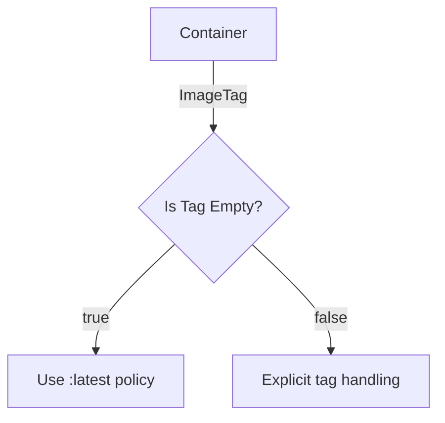

## `IsTagEmpty`

```go
// IsTagEmpty reports whether the container image tag is unset or empty.
func (c Container) IsTagEmpty() bool
```

### Purpose
`IsTagEmpty` is a small helper that determines if a `Container` instance has an **empty** image tag.  
In Kubernetes manifests it is common to omit the tag, implicitly using the `latest` tag.  CertSuite needs to know when the tag was explicitly omitted in order to enforce policies such as *“do not use `:latest`”* or to decide whether a container should be treated specially (e.g., skipped from certain checks).

### Inputs / Receiver
- **Receiver** – `c Container`: a value of the local `Container` type defined in `containers.go`.  
  The struct contains at least an `ImageTag` field (string) that holds whatever tag was supplied when the container image was referenced.

### Output
- Returns a single `bool`:
  - `true` if the tag is either an empty string or not present.
  - `false` otherwise.

### Key Dependencies
| Dependency | Role |
|------------|------|
| `Container.ImageTag` | Holds the tag extracted from the image reference. |
| No external packages are used; the function only performs a simple string comparison. |

### Side‑effects
None – the method is read‑only and has no observable side effects on global state or the container itself.

### How it fits the package

The `provider` package implements checks against Kubernetes objects to validate compliance with Red Hat’s best practices.  
`IsTagEmpty` is used in several places:

1. **Image policy enforcement** – when verifying that containers do not rely on implicit tags, the function tells the checker whether a tag was omitted.
2. **Skipping tests for certain containers** – combined with the `ignoredContainerNames` global (see `containers.go`), the checker can skip containers that are known to be safe even if they use an empty tag.

Because it is part of the public API (`exported: true`), external tools or other packages can also query a container’s tag state without re‑implementing this logic.  

---

#### Suggested Mermaid diagram (optional)



This visual clarifies the decision path taken by `IsTagEmpty` within a larger validation workflow.
