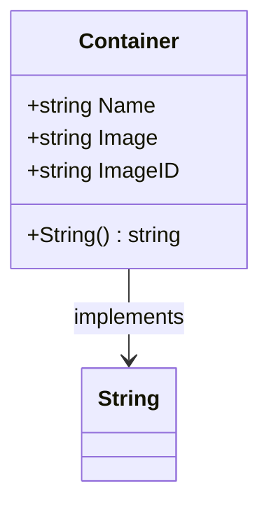

Container.String` – Human‑readable container representation

| Item | Detail |
|------|--------|
| **Package** | `github.com/redhat-best-practices-for-k8s/certsuite/pkg/provider` |
| **Receiver type** | `Container` (struct defined in *containers.go*) |
| **Signature** | `func (c Container) String() string` |

### Purpose
`String` implements the standard `fmt.Stringer` interface for a `Container`.  
It returns a concise, human‑readable description of a container that can be logged,
displayed in test results or used as a key when comparing containers.

The format is:

```
<container name> (image: <image>, imageID: <id>)
```

This representation uniquely identifies the container by its name and the
exact image it runs, which is sufficient for most diagnostic purposes within
the CertSuite provider logic.

### Inputs & Outputs

| Parameter | Type | Description |
|-----------|------|-------------|
| `c` | `Container` (value receiver) | The container instance to describe. |

| Return value | Type | Description |
|--------------|------|-------------|
| `string` | | A formatted string containing the container’s name, image and image ID. |

### Key Dependencies

* **`fmt.Sprintf`** – Used internally to build the output string.
* No other global variables or functions are referenced.

### Side Effects
None. The method is pure; it only reads fields from the `Container` struct and returns a string.

### Relationship with the Package

* The `Container` type represents a container that exists in a Kubernetes pod,
  as discovered by CertSuite’s node‑probe logic.
* `String` is used throughout the provider package wherever a readable
  representation of a container is required, e.g. when printing probe results or
  logging diagnostic messages.

---

#### Suggested Mermaid diagram (optional)



This diagram highlights that `Container.String` is the method providing the string representation for a container instance.
