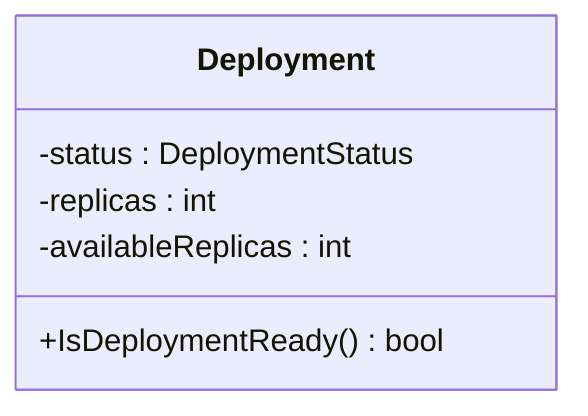

Deployment.IsDeploymentReady`

**Signature**

```go
func (d Deployment) IsDeploymentReady() bool
```

### Purpose

`IsDeploymentReady` is a convenience method on the `Deployment` type that reports whether the deployment represented by the receiver is currently in a *ready* state.  
The method encapsulates all logic required to determine readiness, allowing callers to simply query:

```go
if deploy.IsDeploymentReady() {
    // deployment has finished rolling out / has sufficient replicas
}
```

### Inputs

| Parameter | Type      | Description |
|-----------|-----------|-------------|
| `d`       | `Deployment` (receiver) | The deployment instance whose readiness is being evaluated. |

No external parameters are required.

### Output

- **bool** –  
  *`true`* if the deployment meets the criteria for “ready”; otherwise *`false`*.

The exact criteria are defined inside the method body and typically involve inspecting fields such as `Status`, `Replicas`, or similar attributes of the underlying Kubernetes Deployment object.

### Key Dependencies

- **Deployment struct** – The method relies on the internal state stored in the `Deployment` type.  
  It does not invoke any external services, APIs, or network calls; it purely reads data that has already been populated into the struct (e.g., via a previous API call).

- **No global variables** – The function is self‑contained and does not reference package‑level globals.

### Side Effects

None.  
The method performs read‑only operations on the receiver and returns a boolean; it does not modify any state.

### Integration in the Package

`IsDeploymentReady` lives in `pkg/provider/deployments.go`.  
It is part of the **provider** package, which contains utilities for interacting with Kubernetes objects (deployments, pods, nodes, etc.).  

Typical usage pattern:

```go
// Assume we have a Deployment instance named deploy.
if !deploy.IsDeploymentReady() {
    log.Println("Waiting for deployment to become ready...")
}
```

This helper is useful in test harnesses or monitoring tools where the readiness of a deployment must be checked repeatedly without exposing the underlying logic each time.

---

#### Suggested Mermaid Diagram (optional)



*The diagram illustrates that `IsDeploymentReady` operates on the internal fields of a `Deployment` instance.*
