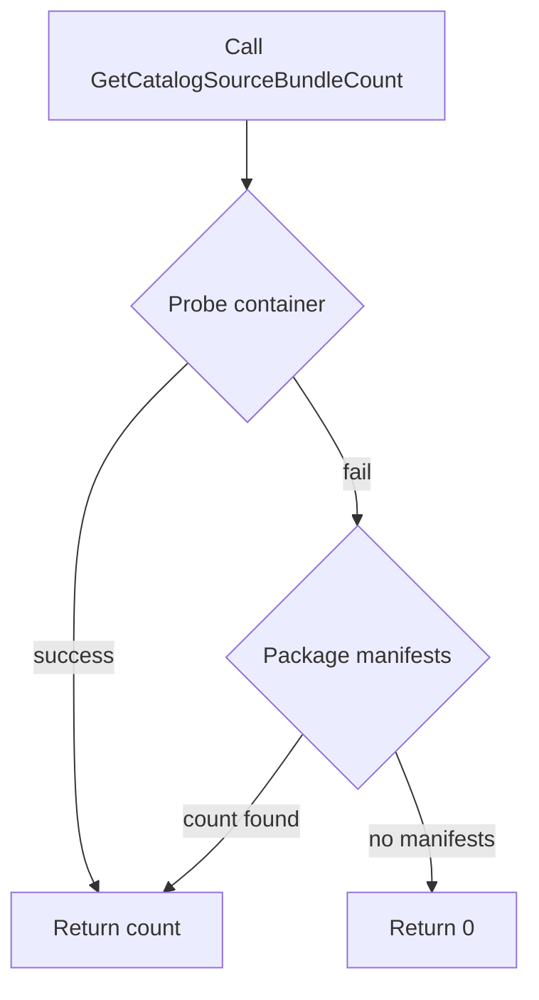

GetCatalogSourceBundleCount`

### Purpose
`GetCatalogSourceBundleCount` returns the number of Operator bundles that are available in a given **CatalogSource**.  
The function first tries to read the bundle count from the CatalogSource’s probe container; if that fails it falls back to counting the bundles that are listed in the source’s `packageManifests`. The result is an integer that can be used by tests or other tooling to verify that a catalog contains the expected number of bundles.

### Signature
```go
func GetCatalogSourceBundleCount(env *TestEnvironment, cs *olmv1Alpha.CatalogSource) int
```
| Parameter | Type                     | Description |
|-----------|--------------------------|-------------|
| `env`     | `*TestEnvironment`       | Provides the test‑environment context (logging, kube client, etc.). |
| `cs`      | `*olmv1Alpha.CatalogSource` | The CatalogSource object whose bundle count is being queried. |

The function returns an **int**; if any error occurs during the probe or manifest extraction the return value defaults to `0`.

### Dependencies & Calls
| Called Function | Purpose |
|-----------------|---------|
| `Info`, `Error` | Logging helpers from `env`. |
| `NewVersion`, `Major`, `Minor` | Version parsing utilities (used by the fallback logic). |
| `getCatalogSourceBundleCountFromProbeContainer` | Attempts to get the count by executing a command in the CatalogSource’s probe container. |
| `getCatalogSourceBundleCountFromPackageManifests` | Counts bundles by inspecting the `packageManifests` field of the CatalogSource when probing fails. |

### Workflow
1. **Probe Container Path**  
   * Invokes `getCatalogSourceBundleCountFromProbeContainer`.  
   * If this returns a non‑zero count, that value is returned immediately.

2. **Fallback to Package Manifests**  
   * If the probe path fails (e.g., container not present or command error), it calls `getCatalogSourceBundleCountFromPackageManifests`.  
   * The number of entries in the `packageManifests` map is used as the bundle count.

3. **Error Handling**  
   * Any errors are logged via `env.Error`, but they do not cause a panic; instead, the function returns `0`.

### Side‑Effects
* No changes to cluster state or CatalogSource objects.  
* Only logs information/errors through the provided test environment logger.

### Package Context
The **provider** package contains utilities that interact with an OpenShift/Kubernetes cluster during CertSuite tests.  
`GetCatalogSourceBundleCount` is part of the catalog‑source helpers, enabling tests to verify that a CatalogSource is correctly populated before proceeding with operator installation or validation steps. It relies on other helper functions within `catalogsources.go`, and works in tandem with the test environment (`TestEnvironment`) for logging and error reporting.

---

**Mermaid diagram suggestion**



This visual clarifies the decision path: probe first, fallback to manifests, then return.
