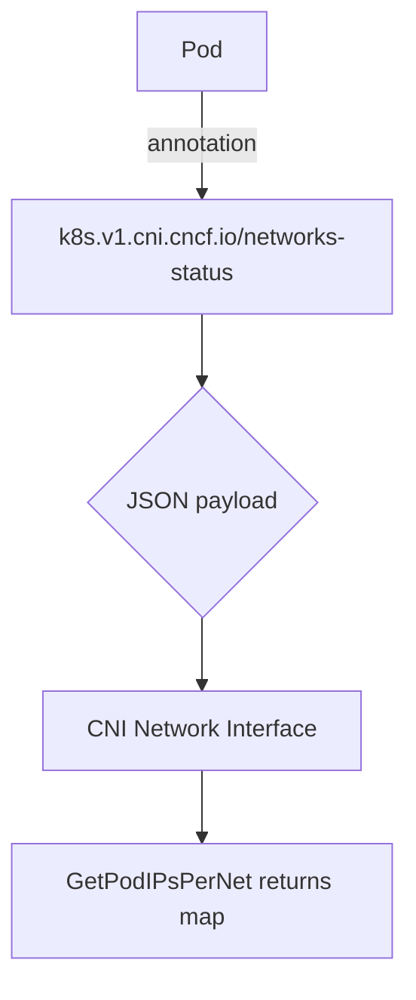

GetPodIPsPerNet`

**Package**: `github.com/redhat-best-practices-for-k8s/certsuite/pkg/provider`  
**Visibility**: exported

### Purpose
`GetPodIPsPerNet` extracts the IP addresses assigned to a pod for each of its CNI networks.  
The function parses the Kubernetes annotation *k8s.v1.cni.cncf.io/networks-status*, which is added by any CNI plugin that supports multiple network attachments (e.g., Multus).  It returns a map keyed by the logical interface name (`CniNetworkInterface`) with the corresponding IP addresses.

### Signature
```go
func GetPodIPsPerNet(podName string) (map[string]CniNetworkInterface, error)
```
| Parameter | Type   | Description |
|-----------|--------|-------------|
| `podName` | `string` | Name of the pod whose network status is to be read. |

### Return values
| Value | Type                                   | Meaning |
|-------|----------------------------------------|---------|
| `map[string]CniNetworkInterface` | Map where key = interface name (e.g., “eth0”, “net1”) and value contains IP information. |
| `error` | Non‑nil if the annotation is missing, malformed, or JSON unmarshalling fails. |

### Implementation details
```go
func GetPodIPsPerNet(podName string) (map[string]CniNetworkInterface, error) {
    var result = make(map[string]CniNetworkInterface)

    // 1. Read the pod's annotation.
    annotations := getAnnotationFromPod(podName, CniNetworksStatusKey)
    if annotations == "" {
        return nil, fmt.Errorf("annotation %s not found on pod %s", CniNetworksStatusKey, podName)
    }

    // 2. Unmarshal JSON into a slice of CNI network status structs.
    var networks []CniNetworkInterface
    if err := json.Unmarshal([]byte(annotations), &networks); err != nil {
        return nil, fmt.Errorf("failed to unmarshal %s: %w", annotations, err)
    }

    // 3. Build the map keyed by interface name.
    for _, n := range networks {
        result[n.Name] = n
    }
    return result, nil
}
```

* `make` – creates an empty map to hold results.  
* `Unmarshal` – parses the JSON string stored in the pod annotation.  
* `Errorf` – produces descriptive error messages when the annotation is missing or cannot be parsed.

The function relies on the global constant `CniNetworksStatusKey`, which holds the annotation key name (`"k8s.v1.cni.cncf.io/networks-status"`).  It also uses a helper (not shown in the snippet) to fetch the annotation from the pod object; that helper accesses the Kubernetes API and therefore has side‑effects of network I/O.

### Side effects & dependencies
| Dependency | Effect |
|------------|--------|
| Kubernetes client (`getAnnotationFromPod`) | Makes an API call to read pod metadata. |
| JSON package | Parses the annotation payload. |

No state is mutated inside the provider package; the function is pure apart from its API call.

### How it fits the package
`GetPodIPsPerNet` is part of the **provider** layer that abstracts interactions with a Kubernetes cluster.  
Other parts of `certsuite` (e.g., connectivity checks, node‑level diagnostics) need to know which IPs a pod has on each network interface to perform tests against them.  This function centralizes that logic so callers can simply request a map and proceed with the appropriate test.

---

**Mermaid diagram suggestion**


