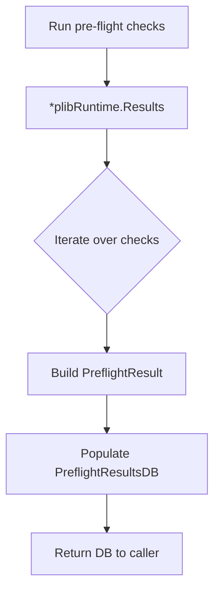

GetPreflightResultsDB`

**File:** `pkg/provider/provider.go:695`  
**Package:** `provider` (github.com/redhat‑best‑practices‑for‑k8s/certsuite/pkg/provider)

### Purpose
Creates a **pre‑flight results database** (`PreflightResultsDB`) that aggregates the outcome of all pre‑flight checks executed by CertSuite.  
The returned DB is used later in the test run to:

* expose structured information about each check (name, metadata, help text)
* record pass/fail status and any error messages
* provide a stable API for external consumers such as UI or reporting tools

### Signature
```go
func GetPreflightResultsDB(r *plibRuntime.Results) PreflightResultsDB
```

| Parameter | Type                     | Description |
|-----------|--------------------------|-------------|
| `r`       | `*plibRuntime.Results`  | Runtime container holding all executed pre‑flight checks. The function pulls data from this structure to populate the DB. |

### Return Value
`PreflightResultsDB` – a map keyed by check name, each value containing:

- **Name**: human‑readable title of the check  
- **Metadata**: key/value pairs describing the check (e.g., severity, category)  
- **Help**: explanatory text for the check  
- **Error**: optional error message if the check failed

### Key Operations
1. **Iterate over `r.Checks`** – each entry is a pre‑flight check struct.  
2. For every check, build a `PreflightResult` by invoking:
   * `Name()`, `Metadata()`, `Help()` to extract static info  
   * `Error()` (if present) to capture runtime failures
3. Append the result to the DB map under its canonical name.

The function relies only on methods defined on the check interface; it does not modify the input `*plibRuntime.Results`. Hence, it is **pure** and free of side effects.

### Dependencies & Interactions
| Dependency | Role |
|------------|------|
| `plibRuntime.Results` | Source of all pre‑flight checks executed during a run. |
| `PreflightResultsDB` | Target data structure that stores the aggregated results. |
| Check interface methods (`Name`, `Metadata`, `Help`, `Error`) | Provide descriptive fields and error status for each check. |

No global variables or external state are accessed, making the function deterministic.

### Placement in Package
The `provider` package orchestrates the entire CertSuite execution pipeline:

1. **Setup** – load configurations, environment vars, node roles (`MasterLabels`, `WorkerLabels`).  
2. **Run checks** – execute individual pre‑flight tests via `plibRuntime`.  
3. **Collect results** – this function gathers those results into a structured DB.  
4. **Expose to consumers** – the DB is returned to callers (e.g., HTTP handlers, CLI output) for reporting.

`GetPreflightResultsDB` sits at step 3: it transforms raw runtime data into a consumable form without altering any state.

---

#### Mermaid diagram suggestion



This diagram illustrates how the function consumes runtime data and produces the final results database.
