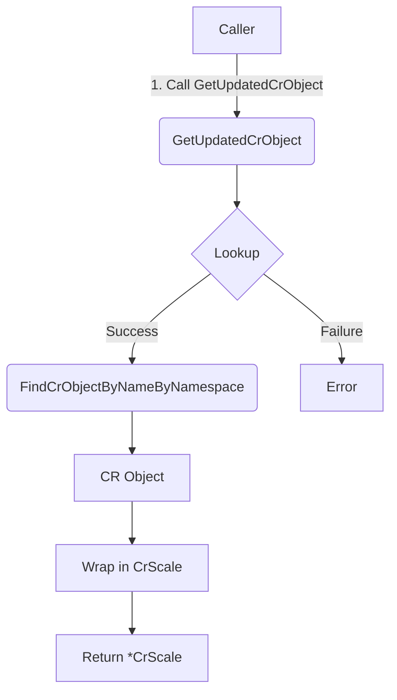

GetUpdatedCrObject`

**Location**

`pkg/provider/scale_object.go:31`

### Purpose
Retrieve a *Custom Resource* (CR) object from the cluster and wrap it in a `CrScale` structure that contains scaling metadata.  
The function is used by the scale‑testing framework to obtain an up‑to‑date view of a CR so that subsequent tests can inspect or modify its spec.

### Signature
```go
func GetUpdatedCrObject(
    getter scale.ScalesGetter,
    namespace string,
    name string,
    resource schema.GroupResource,
) (*CrScale, error)
```

| Parameter | Type                     | Description |
|-----------|--------------------------|-------------|
| `getter`  | `scale.ScalesGetter`     | Interface that exposes the Kubernetes client used to read CRs. It is typically a wrapper around `client.Client`. |
| `namespace` | `string`                | Namespace of the target CR (empty string means cluster‑scoped resources). |
| `name`      | `string`                | Name of the CR instance to fetch. |
| `resource`  | `schema.GroupResource`  | Group and resource part of the CR’s GVR (e.g., `{Group:"apps", Resource:"deployments"}`). |

**Returns**

- `*CrScale`: a pointer to a struct that holds the retrieved CR (`runtime.Object`) and its associated scaling metadata.  
- `error`: non‑nil if the object cannot be fetched or wrapped.

### Key Dependencies
| Dependency | Role |
|------------|------|
| `FindCrObjectByNameByNamespace` | Helper that performs the actual API lookup using the provided `getter`. It returns a raw Kubernetes `runtime.Object`. |
| `scale.ScalesGetter` | Provides the client and namespace context needed to query the cluster. |

### Flow
1. **Lookup**  
   Calls `FindCrObjectByNameByNamespace(getter, resource, namespace, name)` to fetch the CR from the API server.

2. **Wrap**  
   If lookup succeeds, it creates a new `CrScale` instance:
   ```go
   cr := &CrScale{Obj: obj}
   ```
   The struct may also be enriched with scaling information (e.g., desired replicas) – that logic lives in other parts of the package.

3. **Return**  
   Returns the wrapped object or an error if any step fails.

### Side Effects
- No mutation of cluster state; purely read‑only.
- May log diagnostic information via `log` (not shown in snippet).

### Package Context
`GetUpdatedCrObject` is part of the *provider* package, which exposes a high‑level API for interacting with Kubernetes objects during certsuite tests.  
It is typically called by test harnesses that need to validate or modify the desired state of a CR (e.g., deployments, daemonsets) before asserting scaling behavior.

### Mermaid Diagram (suggested)



This diagram illustrates the single‑path flow from caller to CR retrieval and wrapping.
