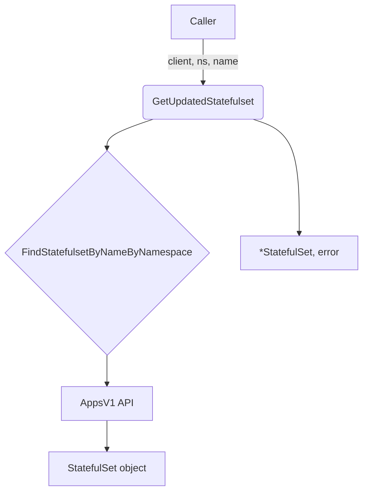

GetUpdatedStatefulset`

| Item | Details |
|------|---------|
| **Signature** | `func GetUpdatedStatefulset(appv1client.AppsV1Interface, namespace string, name string) (*StatefulSet, error)` |
| **Exported?** | Yes (public API of the `provider` package) |

### Purpose
Retrieve a *stateful set* that is in the process of being updated.  
In OpenShift/Kubernetes a stateful set may be rolling‑upgraded; this function returns the *current* version of the object **as seen by the API server** rather than a cached or local copy.  The returned `StatefulSet` contains the latest spec, status and any annotations added during the update.

### Parameters
| Name | Type | Description |
|------|------|-------------|
| `client` | `appv1client.AppsV1Interface` | A typed client for Apps v1 API (used to call `StatefulSets(namespace).Get`). |
| `namespace` | `string` | Namespace of the target stateful set. |
| `name` | `string` | Name of the target stateful set. |

### Return values
| Type | Meaning |
|------|---------|
| `*StatefulSet` | Pointer to the freshly retrieved stateful set object.  The caller should not modify this object because it is a direct reference to the API response. |
| `error` | Non‑nil if the lookup failed (e.g., network error, non‑existent resource). |

### Key dependencies
* **`FindStatefulsetByNameByNamespace`** – a helper that performs the actual API call (`client.StatefulSets(namespace).Get`).  
  * It returns the stateful set or an error; `GetUpdatedStatefulset` simply forwards those results.
* No other package‑level globals are accessed.

### Side effects
None. The function only reads from the Kubernetes API and returns data to the caller.  

### How it fits in the package
The `provider` package contains a collection of helpers that query the cluster for resources (nodes, pods, deployments, etc.).  
*`GetUpdatedStatefulset`* is used by higher‑level validation logic that needs to inspect the current configuration of stateful sets during tests or compliance checks. It abstracts the API call and ensures callers receive the most recent object snapshot.

### Suggested Mermaid diagram

This diagram shows the single‑path call from a consumer to the Kubernetes API and back.
