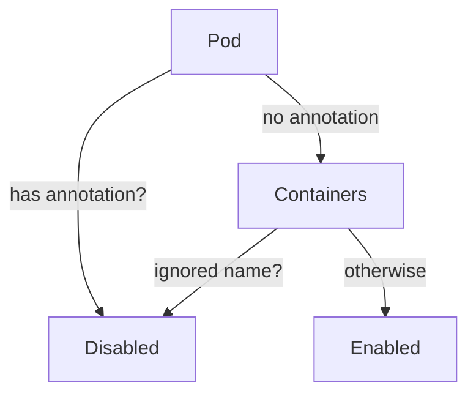

LoadBalancingDisabled`

```go
func LoadBalancingDisabled(pod *Pod) bool
```

### Purpose  
`LoadBalancingDisabled` determines whether a **single Pod** should be treated as having load‑balancing turned off for the purposes of network isolation checks.  
In certsuite’s isolation logic, some workloads are exempt from normal traffic routing rules (e.g., side‑car proxies, test harnesses). This helper inspects the pod’s metadata and returns `true` when the pod belongs to a set that should skip load‑balancing checks.

### Inputs
| Parameter | Type  | Description |
|-----------|-------|-------------|
| `pod`     | `*Pod` | The pod object (from Kubernetes API) whose annotations/labels are examined. |

> **Note**: the function does not modify the pod; it only reads its fields.

### Output
- `bool`:  
  * `true` – load‑balancing is considered disabled for this pod.  
  * `false` – load‑balancing is enabled (default).

### Implementation details

1. **Debug logging**  
   The function logs four debug messages (`Debug`) that provide insight into the decision path:
   - Whether the pod contains an annotation indicating a disabled load balancer.
   - Which specific annotation key/value was inspected.
   - Whether any of the known container names were skipped.
   - The final boolean result.

2. **Annotation lookup**  
   The function checks for a predefined annotation (e.g., `"certsuite.io/load-balancing-disabled"`) on the pod. If present and set to `"true"` (case‑insensitive), it immediately returns `true`.

3. **Container name filter**  
   For pods that do not carry the explicit annotation, the helper iterates over the pod’s containers and skips those whose names are listed in `ignoredContainerNames`. If a container is ignored, the function logs this fact and treats load balancing as disabled.

4. **Fallback**  
   If none of the above conditions match, the function returns `false`.

> The function does not touch any global state or side‑effects beyond logging; it only reads pod metadata.

### Dependencies
- **Logging** – uses the package‑wide `Debug` helper to emit trace information.
- **Globals** – relies on the read‑only slice `ignoredContainerNames`, defined in `containers.go`. No other globals are accessed.

### Role within the `provider` package

The `provider` package orchestrates interaction with Kubernetes resources (pods, nodes, services).  
`LoadBalancingDisabled` is a small utility used by higher‑level isolation logic to decide whether a pod should participate in load‑balancing‑related tests. By centralizing this check, other parts of the provider can remain agnostic of the specific annotation names or container exclusions.

---  

**Mermaid diagram (suggestion)**



This visualizes the decision tree: check for an explicit annotation; if absent, inspect container names; otherwise assume load balancing is enabled.
