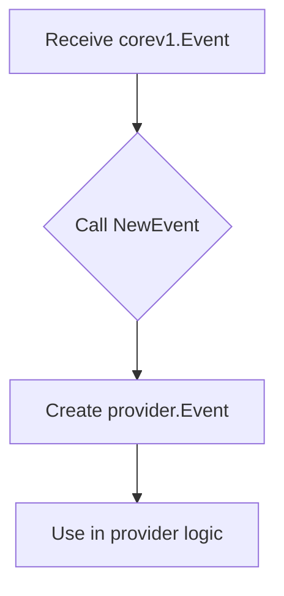

NewEvent` – converting a Kubernetes Event into the provider’s internal representation

```go
func NewEvent(*corev1.Event) Event
```

| Item | Description |
|------|-------------|
| **Purpose** | Transforms a *kubernetes* `corev1.Event` (the type returned by the API server) into the package‑specific `Event` value that the rest of the CertSuite provider logic consumes. |
| **Input** | A pointer to a `corev1.Event`. The caller supplies an event fetched from the cluster. |
| **Output** | An `Event` struct (defined in this package). The returned value is a lightweight, copy‑on‑write representation that contains only the fields needed by the provider’s logic. |
| **Side effects** | None – the function merely reads the supplied event and constructs a new value; it does not modify global state or interact with external resources. |
| **Key dependencies** | `corev1` from `k8s.io/api/core/v1`. No other globals or packages are accessed inside this function, making it pure and easy to test. |
| **Usage context** | The provider uses `NewEvent` whenever it receives an event (e.g., from a watch or list). By converting the raw Kubernetes type into its own `Event`, the rest of the code can rely on a stable interface that is independent of the upstream API changes. |

### How it fits the package

- **Encapsulation** – Keeps the mapping logic in one place, so if the internal `Event` struct changes only this function needs updating.
- **Testability** – Since there are no side effects or global dependencies, unit tests can feed arbitrary `corev1.Event` objects and assert on the resulting `Event`.
- **Consistency** – All event handling paths call `NewEvent`, guaranteeing that downstream code always receives a fully populated internal representation.



*Note*: The actual field mapping performed by `NewEvent` is defined elsewhere in the package; this function simply forwards the conversion.
