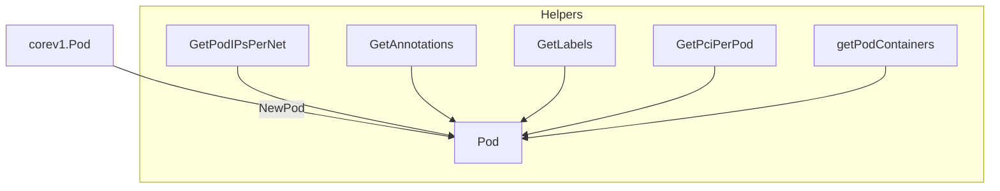

NewPod` – Factory for the internal **Pod** representation

| Item | Detail |
|------|--------|
| **Signature** | `func NewPod(pod *corev1.Pod) Pod` |
| **Exported** | Yes (capitalized name) |
| **Location** | `pkg/provider/pods.go:57` |

### Purpose
Creates the package‑internal `Pod` value that represents a Kubernetes pod.  
The function pulls data from a `*corev1.Pod` object and enriches it with helper
information needed by the rest of the certsuite provider (e.g. networking,
PCI devices, container lists).  The resulting `Pod` is used in all subsequent
checks that operate on pods.

### Inputs

| Parameter | Type | Meaning |
|-----------|------|---------|
| `pod` | `*corev1.Pod` | The raw pod object obtained from the Kubernetes API. |

### Outputs

| Return value | Type | Meaning |
|--------------|------|---------|
| `Pod` | internal struct defined in the same package | A fully populated representation of the pod, ready for validation logic. |

> **Note** – If any required sub‑structure cannot be read (e.g., missing annotations
> or labels) the function logs an error via `Error()` but still returns a partially
> constructed `Pod`.  Callers should check the returned value’s fields for
> consistency.

### Key Steps & Dependencies

1. **Allocate** a new `Pod` struct with `make([]string, …)` for slices that will hold container names and PCI devices.
2. **Extract IPs** – calls `GetPodIPsPerNet(pod)` to map network names to their assigned IP addresses.
3. **Read Annotations & Labels**  
   * `GetAnnotations(pod)` → pod annotations (e.g., network‑specific data).  
   * `GetLabels(pod)` → node labels that influence role classification (`MasterLabels`, `WorkerLabels`).
4. **PCI Device Detection** – `GetPciPerPod(pod)` returns a list of PCI addresses assigned to the pod; these are appended to the `pod.pci` slice.
5. **Container Discovery** – `getPodContainers(pod)` enumerates all containers, filtering out those whose names appear in the package‑level `ignoredContainerNames`.  
   The resulting container names populate `pod.containers`.
6. **Populate Pod fields** – All gathered data is assigned to the corresponding fields of the returned `Pod`.

### Side Effects & Error Handling

* Calls to helper functions (`GetAnnotations`, `GetLabels`, etc.) may log errors via `Error()` if they encounter unexpected state.
* No mutation occurs on the input `*corev1.Pod`; the function is read‑only with respect to the API object.

### How It Fits the Package

`NewPod` sits at the core of the *provider* package’s data model.  
All higher‑level checks (e.g., network reachability, resource limits, PCI
device validation) consume `Pod` instances produced by this factory.  By centralising pod parsing here, the provider ensures a consistent view of pod state across all tests and makes it easier to extend or modify how pods are represented.

---

#### Suggested Mermaid Diagram

This diagram shows the data flow from a raw Kubernetes pod to the enriched internal `Pod` structure through the helper functions used by `NewPod`.
