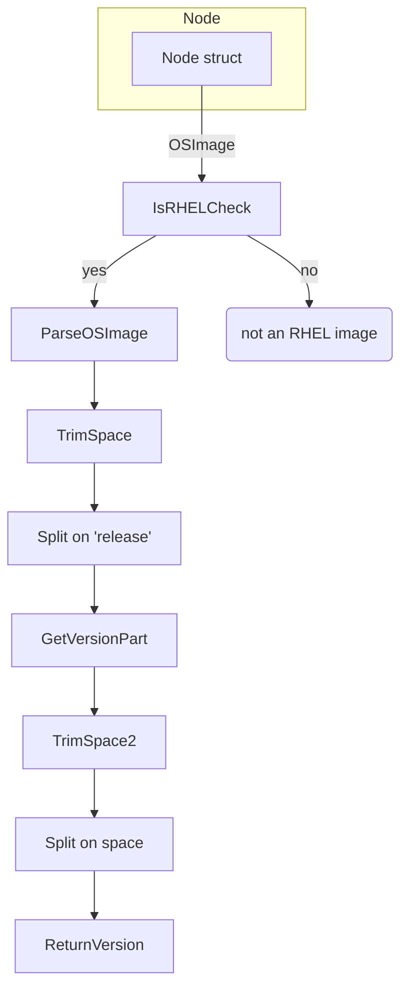

Node.GetRHELVersion`

| Item | Details |
|------|---------|
| **Package** | `provider` (`github.com/redhat-best-practices-for-k8s/certsuite/pkg/provider`) |
| **Exported** | ✅ |
| **Receiver** | `n *Node` – a struct that represents an OpenShift/Kubernetes node (definition in the same package). |
| **Signature** | `func (n *Node) GetRHELVersion() (string, error)` |

### Purpose
Retrieves the RHEL major/minor version string for the node if the node is running a Red Hat Enterprise Linux based OS.  
If the node is not an RHEL derivative (`IsRHEL` returns false) or the version cannot be parsed, it returns an error.

The function is used by tests that need to know which RHEL release is installed on a node (e.g., for selecting compatible certificates or configuration).

### Inputs / Outputs
| Parameter | Type | Description |
|-----------|------|-------------|
| `n` | `*Node` | The node instance whose OS version we want. |

| Return value | Type | Meaning |
|--------------|------|---------|
| `string` | The RHEL major/minor version (e.g., `"7.9"`). |
| `error` | `nil` if successful; otherwise an error describing why the version could not be obtained or parsed. |

### Implementation walk‑through
```go
func (n *Node) GetRHELVersion() (string, error) {
    // Only proceed if node is RHEL based.
    if !IsRHEL(n.OSImage) {
        return "", fmt.Errorf("not an RHEL image")
    }

    // Example OSImage: "Red Hat Enterprise Linux Server release 7.9 (Maipo)"
    parts := strings.Split(strings.TrimSpace(n.OSImage), "release")
    if len(parts) < 2 {
        return "", fmt.Errorf("unexpected OS image format")
    }
    versionPart := strings.TrimSpace(parts[1])
    subparts := strings.Split(versionPart, " ")
    if len(subparts) == 0 {
        return "", fmt.Errorf("unable to extract version")
    }
    return subparts[0], nil
}
```

1. **RHEL check** – `IsRHEL` examines the node’s `OSImage` string for known RHEL identifiers (e.g., `"Red Hat Enterprise Linux"`). If false, an error is returned immediately.
2. **String parsing**  
   * The OS image string is trimmed of surrounding whitespace.  
   * It is split on the literal word `"release"`.  
   * The second part should start with the version number followed by a space and the codename (e.g., `"7.9 (Maipo)"`).  
   * That substring is trimmed again, then split on spaces; the first token is the numeric version.
3. **Return** – The extracted version string is returned, or an error if any step fails.

### Dependencies
| Dependency | Role |
|------------|------|
| `IsRHEL` (package‑level function) | Determines whether the node’s OS image is a RHEL derivative. |
| `fmt.Errorf`, `strings.Split`, `strings.TrimSpace` | Standard library helpers for error formatting and string manipulation. |

### Side effects
None – the method only reads the receiver’s fields and returns computed values.

### How it fits the package
The `provider` package models OpenShift/Kubernetes infrastructure components (nodes, pods, etc.).  
`GetRHELVersion` is a helper that abstracts OS‑level details from higher‑level logic.  
Other parts of the test suite call this method to adapt test behavior based on the underlying RHEL release.

---

#### Mermaid diagram – Node → GetRHELVersion flow



This diagram visualises the linear path through which `GetRHELVersion` processes a node’s OS image to produce the RHEL version string.
