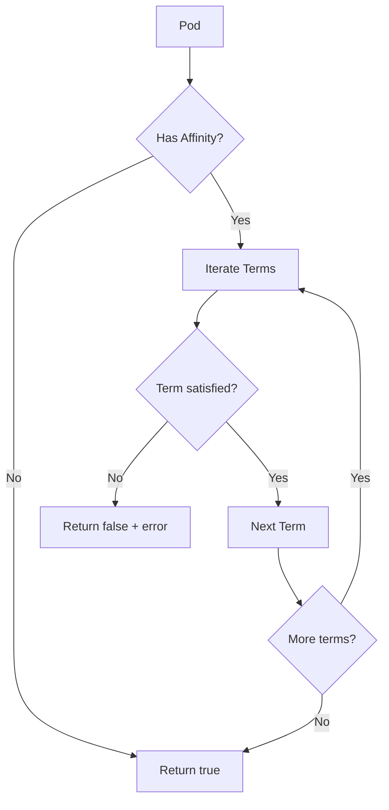

Pod.IsAffinityCompliant` – Provider package

### Purpose
`IsAffinityCompliant` determines whether a pod satisfies the **node‑affinity** rules that the CertSuite provider expects for its workloads.  
The function is part of the public API of the `provider` package and is used by tests that validate that pods can be scheduled onto compliant nodes.

### Receiver

```go
type Pod struct {
    // … other fields …
}
```

`Pod` represents a Kubernetes pod with helper methods to query its spec, status, labels, etc.  
The method does **not** modify the pod – it only reads its state.

### Signature

```go
func (p Pod) IsAffinityCompliant() (bool, error)
```

* `bool` – `true` if all required affinity/anti‑affinity rules are satisfied; otherwise `false`.  
  The boolean is returned even when an error occurs to allow callers to handle the failure separately.
* `error` – describes why the check failed. It is non‑nil only when a pod does not meet one of the expected constraints.

### High‑level algorithm

1. **Read pod’s affinity spec** – pulls `Affinity`, `NodeSelectorTerms`, and `RequiredDuringSchedulingIgnoredDuringExecution`.
2. **Validate required node labels**  
   * For each term, ensure that at least one match expression/label selector is satisfied by the pod’s assigned node(s).  
   * If a term references a label that the pod lacks, return an error with a human‑readable message.
3. **Return** – if all terms are satisfied, `true` and a nil error; otherwise `false` and the constructed error.

### Key dependencies

| Dependency | Role |
|------------|------|
| `fmt.Errorf` | Builds user‑friendly error strings when affinity checks fail. |
| `strings.String` (implicit via fmt) | Formats values in the error messages. |

The function does **not** call any external services or mutate state; it only reads the pod’s fields and performs pure logic.

### Side effects

* None – the method is read‑only.
* No global variables are accessed, so concurrent calls are safe.

### Integration into the package

```go
// In provider/pods.go
func (p Pod) IsAffinityCompliant() (bool, error) {
    // ... implementation ...
}
```

The function is used by:

1. **Provider tests** – to assert that pods under test can be scheduled onto a compliant node set.
2. **Internal validation utilities** – e.g., `ValidatePodScheduling` may call this method before proceeding with further checks.

### Example usage

```go
pod, err := provider.NewPod("mypod")
if err != nil {
    log.Fatal(err)
}

ok, err := pod.IsAffinityCompliant()
if !ok || err != nil {
    fmt.Printf("Pod %s is not affinity‑compliant: %v\n", pod.Name(), err)
}
```

### Caveats

* The method only checks *required* affinity rules. Optional (`PreferredDuringSchedulingIgnoredDuringExecution`) constraints are ignored.
* If the pod has no `Affinity` field, the function returns `true`, assuming there is nothing to check.

--- 

#### Mermaid diagram suggestion (optional)



This diagram illustrates the control flow of `IsAffinityCompliant`.
