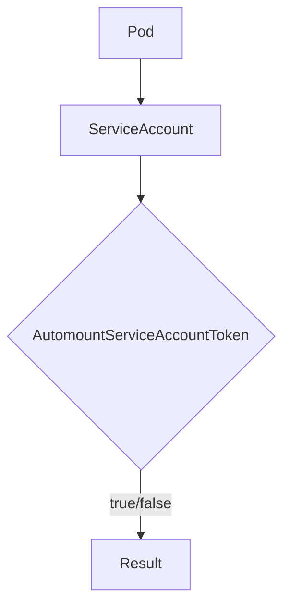

Pod.IsAutomountServiceAccountSetOnSA`

### Purpose
`IsAutomountServiceAccountSetOnSA` inspects the *automount* configuration of a pod’s **service account**.  
In Kubernetes, a pod can be configured to automatically mount the service‑account token (`automountServiceAccountToken: true/false`). This method returns whether that field is explicitly set on the pod's `ServiceAccount`.

### Signature
```go
func (p Pod) IsAutomountServiceAccountSetOnSA() (*bool, error)
```

| Parameter | Type | Description |
|-----------|------|-------------|
| *none* | – | The receiver `Pod` contains the pod spec and metadata needed for the check. |

| Return | Type | Description |
|--------|------|-------------|
| `*bool` | Pointer to a boolean | If non‑nil, points to `true` when the field is set on the service account; `false` if it is not set. A nil pointer indicates that the information could not be retrieved (e.g., the pod has no service account). |
| `error` | Error | Non‑nil when an unexpected condition occurs while accessing the pod or its service account (e.g., missing fields, internal errors). |

### How It Works
1. **Locate Service Account**  
   The method reads `p.Spec.ServiceAccountName`. If this field is empty, the pod has no service account and the function returns a nil pointer with no error.

2. **Retrieve Automount Setting**  
   For the identified service account it checks the `AutomountServiceAccountToken` field:
   * If the field is explicitly set (`true` or `false`) – return a pointer to that value.
   * If the field is omitted (i.e., `nil`) – return nil.

3. **Error Handling**  
   Any failure in reading pod data results in an error created via `fmt.Errorf`. The method propagates this error so callers can decide how to handle it.

### Key Dependencies
- **Pod struct** – contains the necessary metadata and spec fields.
- **`fmt.Errorf`** – used for constructing error messages.

No other global variables or external packages are touched, making the function pure in terms of side effects.  

### Role Within `provider` Package
The `provider` package models Kubernetes objects (pods, nodes, deployments, etc.) for the CertSuite tool.  
`IsAutomountServiceAccountSetOnSA` is a convenience helper used by higher‑level checks that validate security best practices around service accounts—e.g., ensuring that tokens are not automatically mounted where they shouldn’t be.

### Suggested Diagram


This diagram illustrates the simple path from a pod to its service account and the boolean flag that determines the return value.
