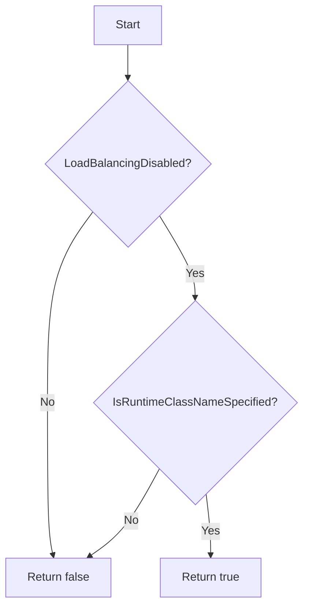

Pod.IsCPUIsolationCompliant`

```go
func (p Pod) IsCPUIsolationCompliant() bool
```

### Purpose  
Determines whether a Kubernetes pod satisfies the *CPU‑isolation* requirement required by OpenShift/Red Hat certified workloads.  
The rule is:

1. **Load balancing must be disabled** – the pod’s spec must have `loadBalancing: Disabled`.  
2. **RuntimeClass name must be specified** – the pod must reference a `runtimeClassName` so that the runtime can enforce isolation.

If either condition fails, the pod is considered non‑compliant.

### Inputs & Receiver  
- **Receiver (`p Pod`)** – The pod instance on which the check runs.  
  *The function does not inspect any fields directly; it relies solely on helper functions.*

### Outputs  
- `bool` – `true` when both conditions above are met, otherwise `false`.

### Key Dependencies  

| Dependency | Role |
|------------|------|
| `LoadBalancingDisabled()` | Returns whether the pod has disabled load balancing. |
| `IsRuntimeClassNameSpecified()` | Checks if the pod’s spec contains a non‑empty `runtimeClassName`. |
| `Debug(...)` | Used to log diagnostic messages during evaluation (no side effects on state). |

These helpers are defined elsewhere in the same package; they perform the actual inspection of the pod spec.

### Side Effects  
- The function only performs read‑only checks and logs debug information. It does not modify the pod or any global state.

### How it fits the package  

`IsCPUIsolationCompliant` is part of the **provider** package’s pod‑level validation utilities.  
The provider package contains a collection of helper functions that inspect Kubernetes objects (pods, nodes, deployments, etc.) for compliance with Red Hat security and operational guidelines.  
This function is invoked by higher‑level test runners or audit tools to filter out pods that do not meet the CPU isolation requirement before further processing.

### Usage Example  

```go
pod := provider.Pod{ /* populated from client */ }
if !pod.IsCPUIsolationCompliant() {
    log.Warn("Pod %s does not satisfy CPU isolation requirements", pod.Name)
}
```

---

**Mermaid flow (optional)**



This diagram illustrates the short decision path that `IsCPUIsolationCompliant` follows.
