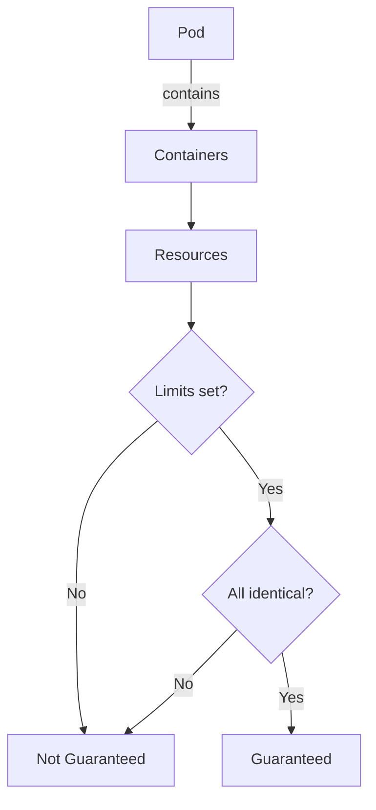

Pod.IsPodGuaranteed`

**File:** `pkg/provider/pods.go:89`  
**Package:** `provider`

### Purpose
Determines whether a Kubernetes pod is *guaranteed* according to the standard K8s definition:

- All containers in the pod have **explicit CPU and memory limits set**.
- Those limits are **identical** across all containers (i.e., no container has a different limit than another).

A guaranteed pod receives priority scheduling, preemption protection, and full resource allocation.

### Receiver
```go
func (p Pod) IsPodGuaranteed() bool
```
`Pod` is an internal representation of a Kubernetes pod; its fields are not shown here but the method relies only on the pod’s container specs via `AreResourcesIdentical`.

### Dependencies
- **`AreResourcesIdentical`** – a helper that checks whether two resource requirements (CPU/memory) are equal.  
  The method calls this function once for each pair of containers in the pod.

No other globals or external state are accessed, making the function pure from an external perspective.

### Implementation Sketch
```go
func (p Pod) IsPodGuaranteed() bool {
    // Empty pods are not guaranteed.
    if len(p.Spec.Containers) == 0 { return false }

    // Pick the first container as reference.
    ref := p.Spec.Containers[0].Resources

    // Every other container must have identical limits and requests.
    for _, c := range p.Spec.Containers[1:] {
        if !AreResourcesIdentical(ref, c.Resources) {
            return false
        }
    }

    // All containers satisfy the requirement → guaranteed.
    return true
}
```
(Actual code may also handle init‑containers or special cases; the above is a conceptual outline.)

### Inputs / Outputs
| Input | Type | Description |
|-------|------|-------------|
| `p` (receiver) | `Pod` | The pod to inspect. |

| Output | Type | Description |
|--------|------|-------------|
| `bool` | `true` if the pod is guaranteed, otherwise `false`. |

### Side Effects
None. The method performs read‑only checks on the pod data and returns a boolean.

### Role in the Package
- **Resource Validation:** Provides a quick predicate used by other components (e.g., workload planners or compliance checks) to identify pods that are guaranteed.
- **Encapsulation:** Hides the internal logic of what constitutes a guaranteed pod, exposing only a simple boolean interface.
- **Testability:** Since it has no side effects, it can be unit‑tested with various pod configurations.

### Usage Example
```go
if myPod.IsPodGuaranteed() {
    fmt.Println("This pod will receive priority scheduling.")
}
```

---

**Mermaid Diagram (optional)**



This function is a core utility for any logic that needs to differentiate between guaranteed and non‑guaranteed workloads in the CertSuite provider package.
