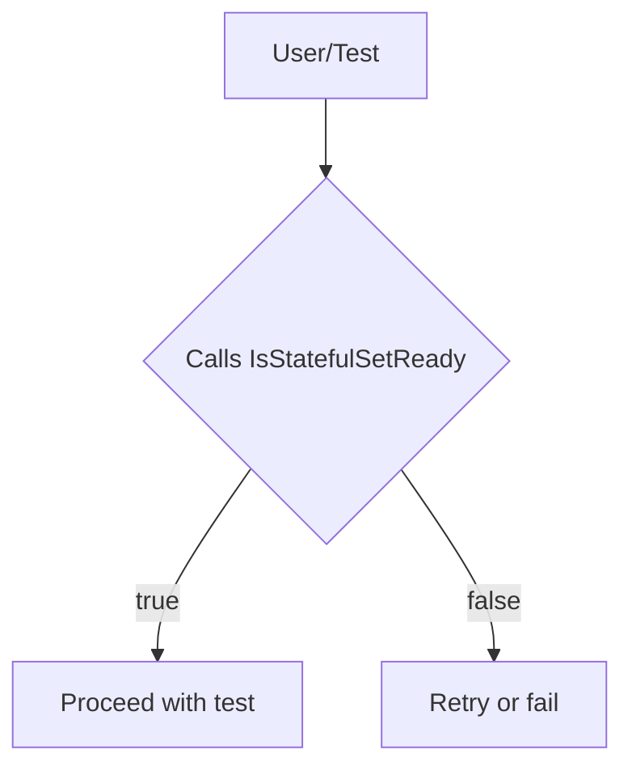

## `IsStatefulSetReady`

**Package:** `provider`  
**File:** `statefulsets.go` (line 31)  
**Visibility:** exported (`public`)  

---

### Purpose
Determines whether a Kubernetes StatefulSet is *fully ready* for use.  
A StatefulSet is considered ready when all its pods are in the `Ready` phase and
the number of ready replicas matches the desired replica count.

The function encapsulates this check so callers can simply query the state without
re‑implementing pod‑count logic or inspecting the Kubernetes API directly.

---

### Signature
```go
func (ss *StatefulSet) IsStatefulSetReady() bool
```

* `ss` – a pointer to a `StatefulSet` instance that holds metadata and status information about a specific StatefulSet.  
  The struct is defined elsewhere in the package (see `statefulsets.go` for its fields, typically including `.Status.Replicas`, `.Status.ReadyReplicas`, etc.).

* **Returns**: `true` if the StatefulSet meets readiness criteria; otherwise `false`.

---

### Dependencies & Side‑Effects
| Dependency | How it is used |
|------------|----------------|
| `StatefulSet.Status` | Reads `.ReadyReplicas` and `.Replicas` to compare counts. |
| No global variables are accessed directly in this function. |
| The function has **no side‑effects** – it only inspects the receiver’s state. |

---

### How It Fits Into the Package

* **High‑level flow**  
  1. `provider` creates a `StatefulSet` object from the Kubernetes API (not shown).  
  2. When the test harness needs to confirm that the StatefulSet is operational, it calls `IsStatefulSetReady`.  
  3. The function returns a boolean used by higher‑level logic (e.g., waiting loops or test assertions).

* **Interaction with other parts**  
  - **Nodes/Pods checks**: Similar ready‑check functions exist for Deployments and DaemonSets (`IsDeploymentReady`, `IsDaemonSetReady`).  
  - **Provider initialization**: The provider’s `ProbePodsTimeout` may use this function in a retry loop to poll readiness.

---

### Suggested Mermaid Diagram



This diagram visualizes the decision point in a test harness that relies on `IsStatefulSetReady`.

---
