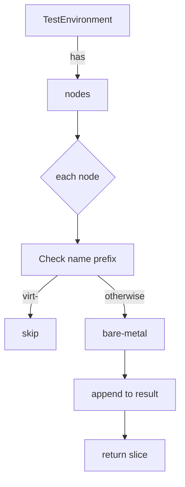

## `GetBaremetalNodes`

**Location**

`pkg/provider/provider.go:685` – part of the **provider** package (`github.com/redhat-best-practices-for-k8s/certsuite/pkg/provider`).

### Purpose

Return a slice containing all nodes in the test environment that are *bare‑metal* (i.e., not virtual machine hosts).  
In the context of CertSuite, this list is used to target checks that only make sense on physical machines – for example, CPU topology validation or huge‑page usage.

### Receiver

```go
func (env TestEnvironment) GetBaremetalNodes() []Node
```

`TestEnvironment` holds cached data about the cluster.  The method operates solely on this receiver; it does **not** modify the environment.

### Inputs / Outputs

| Input | Type | Notes |
|-------|------|-------|
| `env` (receiver) | `TestEnvironment` | Provides access to node information via its internal cache (`nodes`) |

| Output | Type | Description |
|--------|------|-------------|
| `[]Node` | slice of `Node` structs | All nodes that satisfy the “bare‑metal” condition. The order matches the order returned by the underlying cache. |

### Implementation details

```go
func (env TestEnvironment) GetBaremetalNodes() []Node {
    var bm []Node
    for _, n := range env.nodes {
        // A node is considered bare‑metal if its hostname does not start with "virt-"
        if !strings.HasPrefix(n.Name, "virt-") {
            bm = append(bm, n)
        }
    }
    return bm
}
```

* The method iterates over the cached list `env.nodes`.
* For each node it checks whether the node name **does not** begin with `"virt-"`.  
  - This prefix is conventionally used for virtual machine nodes in OpenShift/Kubernetes environments.
* Matching nodes are appended to a new slice and returned.

### Dependencies

| Dependency | Role |
|------------|------|
| `strings.HasPrefix` | String comparison to filter node names. |
| `append` (built‑in) | Builds the result slice. |

No external packages or global variables are referenced; the function is self‑contained apart from the standard library.

### Side effects

* **None** – The method reads from the environment cache and returns a new slice; it does not modify any state.

### How it fits the package

The `provider` package supplies abstractions over the Kubernetes cluster used by CertSuite.  
`GetBaremetalNodes` is one of several helper methods that expose filtered views of the node set (others include `GetMasterNodes`, `GetWorkerNodes`, etc.).  Tests that need to exercise bare‑metal‑specific logic call this method to obtain the relevant nodes and then perform assertions on them.

---

#### Suggested Mermaid diagram



This diagram visualises the filtering logic performed by `GetBaremetalNodes`.
