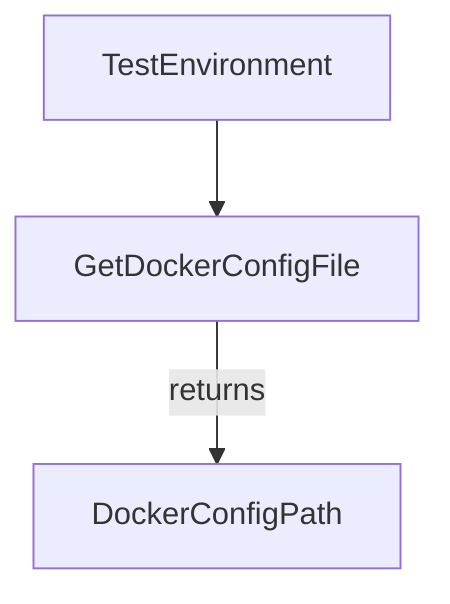

TestEnvironment.GetDockerConfigFile`

```go
func (e TestEnvironment) GetDockerConfigFile() string
```

### Purpose  
`GetDockerConfigFile` is a convenience accessor that returns the absolute path to the Docker configuration file used by the test environment. The returned value is intended for callers that need to load or inspect the daemon‑side Docker credentials (e.g., registry authentication, TLS settings) during test execution.

> **Note**: The implementation details are hidden in this view; the function simply returns a string derived from the `TestEnvironment` state.

### Inputs  
| Parameter | Type   | Description |
|-----------|--------|-------------|
| `e`       | `TestEnvironment` (receiver) | Holds the configuration for the current test run, including any environment‑specific overrides that influence where Docker config is stored. |

### Output  
- **`string`** – The file path to the Docker config (`config.json`) used by the test environment. If no config is available or an error occurs while resolving the location, an empty string is returned.

### Key Dependencies & Side Effects  

| Dependency | Role |
|------------|------|
| `TestEnvironment` fields | Provide context such as `DockerConfigPath`, environment variables, or defaults that determine where Docker config lives. |
| Environment variables (e.g., `DOCKER_CONFIG`) | May be consulted by the method to override the default path. |

The function has **no side effects**: it does not modify any state, write files, or perform network operations.

### How It Fits the Package  

*Package:* `github.com/redhat-best-practices-for-k8s/certsuite/pkg/provider`

Within the *provider* package, many utilities interact with Kubernetes objects and test environment configuration.  
`GetDockerConfigFile` sits alongside other getters (e.g., `GetKubeconfigPath`, `GetClusterName`) that expose internal fields to callers outside the package without leaking implementation details.

Typical usage:

```go
env := provider.NewTestEnvironment(...)
dockerCfg := env.GetDockerConfigFile()
if dockerCfg != "" {
    // load or inspect Docker config
}
```

Because it is exported, tests and tooling can rely on a stable interface for retrieving the Docker configuration path, making the package easier to integrate into CI pipelines that need access to registry credentials or custom Docker settings.

--- 

**Mermaid diagram suggestion**



This illustrates that `GetDockerConfigFile` is a simple accessor on the `TestEnvironment` type.
