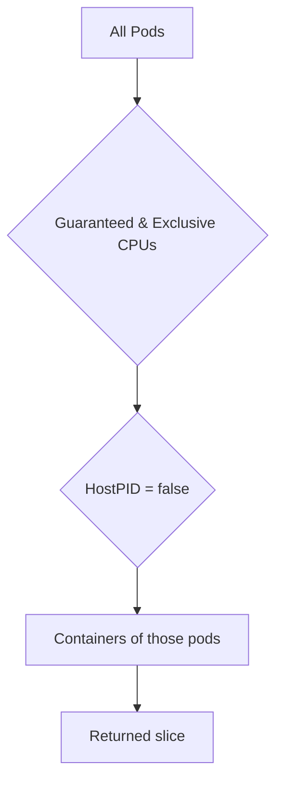

TestEnvironment.GetGuaranteedPodContainersWithExclusiveCPUsWithoutHostPID`

### Purpose
`GetGuaranteedPodContainersWithExclusiveCPUsWithoutHostPID` is a helper that extracts **all containers** belonging to the set of *guaranteed* pods that:
1. Use **exclusive CPUs** (i.e., they are scheduled on CPU sets with `cpuShares`/`cpusetCpus` configured so no other pod can use those cores).
2. Do **not** run in a host‑PID namespace (`hostPID: false`).

The function is used by tests that need to validate properties of containers running under strict CPU isolation (e.g., memory limits, CPU affinity, etc.) while ensuring the test does not accidentally target pods that share the node’s PID namespace.

### Inputs / Receiver
- **Receiver** – `TestEnvironment`.  
  The struct holds a snapshot of the current Kubernetes cluster state:
  - `pods` – all pod objects in the cluster.
  - `containers` – cached container objects derived from those pods.

No explicit arguments are required; all data is pulled from the receiver’s internal cache.

### Outputs
- A slice of pointers to `Container` (`[]*Container`).  
  Each element represents a container that satisfies both filtering criteria above.  
  The returned slice may be empty if no such containers exist.

### Key Dependencies (internal calls)
| Call | What it does |
|------|--------------|
| `GetGuaranteedPodsWithExclusiveCPUs()` | Returns all pods in the environment that are *guaranteed* (i.e., have a CPU request equal to the limit) **and** are scheduled on exclusive CPUs. |
| `filterPodsWithoutHostPID(pods)` | From a list of pods, removes any pod whose spec contains `hostPID: true`. |
| `getContainers(pods)` | For a given slice of pods, collects all containers belonging to those pods (using the cached container map). |

The three helpers work together as follows:

```text
GetGuaranteedPodsWithExclusiveCPUs()  → exclusivePods
filterPodsWithoutHostPID(exclusivePods) → exclusiveNonHostPids
getContainers(exclusiveNonHostPids)      → resultSlice
```

### Side Effects & State Mutations
None.  
The function is purely read‑only: it reads from the `TestEnvironment` cache and returns a new slice.

### How It Fits in the Package

| Related Files | Role |
|---------------|------|
| `filters.go`  | Central location for various filtering utilities that operate on pods, nodes, and containers. |
| `containers.go` | Defines the `Container` type and helper functions like `getContainers`. |
| `pods.go`     | Provides pod‑related helpers such as determining if a pod is guaranteed or uses exclusive CPUs. |

This function is typically invoked by higher‑level test suites that need to examine containers under strict CPU isolation. By delegating the filtering logic here, tests remain concise and focused on their specific assertions rather than re‑implementing common selection patterns.

---

### Example Usage

```go
env := NewTestEnvironment(client)
guaranteedContainers := env.GetGuaranteedPodContainersWithExclusiveCPUsWithoutHostPID()

for _, c := range guaranteedContainers {
    // e.g. assert that each container has a CPU limit set
    if c.Resources.Limits.Cpu() == nil {
        t.Errorf("container %s missing cpu limit", c.Name)
    }
}
```

---

### Diagram (Mermaid)



This visualizes the filtering pipeline used by `GetGuaranteedPodContainersWithExclusiveCPUsWithoutHostPID`.
