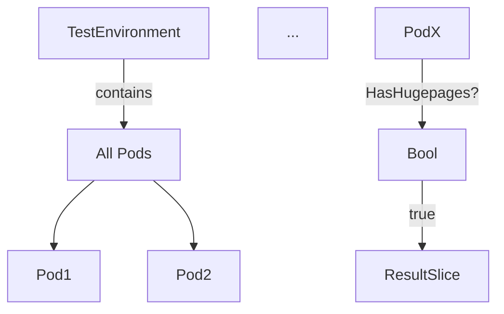

## `GetHugepagesPods`

| Aspect | Details |
|--------|---------|
| **Package** | `provider` (github.com/redhat-best-practices-for-k8s/certsuite/pkg/provider) |
| **Signature** | `func (env *TestEnvironment) GetHugepagesPods() []*Pod` |
| **Visibility** | Exported – usable by other packages. |

### Purpose
Retrieves all pods in the test environment that expose hugepage resources.  
Hugepages are a memory‑allocation feature used by workloads requiring large contiguous blocks of RAM; tests often need to run against such pods.

### Inputs & Outputs
- **Receiver (`env`)**: A `*TestEnvironment` struct containing a map or slice of all discovered `Pod`s.
- **Return value**: Slice of pointers to `Pod` (`[]*Pod`). Each element is guaranteed to satisfy the predicate `HasHugepages(pod) == true`.

### Core Logic
1. Iterate over every pod stored in the test environment.
2. For each pod, call the helper function `HasHugepages`.
3. If `HasHugepages` returns `true`, append the pod pointer to a result slice.
4. Return the resulting slice.

```go
func (env *TestEnvironment) GetHugepagesPods() []*Pod {
    var res []*Pod
    for _, p := range env.Pods { // env.Pods holds all discovered pods
        if HasHugepages(p) {
            res = append(res, p)
        }
    }
    return res
}
```

### Dependencies
- **`HasHugepages(pod *Pod) bool`** – determines whether a pod has hugepage limits/requests.  
  The implementation examines container resource requests/limits for keys such as `hugepages-1Gi` or `hugepages-2Mi`.  
- **`append`** – standard Go slice operation.

No other global variables or side effects are involved; the function is purely functional.

### Side Effects
None. It only reads from the test environment and returns a new slice; it does not modify any state.

### Context in the Package
The `provider` package manages discovery and filtering of Kubernetes objects for certsuite tests.  
`GetHugepagesPods` is one of several filter helpers (others include `GetNodesWithLabels`, `GetDeploymentsWithEnv`) that isolate specific subsets of resources for targeted test scenarios. By exposing this method, other packages can easily obtain all pods needing hugepage support without re‑implementing the logic.

---

#### Suggested Mermaid Diagram


This diagram illustrates the filtering flow from all pods to those that expose hugepage resources.
