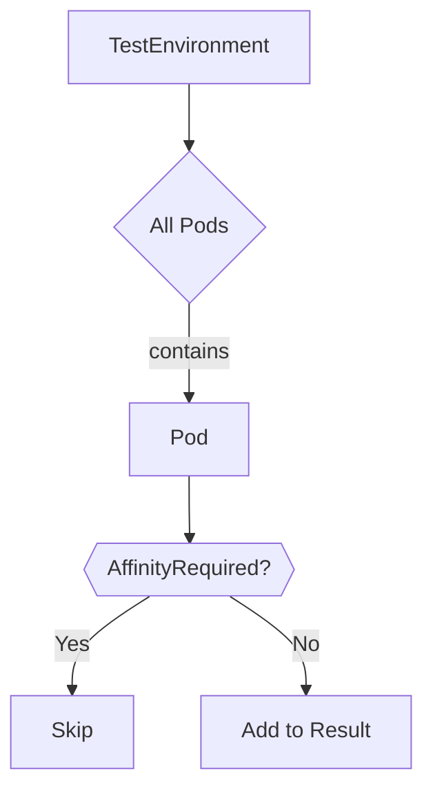

TestEnvironment.GetPodsWithoutAffinityRequiredLabel`

| Item | Details |
|------|---------|
| **Receiver** | `env TestEnvironment` – the environment that holds all known Kubernetes objects (pods, nodes, etc.). |
| **Signature** | `func () []*Pod` |
| **Visibility** | Exported (`GetPods…`) – can be called from other packages. |

### Purpose
Collects **all pods in the test environment that lack the *AffinityRequired* label**.  
The function is used by tests that need to identify workloads that are not constrained by node‑affinity rules (e.g., for checking scheduler behavior or verifying that certain labels were applied correctly).

### Inputs / Outputs
| Input | Type | Description |
|-------|------|-------------|
| None | – | The receiver contains the state; no parameters are required. |

| Output | Type | Description |
|--------|------|-------------|
| `[]*Pod` | slice of pointers to `Pod` objects | Each element represents a pod that **does not** have the label defined by `AffinityRequired`. If all pods contain the label, an empty slice is returned. |

### Key Dependencies
| Dependency | Role |
|------------|------|
| `env.Pods()` (implied) | Provides the list of all pods stored in the environment. |
| `AffinityRequired(p *Pod) bool` | Function that checks whether a pod carries the required affinity label. The filter uses this predicate to decide inclusion. |
| Go built‑in `append` | Builds the result slice incrementally. |

> **Note:** The function does not modify any global state or the pods themselves; it merely reads from the environment and returns a new slice.

### Side Effects
* None – purely functional.  
* No I/O, no mutation of `TestEnvironment`.  
* The returned slice is newly allocated; callers can safely modify it without affecting the original data.

### Placement in the Package
`provider/filters.go` groups helper predicates that operate on collections inside a `TestEnvironment`.  
`GetPodsWithoutAffinityRequiredLabel` sits alongside other filtering utilities (e.g., `GetPodsWithSpecificLabel`) and provides a convenient way to query pods based on label presence. It is often used in higher‑level test suites or validation logic where the presence of affinity constraints must be asserted.

### Suggested Mermaid Diagram

This diagram illustrates that the function iterates over every pod in `TestEnvironment`, applies the `AffinityRequired` check, and collects only those pods that **fail** the check.
