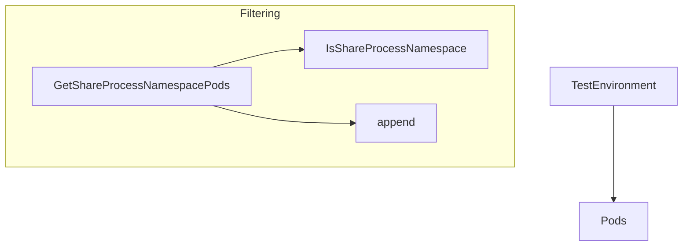

TestEnvironment.GetShareProcessNamespacePods`

**File:** `pkg/provider/filters.go:161`  
**Package:** `provider`

### Purpose
Return the subset of pods managed by a test environment that have their **share process namespace** feature enabled (`Pod.Spec.ShareProcessNamespace == true`).  
This helper is used when tests need to focus on or exclude pods that share a PID namespace with other containers in the same pod.

### Signature
```go
func (e TestEnvironment) GetShareProcessNamespacePods() []*Pod
```

- **Receiver** – `TestEnvironment` holds the collection of all pods in the current test run (`TestEnvironment.Pods`).  
- **Return value** – a slice of pointers to `Pod` objects that satisfy the condition.

### How it works
1. Create an empty slice `filteredPods`.  
2. Iterate over every pod stored in `e.Pods`.
3. For each pod, call `IsShareProcessNamespace(pod)` (a helper that checks the flag).  
4. If true, append the pod to `filteredPods`.  
5. Return the populated slice.

The function has no side‑effects on the environment or the pods themselves; it only reads data.

### Dependencies
| Called | What it does |
|--------|--------------|
| `IsShareProcessNamespace` | Returns a boolean indicating whether `Pod.Spec.ShareProcessNamespace` is set to true. |
| built‑in `append` | Adds matching pods to the result slice. |

No global variables or external state are accessed; the function is fully deterministic.

### Fit in the package
- **Provider context** – In the CertSuite test framework, a `TestEnvironment` represents one run of tests against a cluster.  
- **Filtering utilities** – The provider package contains several helper methods that filter pods by label, annotation, or runtime characteristics. This method complements those by filtering on namespace‑sharing capability, which is required for tests that validate process isolation policies.
- **Use cases** – Tests that check the behavior of containers sharing a PID namespace (e.g., Istio sidecar injection, security contexts) can call this function to isolate relevant pods before applying assertions.

---

#### Mermaid diagram suggestion



This visual helps developers understand that the method reads from `TestEnvironment.Pods`, delegates to a predicate, and collects results.
