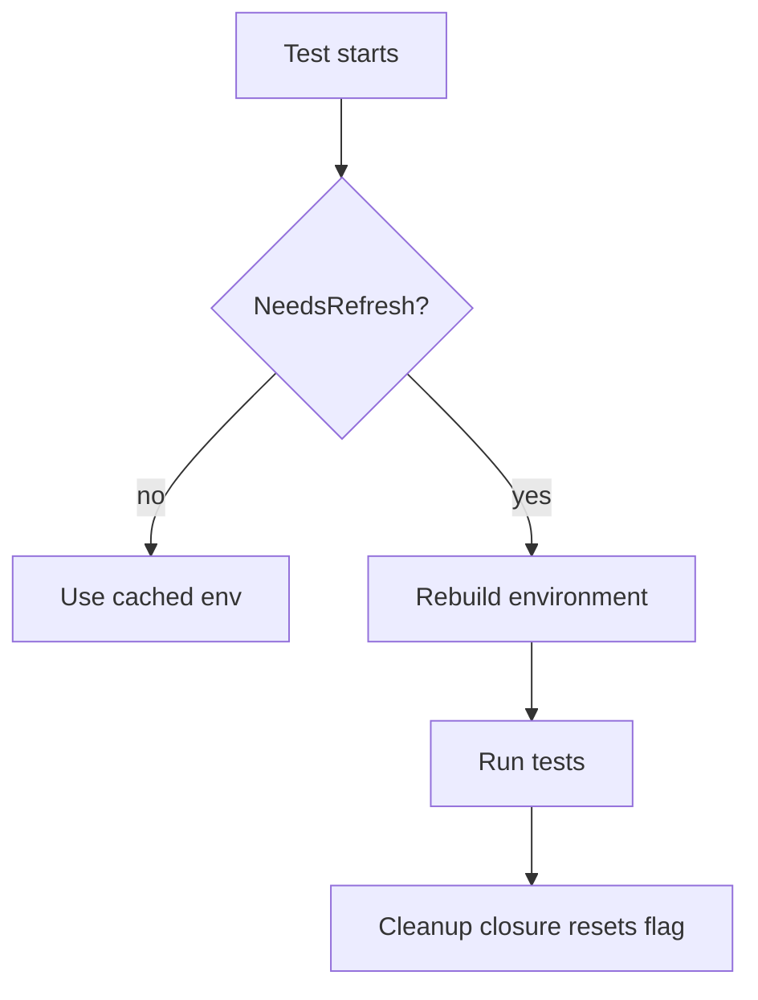

TestEnvironment.SetNeedsRefresh`

```go
func (te *TestEnvironment) SetNeedsRefresh() func()
```

### Purpose  
`SetNeedsRefresh` is a helper used in the test‑suite to signal that the current **test environment** must be rebuilt before the next set of tests runs.  
It sets an internal flag (`needsRefresh`) on the `TestEnvironment` instance and returns a *cleanup* closure that restores the original state when the caller finishes.

### Inputs & Outputs
| Direction | Parameter | Description |
|-----------|-----------|-------------|
| **Input** | none | The method acts only on the receiver. |
| **Output** | `func()` | A zero‑argument function that, when invoked, clears the refresh flag and restores any modified state (typically resetting a global cache). |

### Key Dependencies
* **`TestEnvironment` struct** – holds the environment configuration and an internal boolean field `needsRefresh`.
* No external globals are touched; the cleanup closure interacts only with the receiver’s fields.

### Side‑Effects & Behaviour
1. **Set Flag**  
   The method assigns `te.needsRefresh = true`. This flag is later consulted by the provider when creating or re‑using test resources (pods, nodes, etc.) to decide whether a fresh deployment is required.
2. **Return Cleanup**  
   It returns a closure that resets `te.needsRefresh` back to `false`. The caller should defer this returned function so that the flag is cleared automatically after the test block finishes.

### Usage Pattern

```go
// Inside a test:
cleanup := env.SetNeedsRefresh()
defer cleanup()

// Subsequent operations will see needsRefresh == true
// and trigger a new environment build.
```

### Placement in Package  
`SetNeedsRefresh` lives in `pkg/provider/provider.go`. It is part of the public API (`exported: true`) so that test code outside the package can request an environment rebuild. The function plays a crucial role in ensuring isolation between test cases that require distinct cluster states, especially when tests modify global resources or node labels.

### Mermaid Flow (optional)



---

**Note:** The implementation details are straightforward: a boolean toggle and its reset. No external side‑effects beyond the `TestEnvironment` instance itself.
