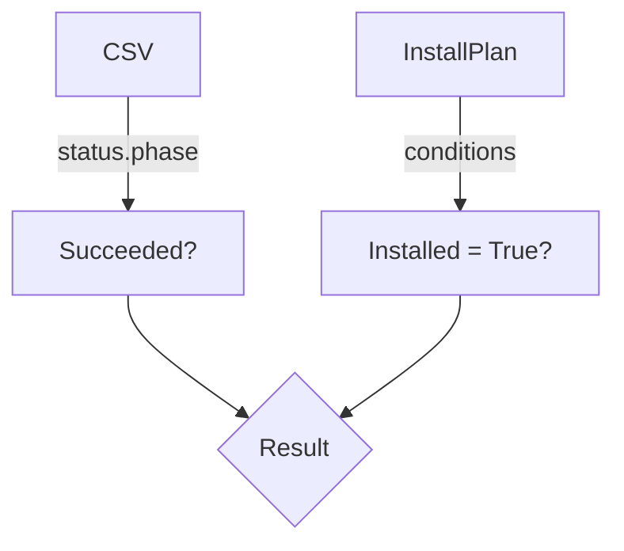

getAtLeastOneCsv`

**File:** `pkg/provider/operators.go` (line 248)  
**Visibility:** unexported – used only inside the *provider* package.

### Purpose
Determines whether an OpenShift **ClusterServiceVersion** (`csv`) has successfully installed at least one of the operator’s bundle images.  
In the context of CertSuite, this function is invoked after an `InstallPlan` has been applied to verify that the operator deployment actually produced a running CSV instance (i.e., the operator is present in the cluster).

### Signature
```go
func getAtLeastOneCsv(csv *olmv1Alpha.ClusterServiceVersion,
                      installPlan *olmv1Alpha.InstallPlan) bool
```

| Parameter | Type                                      | Description |
|-----------|------------------------------------------|-------------|
| `csv`     | `*olmv1Alpha.ClusterServiceVersion`      | The CSV object that was created/updated by the operator. It contains metadata such as the name, namespace and status fields. |
| `installPlan` | `*olmv1Alpha.InstallPlan`          | The install plan that triggered the creation of the CSV. Provides the *spec* (desired state) and *status* (actual progress). |

The function returns a boolean:
- **true** – at least one CSV image is present and ready.
- **false** – no CSV images are available or all failed.

### Key Logic
1. **Guard against nil pointers**  
   If either argument is `nil`, the function logs a warning (via `Warn`) and returns `false`.

2. **Check CSV status**  
   It examines `csv.Status.Phase`. Only when the phase equals `"Succeeded"` does it consider the operator successfully installed.

3. **Inspect InstallPlan conditions**  
   The function iterates over `installPlan.Status.Conditions` to find a condition of type `"Installed"`. If such a condition exists and its status is `"True"`, the CSV is considered valid.

4. **Return result** – true only if both checks pass; otherwise false.

### Dependencies & Side‑Effects
- **External packages**  
  - `olmv1Alpha` from the OpenShift Operator Lifecycle Manager API (provides the types for CSV and InstallPlan).
  - The package’s own `Warn` function is used to emit warnings when inputs are invalid. This is a side‑effect that writes to the provider’s logging system.

- **No mutation** – The function performs read‑only operations on its arguments; it does not modify any global state or the passed objects.

### Integration in the Package
Within `provider/operators.go`, `getAtLeastOneCsv` is called by higher‑level routines that orchestrate operator installation and health checks. For example:

```go
if !getAtLeastOneCsv(csv, installPlan) {
    // handle missing/failed CSV – possibly mark test as failed
}
```

By encapsulating the CSV readiness check in a single helper, the package keeps its operator‑management logic modular and easier to maintain.

---

**Mermaid diagram suggestion**



This visualizes the two independent checks that must both succeed for a true outcome.
