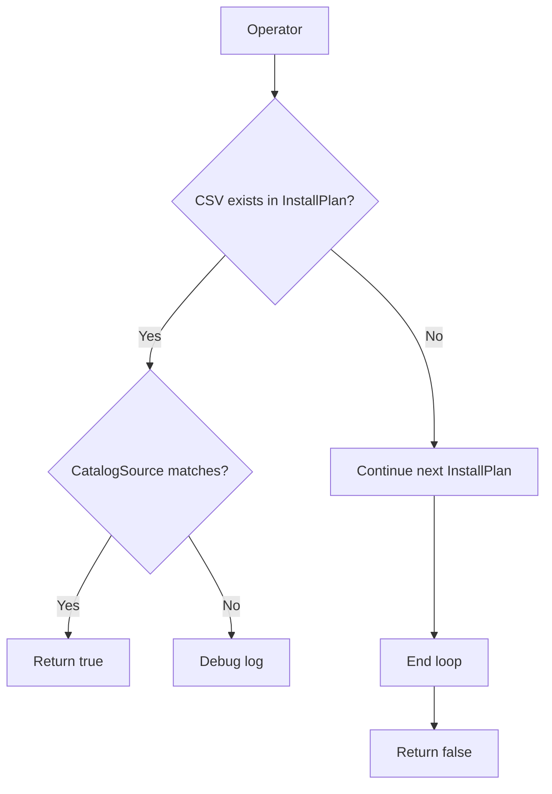

getAtLeastOneInstallPlan`

### Purpose
`getAtLeastOneInstallPlan` verifies that **at least one** Operator has an *install plan* matching the following conditions:

1. The operator’s ClusterServiceVersion (CSV) is present in at least one install plan (`getAtLeastOneCsv`).
2. The install plan’s image index comes from a catalog source that matches the operator’s required catalog source image index (`getCatalogSourceImageIndexFromInstallPlan`).

If both checks succeed for any of the supplied install plans, the function returns `true`; otherwise it returns `false`.

The function is used by the provider to decide whether an Operator can be considered *installed* and ready for further validation steps.

### Signature
```go
func getAtLeastOneInstallPlan(
    op            *Operator,
    csv           *olmv1Alpha.ClusterServiceVersion,
    installPlans  []*olmv1Alpha.InstallPlan,
    catalogSources []*olmv1Alpha.CatalogSource,
) bool
```

| Parameter | Type                               | Description |
|-----------|------------------------------------|-------------|
| `op`      | `*Operator`                        | The Operator definition from the operator bundle. |
| `csv`     | `*olmv1Alpha.ClusterServiceVersion` | CSV that belongs to `op`. |
| `installPlans` | `[]*olmv1Alpha.InstallPlan` | All install plans retrieved for the namespace. |
| `catalogSources` | `[]*olmv1Alpha.CatalogSource` | All catalog sources available in the cluster. |

### Core Logic
```go
for _, ip := range installPlans {
    // 1. CSV must be part of this plan.
    if !getAtLeastOneCsv(csv, ip) { continue }

    // 2. Catalog source image index must match.
    csi := getCatalogSourceImageIndexFromInstallPlan(ip)
    if csi == "" || !contains(op.CatalogSources, csi) {
        Debug("catalogSource not found in operator", op.Name)
        continue
    }

    return true   // All conditions satisfied for this plan.
}
return false
```

* **`getAtLeastOneCsv`** – returns `true` if the CSV’s name appears in any of the install plan's steps.  
* **`getCatalogSourceImageIndexFromInstallPlan`** – extracts the image index label from the install plan’s metadata.  
* **`Debug`** – logs detailed information when a catalog source mismatch occurs.

### Dependencies & Side‑Effects
- Relies on `getAtLeastOneCsv`, `getCatalogSourceImageIndexFromInstallPlan`, and the global `Debug` logger.
- No mutation of arguments; purely read‑only checks.
- The function may call `append` internally to build temporary slices (used in helper functions).

### Integration into the Package
The provider package orchestrates validation of an OpenShift cluster. After loading Operator metadata, it enumerates install plans and catalog sources. `getAtLeastOneInstallPlan` is called during that phase to confirm that at least one install plan satisfies the operator’s CSV and catalog source requirements before proceeding with deeper checks (e.g., health probes, resource limits).

A simplified flow diagram:



### Summary
- **Returns** `true` if an install plan contains the operator’s CSV and references a catalog source that matches the operator definition.
- **Otherwise** returns `false`.
- Used by the provider to gate further validation steps for Operators.
