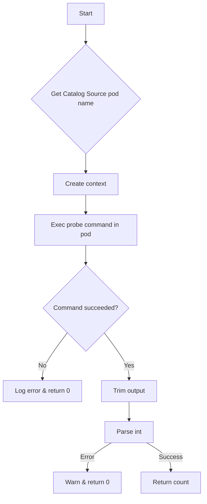

getCatalogSourceBundleCountFromProbeContainer`

| Item | Details |
|------|---------|
| **Package** | `provider` (`github.com/redhat-best-practices-for-k8s/certsuite/pkg/provider`) |
| **Signature** | `func getCatalogSourceBundleCountFromProbeContainer(env *TestEnvironment, cs *olmv1Alpha.CatalogSource) int` |
| **Visibility** | unexported (internal helper) |

### Purpose
The function retrieves the number of bundle images that are stored in an OpenShift Operator‑Lifecycle‑Manager (OLM) `CatalogSource`.  
It does this by executing a probe command inside the catalog‑source pod, parsing its output, and converting it to an integer.

> **Why a probe?**  
> A `CatalogSource` can expose a “probe” endpoint that lists all bundles it contains. The certsuite test harness uses this endpoint to validate that the catalog is correctly populated before running further tests.

### Inputs
| Parameter | Type | Role |
|-----------|------|------|
| `env` | `*TestEnvironment` | Holds shared test state, including a logger and accessors for Kubernetes clients. |
| `cs` | `*olmv1Alpha.CatalogSource` | The catalog source object whose bundle count we want to read. |

### Workflow


1. **Identify pod** – `GetClientsHolder(env).CatalogSource.GetProbePodName()` obtains the name of the pod that runs the probe container for the given catalog source.
2. **Prepare context** – A new Go `context.Context` is created (no timeout, just a simple propagation context).
3. **Execute command** – `ExecCommandContainer(ctx, pod, ns, cs.Probe.ContainerName)` runs the configured probe command inside the identified pod’s container.  
   - The command typically lists bundle files or queries an API endpoint exposed by the catalog source.
4. **Handle errors** – If execution fails, the function logs an error and returns `0`.
5. **Parse output** – On success the raw stdout is trimmed (`strings.TrimSpace`/`Trim`) to remove whitespace/newlines.
6. **Convert to integer** – `strconv.Atoi` converts the cleaned string into an `int`.  
   - If conversion fails, a warning is logged and `0` is returned.
7. **Return count** – The parsed integer (bundle count) is returned.

### Dependencies & Side‑Effects
| Dependency | Role |
|------------|------|
| `GetClientsHolder(env)` | Provides access to the catalog source client used for pod name lookup. |
| `Info`, `Error`, `Warn` | Logging helpers that write to the test environment’s logger. No state mutation occurs. |
| `ExecCommandContainer` | Executes a command inside a container; may produce side‑effects only if the probe itself changes cluster state (unlikely). |

The function **does not modify** any Kubernetes objects or the local `TestEnvironment`. Its sole side‑effect is logging.

### How it fits the package
- **Provider package** orchestrates test execution against an OpenShift cluster.  
- This helper is used by higher‑level catalog source tests to verify that a `CatalogSource` contains the expected number of bundles before proceeding with operator installation or upgrade tests.
- It encapsulates the plumbing needed to run a probe container and parse its output, keeping the public API clean.

### Usage Example
```go
// Inside a test case
cs := &olmv1Alpha.CatalogSource{ /* populated */ }
bundleCount := getCatalogSourceBundleCountFromProbeContainer(env, cs)
if bundleCount == 0 {
    t.Fatalf("catalog source %s has no bundles", cs.Name)
}
```

The function is intentionally unexported because it is an implementation detail; callers should use the public test helpers that wrap this logic.
