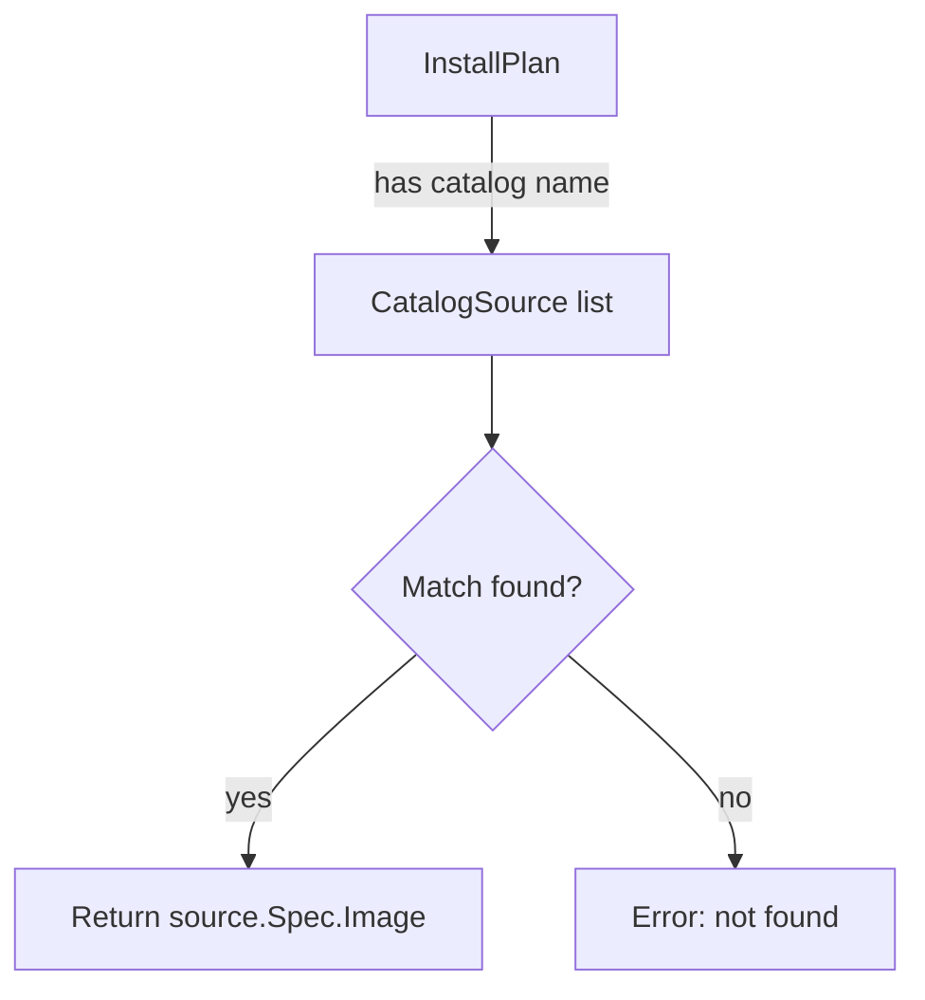

getCatalogSourceImageIndexFromInstallPlan`

| Aspect | Detail |
|--------|--------|
| **Visibility** | Unexported (internal helper) |
| **Signature** | `func getCatalogSourceImageIndexFromInstallPlan(plan *olmv1Alpha.InstallPlan, sources []*olmv1Alpha.CatalogSource) (string, error)` |

### Purpose
Given an Operator Lifecycle Manager (OLM) **`InstallPlan`** and a list of **`CatalogSource`** objects, the function determines which catalog source contains the image index referenced by the install plan. It returns that image index as a string or an error if it cannot be resolved.

This helper is used during operator installation checks to verify that the install plan refers to a known catalog source and to extract the exact image reference for later validation (e.g., ensuring the same index is available in the cluster’s registry).

### Parameters
| Name | Type | Description |
|------|------|-------------|
| `plan` | `*olmv1Alpha.InstallPlan` | The install plan that references a catalog source by name. |
| `sources` | `[]*olmv1Alpha.CatalogSource` | All available catalog sources in the cluster; used to look up the image index for the referenced name. |

### Return values
| Name | Type | Meaning |
|------|------|---------|
| `string` | The image index URL of the catalog source that matches the install plan’s reference. |
| `error` | Non‑nil if the install plan references a non‑existent catalog source or an unexpected condition occurs. |

### Key logic steps
1. **Extract catalog name** – From `plan.Spec.ClusterServiceVersionNames[0].CatalogSourceName` (the exact field is not shown, but it’s the standard OLM reference).  
2. **Search catalog sources** – Iterate over `sources`, comparing each source’s `Metadata.Name` with the extracted name.  
3. **Return image index** – On a match, return `source.Spec.Image`.  
4. **Error handling** – If no match is found, construct an error using `fmt.Errorf("catalog source %q not found", name)`.

### Dependencies
- **`olmv1Alpha.InstallPlan` & `olmv1Alpha.CatalogSource`** from the OLM v0.14 API (`github.com/operator-framework/api/pkg/operators/v1alpha1`).  
- Uses standard library’s `fmt.Errorf` for error creation (see call list).  

No global variables or other package state are referenced, making the function pure apart from its inputs.

### Side‑effects
None – purely functional; it performs lookups and returns a value or error.

### Package context
The **`provider`** package orchestrates checks on Kubernetes/OpenShift clusters for certification compliance. Operator‑related utilities, such as this helper, are invoked during the “operator validation” phase to confirm that operator install plans point to valid catalog sources. By isolating this logic in a dedicated function, the rest of the provider code can simply call it and handle success or failure without duplicating catalog lookup code.

### Suggested Mermaid diagram

This function is a small but essential glue piece that ensures the operator installation workflow can reliably resolve image indices from OLM install plans.
