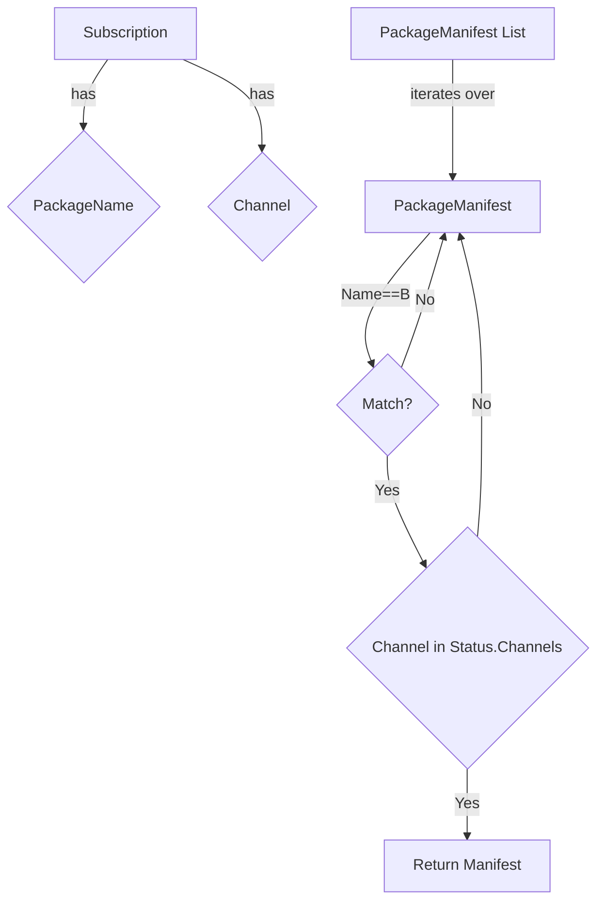

getPackageManifestWithSubscription`

### Purpose
`getPackageManifestWithSubscription` is a helper that, given an Operator Lifecycle Manager (OLM) **subscription** and a list of available **package manifests**, selects the manifest that matches the subscription’s package name and channel.  
It is used by higher‑level logic that needs to inspect the exact set of packages offered by an operator as it will be installed on the cluster.

### Signature
```go
func getPackageManifestWithSubscription(
    sub *olmv1Alpha.Subscription,
    manifests []*olmpkgv1.PackageManifest,
) *olmpkgv1.PackageManifest
```

| Parameter | Type | Description |
|-----------|------|-------------|
| `sub` | `*olmv1Alpha.Subscription` | The OLM subscription that contains the desired `PackageName` and `Channel`. |
| `manifests` | `[]*olmpkgv1.PackageManifest` | All package manifests discovered in the cluster. |

| Return value | Type | Description |
|--------------|------|-------------|
| `*olmpkgv1.PackageManifest` | The manifest whose `Name` matches `sub.Spec.PackageName` **and** whose `Status.Channels[*].CurrentCSV` belongs to the same channel as `sub.Spec.Channel`.  
If no match is found, returns `nil`. |

### How it works
1. **Iterate over all manifests** – the function walks the slice of `PackageManifest` objects.
2. **Match name** – a manifest’s `Name` must equal `sub.Spec.PackageName`.
3. **Validate channel** – for that manifest, the `Status.Channels` list is inspected to find an entry whose `Channel` field equals `sub.Spec.Channel`.  
   The function does *not* check the CSV itself; it only ensures that a channel with the requested name exists.
4. **Return first match** – the first manifest satisfying both conditions is returned immediately.
5. If no manifest satisfies the criteria, `nil` is returned.

### Dependencies & Side‑Effects
- Relies on types from the OLM API groups:
  - `olmv1Alpha.Subscription` (operator lifecycle subscription)
  - `olmpkgv1.PackageManifest` (operator package descriptor)
- No global state is mutated; the function is pure.
- It performs no I/O or network calls – it operates only on in‑memory data passed to it.

### Context within the Package
The `provider` package orchestrates interactions with an OpenShift/Kubernetes cluster for the CertSuite tests.  
This helper sits in **operators.go** and is part of the logic that:

1. Queries the cluster for all available operator package manifests (`PackageManifestList`).
2. Retrieves a subscription describing which operator should be installed.
3. Uses `getPackageManifestWithSubscription` to find the exact manifest that corresponds to that subscription.

The resulting manifest can then be inspected or used to derive further information (e.g., default CSV, bundle images) needed for validation tests.

---

#### Suggested Mermaid diagram



This diagram illustrates the decision flow: the subscription is matched against each manifest until a name and channel match is found.
